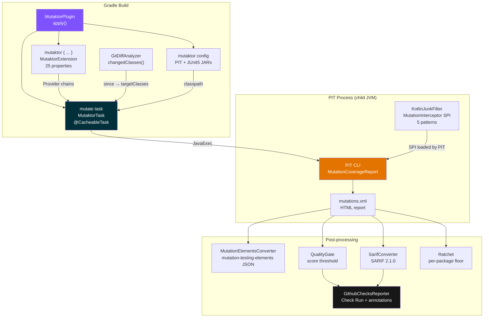

<p align="center">
  <strong>mutaktor</strong><br>
  Kotlin-first Gradle plugin for PIT mutation testing
</p>

<p align="center">
  <a href="https://kotlinlang.org"></a>
  <a href="https://gradle.org"></a>
  <a href="https://pitest.org"></a>
  <a href="https://openjdk.org"></a>
  <a href="LICENSE"></a>
  <br>
  <a href="https://github.com/ioplane/mutaktor/actions/workflows/ci.yml"></a>
  <a href="https://codecov.io/gh/ioplane/mutaktor"></a>
  <a href="https://sonarcloud.io/summary/new_code?id=ioplane_mutaktor"></a>
  <a href="https://scorecard.dev/viewer/?uri=github.com/ioplane/mutaktor"></a>
</p>

---

**mutaktor** is a Kotlin-first Gradle plugin that wraps [PIT](https://pitest.org/) mutation testing with production-grade CI/CD features: git-diff scoped analysis that limits work to changed classes, automatic suppression of Kotlin compiler-generated junk mutations, standardized SARIF 2.1.0 and mutation-testing-elements JSON output, GitHub Checks API inline PR annotations, a configurable quality gate with per-package score ratchet, extreme mutation mode for large codebases, GraalVM/Quarkus JDK auto-detection via Gradle Toolchain, and annotation-driven control — all built on Gradle's Provider API for zero configuration-cache overhead.

---

## What makes mutaktor different?

| Feature | gradle-pitest-plugin | ArcMutate ($) | **mutaktor** |
|---|---|---|---|
| Primary language | Groovy DSL | Java (closed source) | **Kotlin DSL** |
| License | Apache 2.0 | Commercial | **Apache 2.0** |
| Git-diff scoped analysis | No | Yes (paid) | **Yes** |
| Kotlin junk-mutation filter | No | Yes (paid) | **Yes** |
| mutation-testing-elements JSON | Separate plugin | No | **Built-in** |
| SARIF 2.1.0 (GitHub Code Scanning) | No | No | **Built-in** |
| GitHub Checks API annotations | No | No | **Built-in** |
| Extreme mutation mode | No | Yes (paid) | **Yes** |
| Quality gate (threshold) | Manual | Manual | **Built-in** |
| Per-package score ratchet | No | No | **Built-in** |
| GraalVM auto-detect (Toolchain) | No | No | **Built-in** |
| Annotation control (`@SuppressMutations`) | No | No | **Built-in** |
| Gradle configuration cache | Retrofit | Unknown | **By design** |
| External runtime dependencies | None | Closed | **Zero** |

---

## Quick Start

### Kotlin DSL

```kotlin
// build.gradle.kts
plugins {
    kotlin("jvm") version "2.3.0"
    id("io.github.dantte-lp.mutaktor") version "0.1.0"
}

mutaktor {
    targetClasses.set(setOf("com.example.*"))
}
```

### Groovy DSL

```groovy
// build.gradle
plugins {
    id 'org.jetbrains.kotlin.jvm' version '2.3.0'
    id 'io.github.dantte-lp.mutaktor' version '0.1.0'
}

mutaktor {
    targetClasses = ['com.example.*']
}
```

Run mutation analysis:

```bash
./gradlew mutate
```

Reports are written to `build/reports/mutaktor/`.

---

## Architecture



---

## Features

### Git-diff scoped analysis

Scope mutation to only the classes that changed since a given git ref. On a large codebase this can reduce analysis time from hours to minutes:

```kotlin
mutaktor {
    since.set("main")        // branch name
    // since.set("HEAD~5")   // relative ref
    // since.set("a1b2c3d")  // commit SHA
}
```

`GitDiffAnalyzer` runs `git diff --name-only --diff-filter=ACMR` and maps changed source files to class-name glob patterns that are intersected with `targetClasses`.

### Kotlin junk-mutation filter

`KotlinJunkFilter` implements PIT's `MutationInterceptor` SPI and automatically suppresses mutations in five categories of Kotlin compiler-generated bytecode:

| Category | Why it is junk |
|---|---|
| `DefaultImpls` inner classes | Interface default-method adapters — never directly exercised |
| Coroutine state machine | Compiler-generated `invokeSuspend` switch arms |
| Data class generated methods | `copy`, `componentN`, `equals`, `hashCode`, `toString` |
| Intrinsics null-checks | `Intrinsics.checkNotNullParameter` — guaranteed by the type system |
| `when`-expression hashcode dispatch | Compiler switch on string hashcodes — semantic noise |

Enable (on by default):

```kotlin
mutaktor {
    kotlinFilters.set(true)  // default
}
```

### Reports

| Format | File | Use case |
|---|---|---|
| HTML | `build/reports/mutaktor/index.html` | Human review |
| XML | `build/reports/mutaktor/mutations.xml` | Machine processing |
| mutation-testing-elements JSON | `build/reports/mutaktor/mutations.json` | [Stryker Dashboard](https://dashboard.stryker-mutator.io/) |
| SARIF 2.1.0 | `build/reports/mutaktor/mutations.sarif.json` | GitHub Code Scanning |

Configure output:

```kotlin
mutaktor {
    jsonReport.set(true)      // default: true
    sarifReport.set(true)     // default: false
    outputFormats.set(setOf("HTML", "XML"))
}
```

### Quality gate

Fail the build if the mutation score drops below a threshold:

```kotlin
mutaktor {
    mutationScoreThreshold.set(80)  // fail if score < 80%
}
```

The quality gate runs in post-processing after PIT completes and reports the precise score to the build log before failing.

### Per-package score ratchet

Prevent regression at the package level. The ratchet reads a baseline file, fails the build if any package score decreases, and optionally auto-updates the baseline when scores improve:

```kotlin
mutaktor {
    ratchetEnabled.set(true)
    ratchetBaseline.set(layout.projectDirectory.file(".mutaktor-baseline.json"))
    ratchetAutoUpdate.set(true)   // update baseline on improvement
}
```

Commit `.mutaktor-baseline.json` to version control. The build fails if a package score drops below its baseline value.

### Extreme mutation mode

Replace entire method bodies instead of applying fine-grained bytecode mutations. This generates approximately one mutant per method rather than ten, making mutation testing practical for large codebases:

```kotlin
mutaktor {
    extreme.set(true)
}
```

Extreme mode is effective for identifying pseudo-tested methods — methods covered by tests that do not assert on behavior.

### GraalVM and Quarkus auto-detection

When the build JDK is GraalVM, PIT's minion JVM fails on `jrt://` module paths. Mutaktor integrates with Gradle Toolchain API to automatically resolve a standard JDK for the PIT child process:

```kotlin
mutaktor {
    javaLauncher.set(javaToolchains.launcherFor {
        languageVersion.set(JavaLanguageVersion.of(21))
        vendor.set(JvmVendorSpec.ADOPTIUM)
    })
}
```

### Annotation-based control

Add the `mutaktor-annotations` dependency (zero transitive dependencies) to control mutation analysis at the class or method level:

```kotlin
// build.gradle.kts
dependencies {
    implementation("io.github.dantte-lp.mutaktor:mutaktor-annotations:0.1.0")
}
```

```kotlin
import io.github.dantte_lp.mutaktor.annotations.MutationCritical
import io.github.dantte_lp.mutaktor.annotations.SuppressMutations

// Require 100% mutation score — build fails if any mutant survives
@MutationCritical(reason = "Core payment validation logic")
class PaymentValidator {
    fun validate(amount: BigDecimal): ValidationResult { ... }
}

// Exclude from mutation analysis entirely
@SuppressMutations(reason = "Generated serialization code — tested by contract")
fun toJson(): String { ... }
```

### GitHub Checks API

When `GITHUB_TOKEN` is available, mutaktor posts a GitHub Check Run with inline annotations for every surviving mutant directly on the pull request diff:

```yaml
# .github/workflows/ci.yml
- name: Run mutation tests
  run: ./gradlew mutate
  env:
    GITHUB_TOKEN: ${{ secrets.GITHUB_TOKEN }}
```

---

## Multi-module projects

Apply the aggregate plugin to the root project and the standard plugin to each subproject:

```kotlin
// settings.gradle.kts
include("core", "api", "service")

// build.gradle.kts (root)
plugins {
    id("io.github.dantte-lp.mutaktor.aggregate") version "0.1.0"
}

// core/build.gradle.kts, api/build.gradle.kts, service/build.gradle.kts
plugins {
    kotlin("jvm")
    id("io.github.dantte-lp.mutaktor") version "0.1.0"
}

mutaktor {
    targetClasses.set(setOf("com.example.${project.name}.*"))
}
```

Run per-module and aggregate:

```bash
./gradlew mutate              # all subprojects in parallel
./gradlew mutateAggregate     # combined report across all modules
```

---

## Configuration reference

All 25 DSL properties are documented in [`docs/en/02-configuration.md`](docs/en/02-configuration.md). Key properties:

| Property | Type | Default | Description |
|---|---|---|---|
| `pitVersion` | `String` | `"1.23.0"` | PIT version resolved from Maven Central |
| `targetClasses` | `Set<String>` | auto-inferred | Glob patterns for classes to mutate |
| `targetTests` | `Set<String>` | same as `targetClasses` | Glob patterns for test classes |
| `threads` | `Int` | `availableProcessors()` | Parallel mutation threads |
| `mutators` | `Set<String>` | `{"DEFAULTS"}` | Mutator groups or individual mutator IDs |
| `since` | `String` | unset | Git ref for diff-scoped analysis |
| `kotlinFilters` | `Boolean` | `true` | Enable Kotlin junk-mutation filter |
| `extreme` | `Boolean` | `false` | Extreme mutation mode |
| `mutationScoreThreshold` | `Int` | unset | Quality gate threshold (0–100) |
| `ratchetEnabled` | `Boolean` | `false` | Per-package score ratchet |
| `jsonReport` | `Boolean` | `true` | mutation-testing-elements JSON output |
| `sarifReport` | `Boolean` | `false` | SARIF 2.1.0 output |
| `javaLauncher` | `JavaLauncher` | build JDK | Toolchain override for PIT child JVM |
| `verbose` | `Boolean` | `false` | PIT verbose console output |

---

## Documentation

| Document | Audience | Description |
|---|---|---|
| [Getting Started](docs/en/01-getting-started.md) | All users | Installation, first run |
| [Configuration](docs/en/02-configuration.md) | All users | Complete DSL reference |
| [Kotlin Filter](docs/en/03-kotlin-filters.md) | Kotlin developers | Junk-mutation suppression internals |
| [Git-Diff Analysis](docs/en/04-git-integration.md) | CI/CD users | Scoped analysis with `since` |
| [Reports & Quality Gate](docs/en/05-reporting.md) | CI/CD users | SARIF, JSON, thresholds, ratchet |
| [Development Guide](docs/en/06-development.md) | Contributors | Build, test, extend |
| [CI/CD Integration](docs/en/07-ci-cd.md) | DevOps | GitHub Actions, SARIF upload |
| [Changelog](docs/en/08-changelog.md) | All | Release history |

Russian documentation is available at [`docs/ru/`](docs/ru/).

---

## Requirements

| | Minimum | Tested |
|---|---|---|
| Gradle | 9.0 | 9.4.1 |
| JDK | 17 | 17, 21, 25 (Temurin) |
| Kotlin | 1.8 | 2.3.0 |
| PIT | 1.19.0 | 1.23.0 |
| pitest-junit5-plugin | 1.1.0 | 1.2.3 |

---

## Contributing

See [CONTRIBUTING.md](CONTRIBUTING.md) for development setup, code standards, and the pull request process.

## Security

See [SECURITY.md](SECURITY.md) for the vulnerability reporting process and supported versions.

## Support

See [SUPPORT.md](SUPPORT.md) for support channels and how to file an effective bug report.

## Code of Conduct

This project follows the [Contributor Covenant v2.1](CODE_OF_CONDUCT.md).

---

## License

Apache License 2.0. See [LICENSE](LICENSE).
