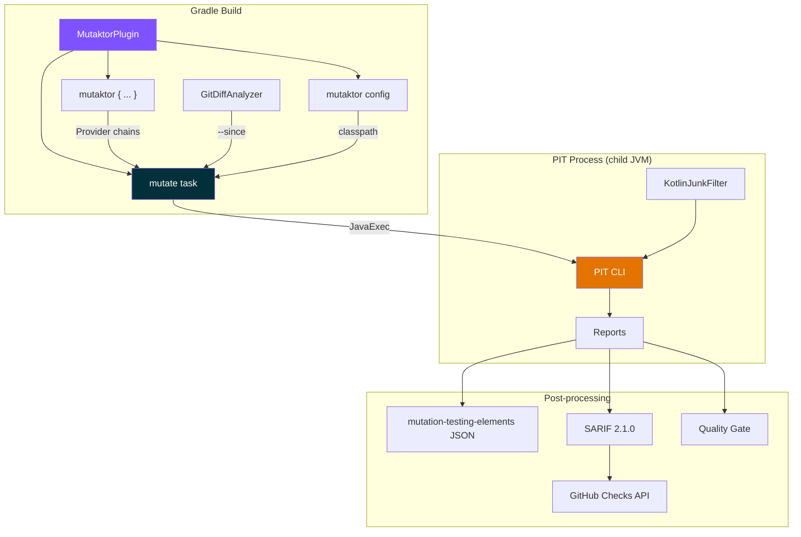

<p align="center">
  <strong>mutaktor</strong><br>
  Kotlin-first Gradle plugin for PIT mutation testing
</p>

<p align="center">
  
  
  
  
  <a href="LICENSE"></a>
</p>

---

Mutation testing finds gaps in your test suite by introducing small code changes (mutants) and checking if your tests catch them. **mutaktor** wraps [PIT](https://pitest.org/) with a modern Kotlin-first Gradle plugin.

## What makes mutaktor different?

| Feature | gradle-pitest-plugin | ArcMutate ($) | **mutaktor** |
|---------|---------------------|---------------|--------------|
| Language | Groovy | Java (closed) | **Kotlin** |
| License | Apache 2.0 | Commercial | **Apache 2.0** |
| Git-diff scoped | No | Yes (paid) | **Yes** |
| Kotlin junk filter | No | Yes (paid) | **Yes** |
| mutation-testing-elements JSON | Separate plugin | No | **Built-in** |
| SARIF (GitHub Code Scanning) | No | No | **Built-in** |
| GitHub Checks API | No | No | **Built-in** |
| Extreme mutation | No | Yes (paid) | **Yes** |
| Quality gate | Manual | Manual | **Built-in** |
| Config cache | Retrofit | ? | **By design** |

## Quick Start

```kotlin
plugins {
    java // or kotlin("jvm")
    id("io.github.dantte-lp.mutaktor") version "0.1.0"
}

mutaktor {
    targetClasses.set(setOf("com.example.*"))
}
```

Run:
```bash
./gradlew mutate
```

## Features

### Git-diff scoped analysis
Only mutate code that changed — dramatically faster in CI:
```kotlin
mutaktor {
    since.set("main") // only classes changed since main branch
}
```

### Kotlin junk filter
Automatically filters meaningless mutations in:
- Coroutine state machines
- Data class generated methods (copy, componentN, equals, hashCode, toString)
- DefaultImpls (interface default methods)
- Intrinsics null-checks
- When-expression hashcode dispatch

### Extreme mutation mode
Replace entire method bodies instead of fine-grained mutations (~10x fewer mutants):
```kotlin
mutaktor {
    extreme.set(true)
}
```

### Reports
- **HTML** — PIT's standard report
- **mutation-testing-elements JSON** — [Stryker Dashboard](https://dashboard.stryker-mutator.io/) compatible
- **SARIF 2.1.0** — GitHub Code Scanning integration

### Quality gate
Fail the build if mutation score drops below threshold:
```kotlin
// In CI workflow, evaluate after mutate task
```

### GitHub Checks API
Inline PR annotations for surviving mutants (requires GITHUB_TOKEN).

## Architecture



## Multi-module
```kotlin
// root build.gradle.kts
plugins {
    id("io.github.dantte-lp.mutaktor.aggregate")
}

// subproject build.gradle.kts
plugins {
    kotlin("jvm")
    id("io.github.dantte-lp.mutaktor")
}
```

```bash
./gradlew mutate mutateAggregate
```

## Configuration

Full DSL reference: see [MutaktorExtension](mutaktor-gradle-plugin/src/main/kotlin/io/github/dantte_lp/mutaktor/MutaktorExtension.kt) — 24+ configurable properties.

## Requirements

| | Minimum | Tested |
|---|---------|--------|
| Gradle | 9.0 | 9.4.1 |
| JDK | 17 | 25 |
| PIT | 1.19.0+ | 1.23.0 |

## License

Apache License 2.0. See [LICENSE](LICENSE).
