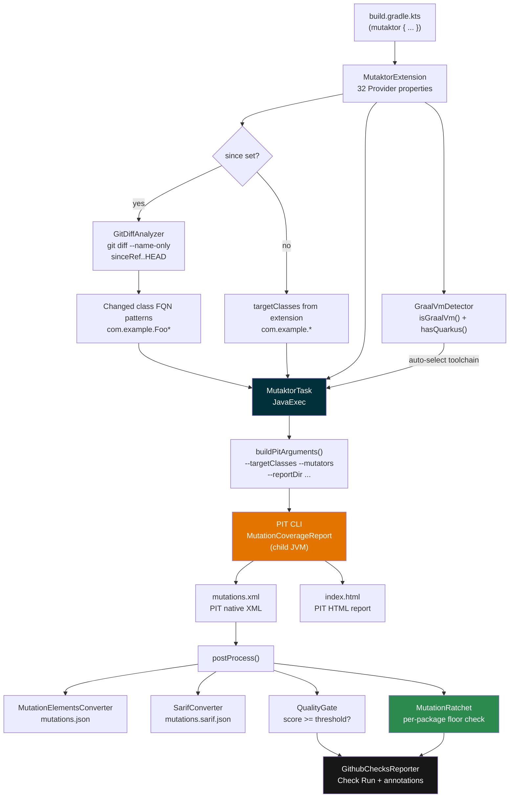
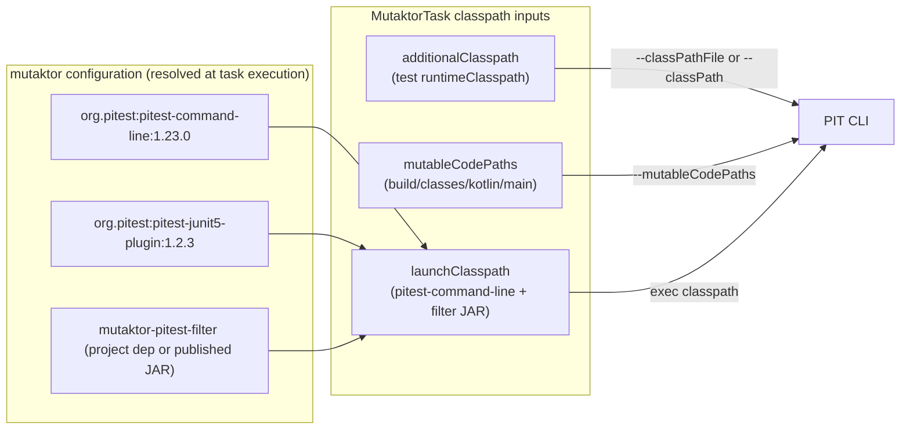
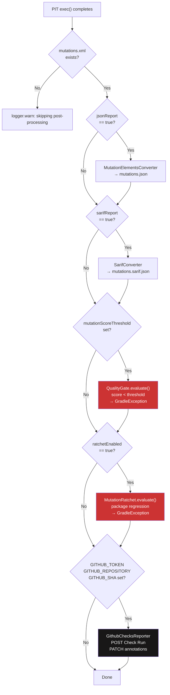
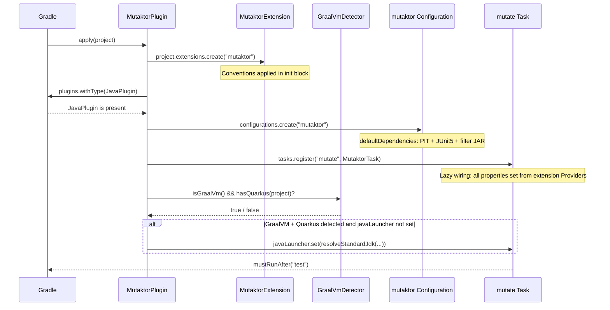
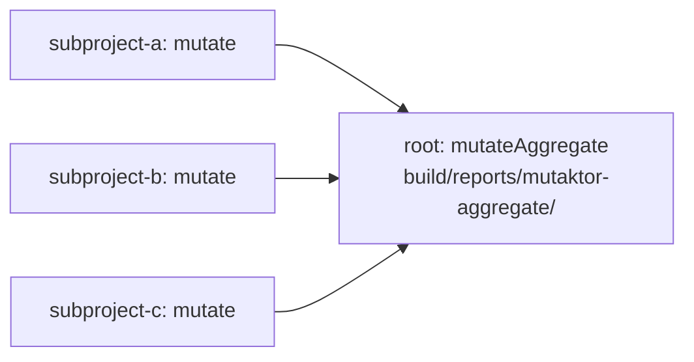

# Plugin Architecture


## Overview

Mutaktor is a Kotlin-first Gradle plugin for [PIT](https://pitest.org/) mutation testing. It wraps the PIT command-line runner in a fully lazy, configuration-cache-compatible Gradle task, adds Kotlin-specific junk mutation filtering, git-diff scoped analysis, GraalVM auto-detection, and a complete post-processing pipeline (JSON, SARIF, quality gate, per-package ratchet, GitHub Checks API) — all with zero external runtime dependencies.

The plugin is composed of four published or companion modules plus a shared build-logic convention plugin.

---

## Module Structure

| Module | Artifact | Purpose |
|--------|----------|---------|
| `mutaktor-gradle-plugin` | `io.github.ioplane.mutaktor` | Gradle plugin, DSL extension, `mutate` task, report converters, ratchet, toolchain detection |
| `mutaktor-pitest-filter` | companion JAR on PIT classpath | PIT `MutationInterceptor` SPI that filters Kotlin compiler-generated junk |
| `mutaktor-annotations` | `mutaktor-annotations.jar` | `@MutationCritical` and `@SuppressMutations` source-level annotations |
| `build-logic` | internal only | Convention plugins for shared Kotlin/publishing config |

### Source Tree

```
mutaktor/
├── mutaktor-gradle-plugin/
│   └── src/main/kotlin/io/github/ioplane/mutaktor/
│       ├── MutaktorPlugin.kt              # Plugin entry point
│       ├── MutaktorExtension.kt           # DSL extension (32 properties)
│       ├── MutaktorTask.kt                # JavaExec task + post-processing pipeline
│       ├── MutaktorAggregatePlugin.kt     # Multi-module report aggregation
│       ├── git/
│       │   └── GitDiffAnalyzer.kt         # git diff → FQN class patterns
│       ├── extreme/
│       │   └── ExtremeMutationConfig.kt   # Method-body removal mutators
│       ├── toolchain/
│       │   └── GraalVmDetector.kt         # GraalVM + Quarkus detection
│       ├── ratchet/
│       │   ├── MutationRatchet.kt         # Per-package score floor
│       │   └── RatchetBaseline.kt         # JSON baseline persistence
│       ├── report/
│       │   ├── MutationElementsConverter.kt  # XML → mutation-testing-elements JSON
│       │   ├── SarifConverter.kt             # XML → SARIF 2.1.0
│       │   ├── QualityGate.kt                # Mutation score threshold check
│       │   └── GithubChecksReporter.kt       # GitHub Checks API annotations
│       └── util/
│           ├── XmlParser.kt               # Secure SAX/DOM parsing utilities
│           ├── JsonBuilder.kt             # Zero-dependency JSON construction
│           └── SourcePathResolver.kt      # File path → FQN conversion
│
├── mutaktor-pitest-filter/
│   └── src/main/kotlin/io/github/ioplane/mutaktor/pitest/
│       └── KotlinJunkFilter.kt            # MutationInterceptorFactory + 5 filters
│
├── mutaktor-annotations/
│   └── src/main/kotlin/io/github/ioplane/mutaktor/annotations/
│       ├── MutationCritical.kt            # Enforces 100% mutation score
│       └── SuppressMutations.kt           # Excludes code from analysis
│
└── build-logic/
    └── src/main/kotlin/
        └── kotlin-conventions.gradle.kts  # Shared Kotlin + JVM toolchain config
```

---

## Data Flow

The following diagram shows how configuration flows from `build.gradle.kts` through the plugin into PIT and then through the post-processing pipeline.



---

## Classpath Architecture

Mutaktor creates a dedicated `mutaktor` Gradle configuration to manage the PIT classpath. This keeps PIT dependencies completely separate from the project's own compile and runtime dependencies.



When `useClasspathFile = true` (the default), the `additionalClasspath` and `mutableCodePaths` entries are written to `build/mutaktor/pitClasspath` (one path per line) and passed via `--classPathFile`. This avoids OS command-line length limits on Windows and large monorepo builds.

---

## Post-Processing Pipeline

After PIT completes, `MutaktorTask.postProcess()` runs five sequential steps. Each step is guarded: if `mutations.xml` does not exist (PIT produced no output or failed), the entire post-processing phase is skipped with a warning.



---

## Key Classes

| Class | Package | Role |
|-------|---------|------|
| `MutaktorPlugin` | `io.github.ioplane.mutaktor` | `Plugin<Project>` entry point; creates the `mutaktor` configuration and registers the `mutate` task with lazy wiring |
| `MutaktorExtension` | `io.github.ioplane.mutaktor` | Type-safe DSL; all 32 properties use the Gradle Provider API for lazy evaluation and configuration-cache compatibility |
| `MutaktorTask` | `io.github.ioplane.mutaktor` | `@CacheableTask` extending `JavaExec`; assembles the PIT CLI argument list from Provider values, delegates to `super.exec()`, then runs the post-processing pipeline |
| `MutaktorAggregatePlugin` | `io.github.ioplane.mutaktor` | Optional root-project plugin; registers `mutateAggregate` (`Copy` task) that collects subproject reports |
| `GitDiffAnalyzer` | `io.github.ioplane.mutaktor.git` | Runs `git diff --name-only --diff-filter=ACMR sinceRef..HEAD` and converts file paths to FQN glob patterns |
| `GraalVmDetector` | `io.github.ioplane.mutaktor.toolchain` | Detects GraalVM + Quarkus combination; auto-resolves a standard JDK via `JavaToolchainService` for PIT child process |
| `ExtremeMutationConfig` | `io.github.ioplane.mutaktor.extreme` | Holds the 6 method-body removal mutators used in extreme mode |
| `KotlinJunkFilter` | `io.github.ioplane.mutaktor.pitest` | PIT `MutationInterceptor` with 5 predicates that discard compiler-generated noise mutations |
| `KotlinJunkFilterFactory` | `io.github.ioplane.mutaktor.pitest` | `MutationInterceptorFactory` discovered via `META-INF/services`; registers the `KOTLIN_JUNK` feature flag |
| `MutationElementsConverter` | `io.github.ioplane.mutaktor.report` | Parses `mutations.xml` and emits mutation-testing-elements JSON (Stryker Dashboard schema v2) |
| `SarifConverter` | `io.github.ioplane.mutaktor.report` | Parses `mutations.xml` and emits SARIF 2.1.0; only survived mutations are included as results |
| `QualityGate` | `io.github.ioplane.mutaktor.report` | Computes kill ratio and compares against a threshold; returns a typed `Result` |
| `MutationRatchet` | `io.github.ioplane.mutaktor.ratchet` | Computes per-package scores from `mutations.xml`; fails if any package drops below its baseline |
| `RatchetBaseline` | `io.github.ioplane.mutaktor.ratchet` | Reads and writes the JSON baseline file (`.mutaktor-baseline.json`) |
| `GithubChecksReporter` | `io.github.ioplane.mutaktor.report` | Posts a GitHub Check Run with warning annotations for each survived mutant via the GitHub Checks API |

---

## Plugin Application Lifecycle



---

## Gradle Task Graph


`mustRunAfter` (not `dependsOn`) means `mutate` does not automatically trigger `test`. In most workflows you invoke `./gradlew test mutate` or wire `mutate` into a CI step that runs after tests.

---

## Configuration Cache Compatibility

All properties in `MutaktorTask` use the Gradle Provider API (`Property`, `SetProperty`, `ListProperty`, `MapProperty`, `DirectoryProperty`, `RegularFileProperty`, `ConfigurableFileCollection`). No `Project` references are stored in task fields. The task is annotated `@CacheableTask` and all file inputs carry `@PathSensitive` annotations with the appropriate sensitivity level.

| Provider Type | Use Case |
|---------------|----------|
| `Property<T>` | Single scalar value (thread count, boolean flags, strings) |
| `SetProperty<T>` | Unordered set (class patterns, mutator names) |
| `ListProperty<T>` | Ordered list (JVM args, PIT feature flags) |
| `MapProperty<K, V>` | Key-value pairs (plugin configuration) |
| `DirectoryProperty` | Output/input directory |
| `RegularFileProperty` | Single file (history files, baseline, classpath file) |
| `ConfigurableFileCollection` | Multiple files (source dirs, classpath, code paths) |

> **Warning:** Never store `Project` references in task fields. `Project` is not serializable for the configuration cache and will cause a cache miss or a hard failure on Gradle 9+.

---

## Zero External Dependencies

The production code in `mutaktor-gradle-plugin` has exactly **one** compile dependency: `org.pitest:pitest-command-line`. Everything else uses JDK standard library:

| Operation | Implementation |
|-----------|---------------|
| HTTP requests | `java.net.http.HttpClient` (JDK 11+) |
| XML parsing | `javax.xml.parsers.DocumentBuilderFactory` (SAX/DOM) |
| JSON generation | `StringBuilder` with manual escaping via `JsonBuilder` |
| File I/O | `java.io.File` |
| Process execution | Gradle `JavaExec` task type |

> **Note:** This constraint is intentional. Adding Jackson, OkHttp, Gson, or any other third-party library to the plugin JAR would increase the risk of dependency conflicts with consumer project classpaths.

---

## Aggregate Plugin

For multi-module builds, apply the aggregate plugin to the root project:

```kotlin
// root build.gradle.kts
plugins {
    id("io.github.ioplane.mutaktor.aggregate")
}
```

The `mutateAggregate` task copies each subproject's `build/reports/mutaktor/` into `build/reports/mutaktor-aggregate/<subprojectName>/` and automatically runs after each subproject's `mutate` task.



---

## See Also

- [Configuration DSL Reference](./02-configuration.md)
- [Kotlin Junk Mutation Filter](./03-kotlin-filters.md)
- [Git-Diff Scoped Analysis](./04-git-integration.md)
- [Report Formats and Quality Gate](./05-reporting.md)
- [Development Guide](./06-development.md)
