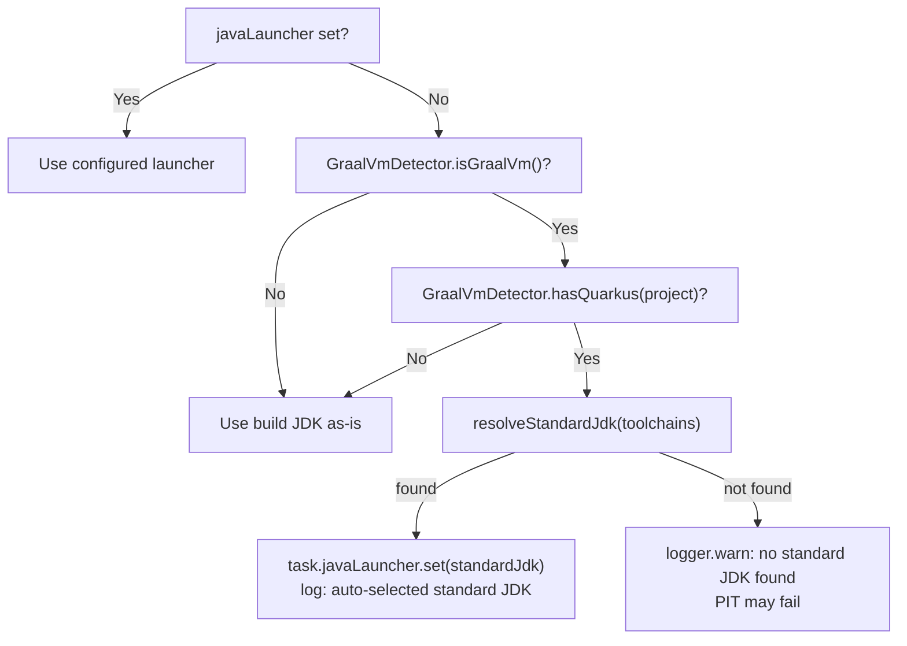

# Configuration DSL Reference


## Overview

All plugin options are declared in the `mutaktor` extension block inside your `build.gradle.kts` (or `build.gradle`). Every property is backed by the Gradle Provider API, which means values are resolved lazily at task-execution time rather than at configuration time. This makes the plugin fully compatible with Gradle's configuration cache and isolated projects mode.

---

## Quick Start

### Kotlin DSL

```kotlin
// build.gradle.kts
plugins {
    kotlin("jvm") version "2.3.0"
    id("io.github.dantte-lp.mutaktor") version "0.2.0"
}

mutaktor {
    targetClasses = setOf("com.example.*")
    mutationScoreThreshold = 80          // fail build below 80%
    since = "main"                       // git-diff scoped analysis
    kotlinFilters = true                 // filter Kotlin compiler noise
    jsonReport = true                    // mutation-testing-elements JSON
    sarifReport = true                   // SARIF for GitHub Code Scanning
}
```

### Groovy DSL

```groovy
// build.gradle
plugins {
    id 'org.jetbrains.kotlin.jvm' version '2.3.0'
    id 'io.github.dantte-lp.mutaktor' version '0.2.0'
}

mutaktor {
    targetClasses = ['com.example.*'] as Set
    mutationScoreThreshold = 80
    since = 'main'
    kotlinFilters = true
    jsonReport = true
    sarifReport = true
}
```

---

## Property Reference

### Core

Control which classes are mutated, how many threads are used, and which version of PIT is resolved.

| Property | Type | Default | Description |
|----------|------|---------|-------------|
| `pitVersion` | `Property<String>` | `"1.23.0"` | PIT version resolved from Maven Central |
| `targetClasses` | `SetProperty<String>` | `setOf("$group.*")` | Glob patterns selecting classes to mutate; **required** |
| `targetTests` | `SetProperty<String>` | _(PIT auto-detect)_ | Glob patterns selecting test classes to run |
| `threads` | `Property<Int>` | `availableProcessors()` | Number of parallel mutation analysis threads |
| `mutators` | `SetProperty<String>` | `setOf("DEFAULTS")` | Mutator groups or individual mutator names |
| `timeoutFactor` | `Property<BigDecimal>` | `1.25` | Multiplier applied to normal test execution time for per-mutant timeout |
| `timeoutConstant` | `Property<Int>` | `4000` | Constant milliseconds added to the computed per-mutant timeout |

> **Warning:** `targetClasses` must be non-empty. If neither `targetClasses` nor `project.group` is set, the `mutate` task will throw a `GradleException` immediately on execution:
> ```
> Mutaktor: targetClasses is empty. Set mutaktor.targetClasses or project.group.
> ```

#### Mutator Groups

| Group | Description |
|-------|-------------|
| `DEFAULTS` | Standard mutation operators — the baseline for most projects |
| `STRONGER` | More aggressive operators; produces more mutants, may increase analysis time |
| `ALL` | Every available mutator; use only on small codebases |

Individual mutators can be mixed with groups:

```kotlin
mutaktor {
    mutators = setOf("DEFAULTS", "UOI", "AOR")
}
```

```groovy
mutaktor {
    mutators = ['DEFAULTS', 'UOI', 'AOR'] as Set
}
```

---

### Filtering

Exclude generated code, framework boilerplate, and infrastructure classes that are not meaningful targets for mutation testing.

| Property | Type | Default | Description |
|----------|------|---------|-------------|
| `excludedClasses` | `SetProperty<String>` | _(empty)_ | Glob patterns for classes excluded from mutation |
| `excludedMethods` | `SetProperty<String>` | _(empty)_ | Method-name patterns excluded from mutation; supports simple wildcards |
| `excludedTestClasses` | `SetProperty<String>` | _(empty)_ | Glob patterns for test classes excluded from test execution |
| `avoidCallsTo` | `SetProperty<String>` | _(empty)_ | FQN package prefixes whose method calls are replaced with NO-OPs (e.g. logging) |

```kotlin
// Kotlin DSL
mutaktor {
    excludedClasses = setOf(
        "com.example.generated.*",
        "com.example.config.*",
        "*\$Companion",
    )
    excludedMethods = setOf("toString", "hashCode", "equals")
    avoidCallsTo = setOf(
        "kotlin.jvm.internal",
        "org.slf4j",
        "org.apache.logging",
    )
}
```

```groovy
// Groovy DSL
mutaktor {
    excludedClasses = ['com.example.generated.*', 'com.example.config.*'] as Set
    excludedMethods = ['toString', 'hashCode', 'equals'] as Set
    avoidCallsTo = ['kotlin.jvm.internal', 'org.slf4j'] as Set
}
```

---

### Reporting

| Property | Type | Default | Description |
|----------|------|---------|-------------|
| `reportDir` | `DirectoryProperty` | `build/reports/mutaktor` | Directory where PIT writes its output |
| `outputFormats` | `SetProperty<String>` | `setOf("HTML", "XML")` | PIT output formats to generate; `XML` is required for post-processing |
| `timestampedReports` | `Property<Boolean>` | `false` | When `true`, PIT creates a timestamped sub-directory per run |
| `jsonReport` | `Property<Boolean>` | `true` | When `true`, produces `mutations.json` (mutation-testing-elements schema v2) |
| `sarifReport` | `Property<Boolean>` | `false` | When `true`, produces `mutations.sarif.json` (SARIF 2.1.0) |
| `mutationScoreThreshold` | `Property<Int>` | _(not set)_ | Minimum required mutation score (0–100); build fails if score is below this value |

> **Note:** `jsonReport` defaults to `true` in v0.2.0 — the mutation-testing-elements JSON file is generated automatically after every successful PIT run unless you explicitly set `jsonReport = false`.

> **Note:** `sarifReport = false` by default to avoid generating SARIF files in every local developer build. Enable it in CI where you upload to GitHub Code Scanning.

#### Output Formats (PIT native)

| Value | Description |
|-------|-------------|
| `HTML` | Interactive HTML report with line-level mutation highlighting |
| `XML` | `mutations.xml` machine-readable report; **required** for `jsonReport` and `sarifReport` |
| `CSV` | Tab-separated summary file |

#### mutationScoreThreshold

```kotlin
// Kotlin DSL
mutaktor {
    mutationScoreThreshold = 80   // fail build if score < 80%
}
```

```groovy
// Groovy DSL
mutaktor {
    mutationScoreThreshold = 80
}
```

When `mutationScoreThreshold` is set, `MutaktorTask` calls `QualityGate.evaluate()` after PIT completes and throws `GradleException` if the score is below the threshold:

```
Mutaktor: quality gate FAILED — mutation score 72% is below threshold 80%
```

If `totalMutations == 0` (nothing was mutated, e.g. all changed classes were excluded), the score is treated as `100` and the gate passes.

---

### Test Configuration

| Property | Type | Default | Description |
|----------|------|---------|-------------|
| `junit5PluginVersion` | `Property<String>` | `"1.2.3"` | Version of `org.pitest:pitest-junit5-plugin` |
| `includedGroups` | `SetProperty<String>` | _(empty)_ | JUnit 5 tag expressions for tests to include |
| `excludedGroups` | `SetProperty<String>` | _(empty)_ | JUnit 5 tag expressions for tests to exclude |
| `fullMutationMatrix` | `Property<Boolean>` | `false` | When `true`, every mutant is tested against every test without early exit |

```kotlin
// Kotlin DSL
mutaktor {
    junit5PluginVersion = "1.2.3"
    includedGroups = setOf("unit", "integration")
    excludedGroups = setOf("slow", "e2e")
    fullMutationMatrix = false
}
```

> **Warning:** `fullMutationMatrix = true` significantly increases run time. It should only be used when you need to identify exactly which tests kill which mutants for coverage analysis purposes.

---

### Advanced / JVM

| Property | Type | Default | Description |
|----------|------|---------|-------------|
| `jvmArgs` | `ListProperty<String>` | _(empty)_ | Extra JVM arguments passed to the **forked** child test processes |
| `mainProcessJvmArgs` | `ListProperty<String>` | _(empty)_ | Extra JVM arguments passed to the **main** PIT analysis process |
| `pluginConfiguration` | `MapProperty<String, String>` | _(empty)_ | Key-value pairs forwarded to PIT plugins via `--pluginConfiguration` |
| `features` | `ListProperty<String>` | _(empty)_ | PIT feature flags to enable (`+flagName`) or disable (`-flagName`) |
| `verbose` | `Property<Boolean>` | `false` | Enable verbose PIT console output |
| `useClasspathFile` | `Property<Boolean>` | `true` | Write classpath to `build/mutaktor/pitClasspath` and pass via `--classPathFile` |

```kotlin
// Kotlin DSL
mutaktor {
    jvmArgs = listOf(
        "--add-opens=java.base/java.lang=ALL-UNNAMED",
        "-Xmx2g",
    )
    features = listOf("+auto_threads", "-FLOGIC")
    pluginConfiguration = mapOf(
        "ARCMUTATE_ENGINE.limit" to "100",
    )
    verbose = false
    useClasspathFile = true
}
```

```groovy
// Groovy DSL
mutaktor {
    jvmArgs = ['--add-opens=java.base/java.lang=ALL-UNNAMED', '-Xmx2g']
    features = ['+auto_threads', '-FLOGIC']
    pluginConfiguration = ['ARCMUTATE_ENGINE.limit': '100']
}
```

---

### javaLauncher

The `javaLauncher` property controls which JDK is used for the PIT child process (the minion JVM that runs your tests under mutation). This is distinct from the Gradle build JVM.

| Property | Type | Default | Description |
|----------|------|---------|-------------|
| `javaLauncher` | `Property<JavaLauncher>` | _(build JDK)_ | Java launcher for the PIT child process via Gradle Toolchain API |

#### When to use javaLauncher

The most important use case is building with GraalVM. GraalVM uses `jrt://` module URL schemes in its classpath, which cause PIT minion JVM failures. Set `javaLauncher` to a standard HotSpot JDK:

```kotlin
// Kotlin DSL — explicit toolchain selection
mutaktor {
    javaLauncher.set(
        javaToolchains.launcherFor {
            languageVersion.set(JavaLanguageVersion.of(21))
            vendor.set(JvmVendorSpec.AZUL)
        }
    )
}
```

```groovy
// Groovy DSL
mutaktor {
    javaLauncher.set(
        javaToolchains.launcherFor {
            languageVersion = JavaLanguageVersion.of(21)
            vendor = JvmVendorSpec.AZUL
        }
    )
}
```

#### GraalVM Auto-Detection

When `javaLauncher` is **not** explicitly set, `MutaktorPlugin` automatically checks whether the current build JDK is GraalVM and whether the project uses Quarkus. If both conditions are true, `GraalVmDetector` attempts to resolve a standard JDK via `JavaToolchainService` (trying Azul, Adoptium, and Amazon vendors in order):



> **Tip:** To ensure GraalVM auto-detection can download JDKs on demand, add the foojay toolchain resolver to `settings.gradle.kts`:
> ```kotlin
> plugins {
>     id("org.gradle.toolchains.foojay-resolver-convention") version "0.9.0"
> }
> ```

---

### Git-Aware Analysis

| Property | Type | Default | Description |
|----------|------|---------|-------------|
| `since` | `Property<String>` | _(not set)_ | Git ref to diff against. When set, only classes changed since this ref are mutated. |

The `since` property accepts any git ref:

| Value | Meaning |
|-------|---------|
| `"main"` | All commits on the current branch not yet merged into `main` |
| `"develop"` | All commits not yet merged into `develop` |
| `"HEAD~5"` | The last 5 commits on the current branch |
| `"v1.2.3"` | All commits since the `v1.2.3` tag |
| `"a1b2c3d"` | All commits since a specific commit SHA |

```kotlin
// Kotlin DSL — read from CI environment
mutaktor {
    since = providers.environmentVariable("MUTATION_SINCE").orNull
    targetClasses = setOf("com.example.*")  // fallback when since is not set
}
```

See [Git-Diff Scoped Analysis](./04-git-integration.md) for full details.

---

### Kotlin Junk Mutation Filter

| Property | Type | Default | Description |
|----------|------|---------|-------------|
| `kotlinFilters` | `Property<Boolean>` | `true` | Enable the `KotlinJunkFilter` that suppresses mutations in Kotlin compiler-generated bytecode |

When enabled, the `mutaktor-pitest-filter` JAR is added to the PIT classpath. The filter covers 5 patterns: null-check intrinsics, data-class generated methods, coroutine state machines, `$DefaultImpls` bridge classes, and `when`-expression hashcode dispatch.

```kotlin
mutaktor {
    kotlinFilters = true   // default; suppress data-class, coroutine, null-check noise
}
```

See [Kotlin Junk Mutation Filter](./03-kotlin-filters.md) for details on all 5 patterns.

---

### Extreme Mutation Mode

| Property | Type | Default | Description |
|----------|------|---------|-------------|
| `extreme` | `Property<Boolean>` | `false` | Replace fine-grained mutators with method-body removal operators (~1 mutant per method vs ~10) |

When `extreme = true`, the `mutators` property is overridden with these 6 method-body removal operators:

| Mutator | Effect |
|---------|--------|
| `VOID_METHOD_CALLS` | Removes calls to void methods |
| `EMPTY_RETURNS` | Replaces object returns with empty/default values |
| `FALSE_RETURNS` | Replaces boolean returns with `false` |
| `TRUE_RETURNS` | Replaces boolean returns with `true` |
| `NULL_RETURNS` | Replaces object returns with `null` |
| `PRIMITIVE_RETURNS` | Replaces primitive returns with `0` |

```kotlin
mutaktor {
    extreme = true   // overrides mutators; any mutators = setOf(...) is ignored
}
```

> **Tip:** Extreme mode is practical for large codebases where full mutation testing would take hours. It detects pseudo-tested methods — methods that are called by tests but whose logic is never actually verified.

---

### Per-Package Ratchet

The ratchet prevents mutation score regression. On each run, per-package scores are compared against a stored baseline. If any package drops below its baseline score, the build fails.

| Property | Type | Default | Description |
|----------|------|---------|-------------|
| `ratchetEnabled` | `Property<Boolean>` | `false` | Enable per-package mutation score ratchet |
| `ratchetBaseline` | `RegularFileProperty` | `.mutaktor-baseline.json` | Baseline file for ratchet comparison |
| `ratchetAutoUpdate` | `Property<Boolean>` | `true` | Auto-update baseline when scores improve |

```kotlin
// Kotlin DSL
mutaktor {
    ratchetEnabled = true
    ratchetBaseline = layout.projectDirectory.file(".mutaktor-baseline.json")
    ratchetAutoUpdate = true   // auto-update when scores improve
}
```

```groovy
// Groovy DSL
mutaktor {
    ratchetEnabled = true
    ratchetAutoUpdate = true
}
```

When a regression is detected:

```
Mutaktor: ratchet FAILED — mutation score regression detected:
  com.example.service: 85% → 72%
  com.example.domain: 90% → 87%
```

> **Tip:** Commit `.mutaktor-baseline.json` to your repository. When `ratchetAutoUpdate = true`, the baseline file is automatically updated whenever any package improves, so only regressions fail the build.

See [Report Formats and Quality Gate](./05-reporting.md#per-package-ratchet) for implementation details.

---

### Incremental Analysis

| Property | Type | Default | Description |
|----------|------|---------|-------------|
| `historyInputLocation` | `RegularFileProperty` | _(not set)_ | File to read previous mutation analysis state from |
| `historyOutputLocation` | `RegularFileProperty` | _(not set)_ | File to write mutation analysis state to after a run |

```kotlin
// Kotlin DSL
mutaktor {
    val historyFile = layout.projectDirectory.file(".mutation-history")
    historyInputLocation = historyFile
    historyOutputLocation = historyFile
}
```

PIT re-uses previous results for mutants whose surrounding code has not changed, significantly reducing run time on repeated builds. See [CI/CD: Caching and Incremental Analysis](./07-ci-cd.md#caching-and-incremental-analysis) for how to persist the history file across GitHub Actions runs.

---

## Annotations Module

The `mutaktor-annotations` module provides source-level annotations for fine-grained control over mutation testing. The JAR has no dependencies and can be added to any module without pulling in Gradle API.

### Adding the Dependency

```kotlin
// build.gradle.kts
dependencies {
    implementation("io.github.dantte-lp.mutaktor:mutaktor-annotations:0.2.0")
}
```

```groovy
// build.gradle
dependencies {
    implementation 'io.github.dantte-lp.mutaktor:mutaktor-annotations:0.2.0'
}
```

### @MutationCritical

Marks code that must achieve a 100% mutation score. The build fails if any mutant survives in annotated code.

```kotlin
import io.github.dantte_lp.mutaktor.annotations.MutationCritical

@MutationCritical(reason = "Core authentication logic — all mutations must be killed")
class AuthService {
    fun authenticate(token: String): Boolean {
        // Every mutation here must be caught by tests
    }
}

@MutationCritical
fun computeHash(input: String): String {
    // Method-level annotation
}
```

### @SuppressMutations

Excludes a class or method from mutation analysis entirely. Use sparingly and always document the reason.

```kotlin
import io.github.dantte_lp.mutaktor.annotations.SuppressMutations

@SuppressMutations(reason = "Adapter for legacy API — logic is integration-tested externally")
class LegacyApiAdapter {
    // Not mutated
}

@SuppressMutations(reason = "Formatting only — no business logic")
fun formatDisplayName(first: String, last: String): String = "$last, $first"
```

| Annotation | Target | `reason` | Effect |
|------------|--------|----------|--------|
| `@MutationCritical` | CLASS, FUNCTION, CONSTRUCTOR | optional | Build fails if any mutant survives |
| `@SuppressMutations` | CLASS, FUNCTION, CONSTRUCTOR | required | Code is excluded from analysis |

> **Warning:** `@SuppressMutations` requires a `reason` parameter by design. This is a deliberate API choice to discourage casual suppression — every suppression must be justified and visible in code review.

---

## Complete Configuration Example

### Kotlin DSL — Full

```kotlin
// build.gradle.kts
plugins {
    kotlin("jvm") version "2.3.0"
    id("io.github.dantte-lp.mutaktor") version "0.2.0"
}

mutaktor {
    // Core
    pitVersion = "1.23.0"
    targetClasses = setOf("com.example.*")
    threads = Runtime.getRuntime().availableProcessors()
    mutators = setOf("DEFAULTS")
    timeoutFactor = java.math.BigDecimal("1.25")
    timeoutConstant = 4000

    // Filtering
    excludedClasses = setOf("com.example.generated.*")
    excludedMethods = setOf("toString", "hashCode", "equals")
    avoidCallsTo = setOf("kotlin.jvm.internal", "org.slf4j")

    // Reporting
    outputFormats = setOf("HTML", "XML")
    timestampedReports = false
    jsonReport = true
    sarifReport = true
    mutationScoreThreshold = 80

    // Test
    junit5PluginVersion = "1.2.3"
    includedGroups = setOf("unit")
    excludedGroups = setOf("slow", "e2e")

    // Advanced
    jvmArgs = listOf("-Xmx2g")
    useClasspathFile = true
    verbose = false

    // Git-aware analysis
    since = providers.environmentVariable("MUTATION_SINCE").orNull

    // Kotlin filter
    kotlinFilters = true

    // Ratchet
    ratchetEnabled = true
    ratchetBaseline = layout.projectDirectory.file(".mutaktor-baseline.json")
    ratchetAutoUpdate = true

    // Incremental
    val historyFile = layout.projectDirectory.file(".mutation-history")
    historyInputLocation = historyFile
    historyOutputLocation = historyFile
}
```

### Groovy DSL — Full

```groovy
// build.gradle
plugins {
    id 'org.jetbrains.kotlin.jvm' version '2.3.0'
    id 'io.github.dantte-lp.mutaktor' version '0.2.0'
}

mutaktor {
    pitVersion = '1.23.0'
    targetClasses = ['com.example.*'] as Set
    threads = Runtime.runtime.availableProcessors()
    mutators = ['DEFAULTS'] as Set
    timeoutFactor = 1.25
    timeoutConstant = 4000

    excludedClasses = ['com.example.generated.*'] as Set
    excludedMethods = ['toString', 'hashCode', 'equals'] as Set
    avoidCallsTo = ['kotlin.jvm.internal', 'org.slf4j'] as Set

    outputFormats = ['HTML', 'XML'] as Set
    timestampedReports = false
    jsonReport = true
    sarifReport = true
    mutationScoreThreshold = 80

    junit5PluginVersion = '1.2.3'

    jvmArgs = ['-Xmx2g']
    useClasspathFile = true
    verbose = false

    since = System.getenv('MUTATION_SINCE')
    kotlinFilters = true

    ratchetEnabled = true
    ratchetAutoUpdate = true
}
```

---

## Complete Defaults Table

| Property | Default Value |
|----------|---------------|
| `pitVersion` | `"1.23.0"` |
| `targetClasses` | `setOf("$project.group.*")` |
| `targetTests` | PIT auto-detect from `targetClasses` |
| `threads` | `Runtime.getRuntime().availableProcessors()` |
| `mutators` | `setOf("DEFAULTS")` |
| `timeoutFactor` | `BigDecimal("1.25")` |
| `timeoutConstant` | `4000` |
| `excludedClasses` | _(empty)_ |
| `excludedMethods` | _(empty)_ |
| `excludedTestClasses` | _(empty)_ |
| `avoidCallsTo` | _(empty)_ |
| `reportDir` | `build/reports/mutaktor` |
| `outputFormats` | `setOf("HTML", "XML")` |
| `timestampedReports` | `false` |
| `jsonReport` | `true` |
| `sarifReport` | `false` |
| `mutationScoreThreshold` | _(not set — no gate)_ |
| `junit5PluginVersion` | `"1.2.3"` |
| `includedGroups` | _(empty)_ |
| `excludedGroups` | _(empty)_ |
| `fullMutationMatrix` | `false` |
| `jvmArgs` | _(empty)_ |
| `mainProcessJvmArgs` | _(empty)_ |
| `pluginConfiguration` | _(empty)_ |
| `features` | _(empty)_ |
| `verbose` | `false` |
| `useClasspathFile` | `true` |
| `javaLauncher` | _(build JDK, or auto-selected for GraalVM)_ |
| `since` | _(not set)_ |
| `kotlinFilters` | `true` |
| `extreme` | `false` |
| `ratchetEnabled` | `false` |
| `ratchetBaseline` | `.mutaktor-baseline.json` |
| `ratchetAutoUpdate` | `true` |
| `historyInputLocation` | _(not set)_ |
| `historyOutputLocation` | _(not set)_ |

---

## See Also

- [Plugin Architecture](./01-architecture.md)
- [Kotlin Junk Mutation Filter](./03-kotlin-filters.md)
- [Git-Diff Scoped Analysis](./04-git-integration.md)
- [Report Formats and Quality Gate](./05-reporting.md)
