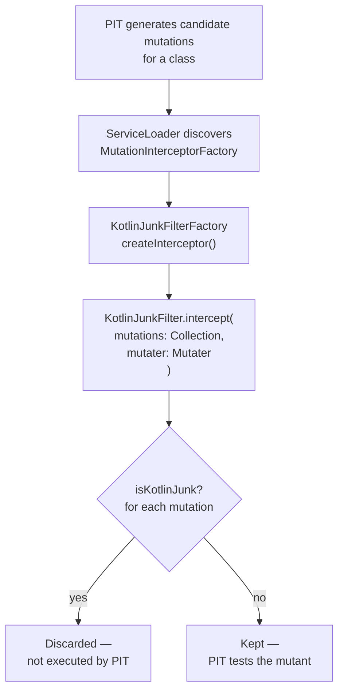

# Kotlin Junk Mutation Filter


## Overview

The Kotlin compiler generates a significant amount of bytecode that has no direct equivalent in your source code: null-check intrinsics, data-class method implementations, coroutine state machines, interface default-implementation bridge classes, and `when`-expression dispatch tables. PIT instruments compiled bytecode directly and is not Kotlin-aware, so it produces large numbers of mutations in this generated code.

These mutations are almost always **unkillable**: no test you can reasonably write will ever kill a mutation in `Intrinsics.checkNotNullParameter`, a `copy$default` bridge, or a `$Continuation.invokeSuspend` dispatch table. They inflate the total mutation count, reduce the reported mutation score, and waste CPU time on analysis runs.

The `KotlinJunkFilter` is a PIT `MutationInterceptor` that identifies and discards these mutations **before** PIT attempts to create and run the corresponding mutants — eliminating the CPU cost entirely.

---

## How the PIT MutationInterceptor SPI Works

PIT's interceptor pipeline runs between mutation generation and mutant execution. Interceptors of type `FILTER` remove mutations from the set that PIT will actually test.



The factory is discovered through the standard Java `ServiceLoader` mechanism. The filter JAR ships a `META-INF/services/org.pitest.mutationtest.build.MutationInterceptorFactory` entry pointing to `KotlinJunkFilterFactory`.

The factory registers the feature as `KOTLIN_JUNK` with `withOnByDefault(true)`. This means the filter is active whenever the JAR is on the PIT classpath — no additional PIT feature flag is needed.

### MutationInterceptor Interface

| Method | Description |
|--------|-------------|
| `type()` | Returns `InterceptorType.FILTER` — mutations not returned by `intercept` are removed from the pipeline |
| `begin(ClassTree)` | Called once per class before mutations are processed; `KotlinJunkFilter` keeps no per-class state |
| `intercept(Collection<MutationDetails>, Mutater)` | The filtering entry point; returns only the mutations that should be kept |
| `end()` | Called after all mutations for a class have been processed |

---

## The 5 Filter Patterns

### Pattern 1: Kotlin Null-Check Intrinsics

**What is filtered:** Mutations whose description references `kotlin/jvm/internal/Intrinsics` null-checking methods.

**Bytecode origin:** Every non-null Kotlin parameter generates a call to `Intrinsics.checkNotNullParameter` at the top of the function body. The Kotlin compiler emits this as a regular method call in the bytecode.

**Why it is junk:** PIT can mutate the null-check itself (e.g. by removing the call). The resulting mutant would only be killed by a test that passes `null` for a non-null parameter — which is a compile-time error in Kotlin. No such test can exist in a correctly typed codebase.

**Detection heuristic:** The mutation description contains any of: `Intrinsics`, `checkNotNull`, `checkParameterIsNotNull`, `checkNotNullParameter`, `checkNotNullExpressionValue`.

```kotlin
// Source code (Kotlin)
fun process(name: String): String {
    return name.uppercase()
}

// Bytecode equivalent (what PIT sees)
public static String process(String name) {
    Intrinsics.checkNotNullParameter(name, "name");  // <-- mutation here is filtered
    return name.toUpperCase();                        // <-- mutation here is kept
}
```

---

### Pattern 2: Data-Class Generated Methods

**What is filtered:** Mutations inside `copy`, `copy$default`, `component1` through `componentN`, `toString`, `hashCode`, and `equals` methods.

**Bytecode origin:** Kotlin `data class` declarations automatically generate these methods based on the primary constructor properties.

**Why it is junk:** These methods are purely mechanical implementations of a standard contract. Testing that `data class User(val name: String)` correctly copies `name` in its generated `copy()` adds no value — the logic is trivially correct by construction.

**Detection heuristic:** The mutation's method name matches the regex `^(copy|copy\$default|component\d+|toString|hashCode|equals)$`.

```kotlin
// Source code
data class User(val id: Long, val name: String, val email: String)

// Compiler generates: copy(), copy$default(), component1(), component2(), component3(),
// toString(), hashCode(), equals() — all mutations in these methods are filtered.
// Any non-generated method added to User is still mutated normally.
```

| Method | Filtered? | Reason |
|--------|-----------|--------|
| `copy()` | Yes | Pattern 2 — compiler-generated `data class` method |
| `component1()` | Yes | Pattern 2 — destructuring component accessor |
| `hashCode()` | Yes | Pattern 2 — compiler-generated contract method |
| `validate()` (user-written) | No | Not generated; normal mutation applies |

---

### Pattern 3: Coroutine State-Machine Dispatch

**What is filtered:** Mutations in `invokeSuspend` methods inside compiler-generated continuation classes (class names containing `$`).

**Bytecode origin:** Every `suspend` function is compiled into a state machine. The Kotlin compiler creates an anonymous inner class (e.g. `MyService$fetchUser$1`) that implements `Continuation<T>`. The `invokeSuspend` method contains the state dispatch table — a large `when` block switching on the coroutine's resume point.

**Why it is junk:** The state machine structure is an implementation detail of the coroutine runtime. Mutations in the dispatch table cannot be killed by business-logic tests; they would require tests that specifically probe internal coroutine state, which is neither practical nor desirable.

**Detection heuristic:** Method name is `invokeSuspend` AND the class name contains `$`.

```kotlin
// Source code
suspend fun fetchUser(id: Long): User {
    val data = repository.load(id)   // suspension point
    return User(data)
}

// Compiler generates approximately:
// class MyService$fetchUser$1 : Continuation<Any?> {
//     var label = 0
//     override fun invokeSuspend(result: Any?): Any? {
//         when (label) {     // <-- all mutations in here are filtered
//             0 -> { ... }
//             1 -> { ... }
//         }
//     }
// }
```

---

### Pattern 4: DefaultImpls Bridge Classes

**What is filtered:** All mutations in classes whose fully-qualified name ends with `$DefaultImpls`.

**Bytecode origin:** When a Kotlin interface declares a method with a default body, the Kotlin compiler generates a static inner class `InterfaceName$DefaultImpls` that holds the actual implementation. JVM classes implementing the interface delegate to `DefaultImpls` unless they override the method.

**Why it is junk:** `$DefaultImpls` is a JVM compatibility shim for Java 8 bytecode compatibility. The actual business logic is in the interface declaration as seen in the Kotlin source. Testing mutations in the bridge class duplicates effort and produces unkillable mutants.

**Detection heuristic:** `mutation.className.asJavaName().endsWith("\$DefaultImpls")`.

```kotlin
// Source code
interface Repository {
    fun findAll(): List<String> = emptyList()   // default body
}

// Compiler generates:
// class Repository$DefaultImpls {
//     static List findAll(Repository $this) { return CollectionsKt.emptyList(); }
// }
// All mutations inside Repository$DefaultImpls are filtered.
```

---

### Pattern 5: When-Expression Hashcode Dispatch

**What is filtered:** Mutations whose description mentions both `hashCode` and `equals` simultaneously.

**Bytecode origin:** Kotlin `when` expressions that switch on `String` values are compiled using `hashCode()` for bucket selection followed by `equals()` for disambiguation — identical to how Java switch-on-String works at the bytecode level.

**Why it is junk:** The hash dispatch is a compiler-generated pattern. A mutation that inverts the `equals` check in the switch dispatch — as opposed to in actual business logic — is unkillable by any normal test because the hash computation mechanism is not under test.

**Detection heuristic:** The mutation description contains both `hashCode` and `equals`.

```kotlin
// Source code
fun describe(status: String): String = when (status) {
    "active"   -> "User is active"
    "inactive" -> "User is inactive"
    else       -> "Unknown status"
}

// Compiled bytecode contains hashCode()+equals() dispatch logic.
// Mutations in the dispatch logic are filtered.
// Mutations in the string literal branches ("User is active") are kept.
```

---

## Filter Summary Table

| # | Pattern | Detection Predicate | Root Cause |
|---|---------|---------------------|------------|
| 1 | Null-check intrinsics | Description contains `Intrinsics` / `checkNotNull*` | `Intrinsics.checkNotNullParameter` on every non-null parameter |
| 2 | Data-class generated methods | Method name matches `copy`, `componentN`, `toString`, `hashCode`, `equals` | Compiler-generated `data class` implementations |
| 3 | Coroutine state machine | Method == `invokeSuspend` AND class name contains `$` | `suspend` function compiled to a continuation state machine |
| 4 | DefaultImpls bridge | Class name ends with `$DefaultImpls` | Interface default methods JVM compatibility bridge |
| 5 | When hashcode dispatch | Description contains both `hashCode` and `equals` | `when(String)` compiled to hash bucket + equality check |

---

## Filtered vs. Kept: Reference Examples

### Null-Check Mutations

| Mutation Description | Filtered? | Pattern |
|----------------------|-----------|---------|
| `removed call to kotlin/jvm/internal/Intrinsics.checkNotNullParameter` | Yes | 1 — unkillable null-check intrinsic |
| `replaced return value with null in String process(String)` | No | Normal mutation on user code |
| `negated conditional in String process(String)` | No | Normal mutation on user code |

### Data-Class Mutations

| Mutation Description | Filtered? | Pattern |
|----------------------|-----------|---------|
| `negated conditional in data class User.hashCode()` | Yes | 2 — compiler-generated method |
| `negated conditional in data class User.equals()` | Yes | 2 — compiler-generated method |
| `removed call in User.validate()` | No | User-written method, normal mutation |

### Coroutine Mutations

| Mutation Description | Filtered? | Pattern |
|----------------------|-----------|---------|
| `changed conditional boundary in MyService$fetchUser$1.invokeSuspend` | Yes | 3 — coroutine state machine |
| `changed conditional boundary in MyService.processData` | No | Business logic in a regular function |

---

## Disabling the Filter

### Disable entirely

Remove the filter JAR from the PIT classpath entirely:

```kotlin
// Kotlin DSL
mutaktor {
    kotlinFilters = false
}
```

### Disable at the PIT feature level

Keep the JAR on the classpath but disable the `KOTLIN_JUNK` interceptor (useful when you want to inspect what would otherwise be filtered):

```kotlin
// Kotlin DSL
mutaktor {
    features = listOf("-KOTLIN_JUNK")
}
```

```groovy
// Groovy DSL
mutaktor {
    features = ['-KOTLIN_JUNK']
}
```

---

## Impact on Mutation Score

Without the filter, Kotlin projects typically see 15–40% of their mutations fall in compiler-generated code — mutations that cannot be killed by any reasonable test. The `KotlinJunkFilter` removes these mutations before PIT runs them, which has two beneficial effects:

1. **Accurate mutation score**: The reported score reflects actual testable code coverage, not inflated by unkillable noise.
2. **Faster runs**: Filtered mutations are discarded before any child JVM is forked. CPU time scales with killable mutation count, not total bytecode mutation count.

---

## Adding a New Filter Pattern

See [Development Guide: Adding New Filter Patterns](./06-development.md#adding-new-filter-patterns) for step-by-step instructions on identifying new patterns in `mutations.xml`, adding a predicate to `KotlinJunkFilter`, writing unit tests, and updating this documentation.

---

## See Also

- [Plugin Architecture](./01-architecture.md)
- [Configuration DSL Reference](./02-configuration.md#kotlin-junk-mutation-filter)
- [Development Guide](./06-development.md#adding-new-filter-patterns)
- [PIT MutationInterceptor documentation](https://pitest.org/javadoc/)
