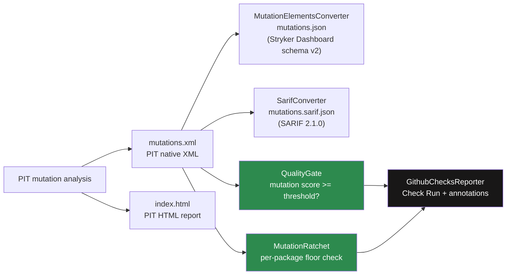
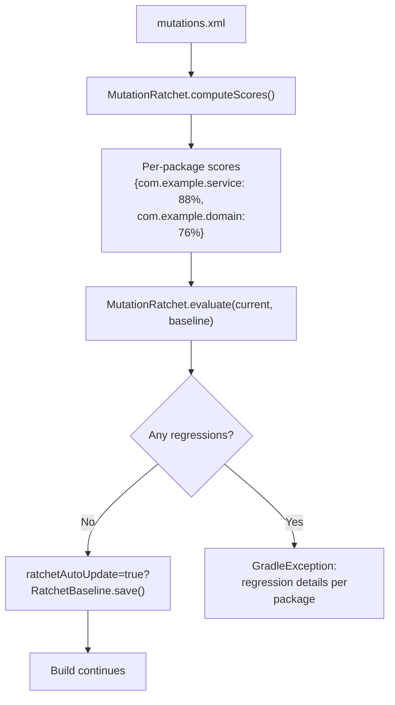
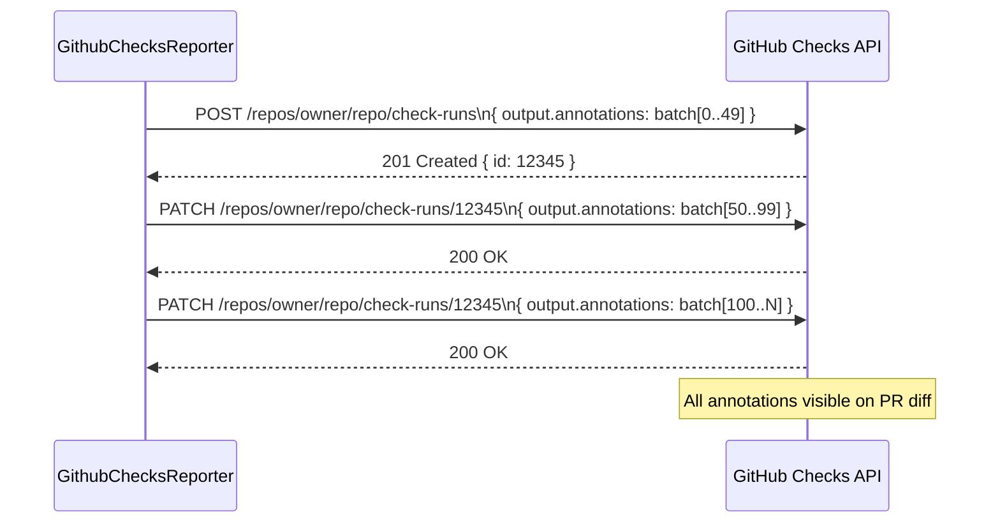

# Report Formats and Quality Gate


## Overview

After PIT finishes mutation analysis, Mutaktor runs a **post-processing pipeline** that produces multiple output formats from the native PIT XML and enforces configurable quality policies. Each component targets a different consumer: HTML for manual inspection, mutation-testing-elements JSON for the Stryker Dashboard, SARIF for GitHub Code Scanning, the quality gate for CI pass/fail, the ratchet for regression prevention, and GitHub Checks for inline PR annotations.



All post-processing steps run inside `MutaktorTask.postProcess()` immediately after PIT exits. Steps are guarded individually: a missing `mutations.xml` skips the entire pipeline with a warning; a `sarifReport = false` property skips only the SARIF step.

---

## Report Directory Structure

By default, all reports are written to `build/reports/mutaktor/`. After a full run:

```
build/reports/mutaktor/
├── index.html                          # PIT interactive HTML summary
├── mutations.xml                       # PIT machine-readable XML (required for pipeline)
├── mutations.json                      # mutation-testing-elements JSON (jsonReport=true)
├── mutations.sarif.json                # SARIF 2.1.0 (sarifReport=true)
└── com/
    └── example/
        └── UserService.java.html       # Per-class line-level HTML
```

Change the output directory:

```kotlin
mutaktor {
    reportDir = layout.buildDirectory.dir("reports/mutation")
}
```

---

## HTML Report (PIT Native)

The HTML report is generated directly by PIT. It requires no post-processing by Mutaktor. Enable it by including `"HTML"` in `outputFormats` (the default).

### What the HTML Report Contains

- A summary page (`index.html`) showing package-level mutation scores with color-coded badges
- Per-class pages showing source code lines annotated with mutation status:
  - Green: all mutations on this line were killed
  - Red: one or more mutations on this line survived
  - Grey: line was not mutated
- Drill-down to individual mutation descriptions and killing test names

### Opening Locally

```bash
./gradlew mutate
open build/reports/mutaktor/index.html          # macOS
xdg-open build/reports/mutaktor/index.html      # Linux
start build\reports\mutaktor\index.html         # Windows
```

---

## Mutation-Testing-Elements JSON

`MutationElementsConverter` parses `mutations.xml` and produces `mutations.json` conforming to the [mutation-testing-elements schema version 2](https://github.com/stryker-mutator/mutation-testing-elements/tree/master/packages/report-schema). This format is consumed by the [Stryker Dashboard](https://dashboard.stryker-mutator.io/).

Enable with `jsonReport = true` (default in v0.2.0).

### JSON Structure

```json
{
  "schemaVersion": "2",
  "thresholds": { "high": 80, "low": 60 },
  "projectRoot": ".",
  "files": {
    "src/main/kotlin/com/example/UserService.kt": {
      "language": "kotlin",
      "source": "package com.example;\n...",
      "mutants": [
        {
          "id": "1001",
          "mutatorName": "ConditionalsBoundaryMutator",
          "replacement": "changed conditional boundary",
          "location": {
            "start": { "line": 42, "column": 1 },
            "end":   { "line": 42, "column": 100 }
          },
          "status": "Killed",
          "killedBy": ["shouldRejectNegativeAge"]
        },
        {
          "id": "1002",
          "mutatorName": "NegateConditionalsMutator",
          "replacement": "negated conditional",
          "location": {
            "start": { "line": 58, "column": 1 },
            "end":   { "line": 58, "column": 100 }
          },
          "status": "Survived",
          "killedBy": []
        }
      ]
    }
  }
}
```

### PIT Status to Stryker Status Mapping

| PIT Status | Stryker Status |
|------------|----------------|
| `KILLED` | `Killed` |
| `SURVIVED` | `Survived` |
| `NO_COVERAGE` | `NoCoverage` |
| `TIMED_OUT` | `Timeout` |
| `MEMORY_ERROR` | `RuntimeError` |
| `RUN_ERROR` | `RuntimeError` |

---

## SARIF 2.1.0 (GitHub Code Scanning)

`SarifConverter` parses `mutations.xml` and produces `mutations.sarif.json` in [SARIF 2.1.0](https://docs.oasis-open.org/sarif/sarif/v2.1.0/sarif-v2.1.0.html) format. Only **survived** mutations are emitted as results — killed mutations indicate correct test coverage and do not warrant developer attention.

Enable with `sarifReport = true` (defaults to `false`).

Upload the SARIF file to GitHub's Code Scanning API to surface survived mutations as annotations directly on pull request diffs, persisted across runs in the Security tab.

### SARIF Output Structure

```json
{
  "$schema": "https://raw.githubusercontent.com/oasis-tcs/sarif-spec/main/sarif-2.1/schema/sarif-schema-2.1.0.json",
  "version": "2.1.0",
  "runs": [{
    "tool": {
      "driver": {
        "name": "Mutaktor (PIT)",
        "version": "1.23.0",
        "informationUri": "https://github.com/dantte-lp/mutaktor"
      }
    },
    "results": [
      {
        "ruleId": "mutation/survived",
        "level": "warning",
        "message": {
          "text": "Survived mutation: negated conditional"
        },
        "locations": [{
          "physicalLocation": {
            "artifactLocation": {
              "uri": "src/main/kotlin/com/example/UserService.kt"
            },
            "region": { "startLine": 58 }
          }
        }]
      }
    ]
  }]
}
```

### SARIF Field Mapping

| SARIF field | Value |
|-------------|-------|
| `ruleId` | `mutation/survived` |
| `level` | `warning` |
| `message.text` | `Survived mutation: <PIT description>` |
| `artifactLocation.uri` | Relative source file path |
| `region.startLine` | Line number from PIT XML |
| `driver.name` | `Mutaktor (PIT)` |
| `driver.version` | PIT version (e.g. `1.23.0`) |

### Upload to GitHub Code Scanning

```yaml
# .github/workflows/mutation.yml
- name: Run mutation tests
  run: ./gradlew mutate --no-daemon

- name: Upload SARIF to GitHub Code Scanning
  uses: github/codeql-action/upload-sarif@v3
  if: always()    # upload even when quality gate fails
  with:
    sarif_file: build/reports/mutaktor/mutations.sarif.json
    category: mutation-testing
```

---

## Quality Gate

`QualityGate` reads `mutations.xml`, counts mutations by status, and computes the mutation score:

```
score = killedMutations × 100 / totalMutations
```

When `mutationScoreThreshold` is set in the DSL, `MutaktorTask` calls `QualityGate.evaluate()` and throws `GradleException` if the score is below the threshold.

If `totalMutations == 0` (nothing was mutated — e.g. only excluded classes changed), the score is treated as `100` and the gate passes.

### QualityGate.Result

```kotlin
data class Result(
    val totalMutations: Int,
    val killedMutations: Int,
    val survivedMutations: Int,
    val mutationScore: Int,    // 0–100 integer percentage
    val passed: Boolean,
    val threshold: Int,
)
```

### Score Calculation Examples

| Total | Killed | Score | Threshold | Passed? |
|-------|--------|-------|-----------|---------|
| 100 | 85 | 85% | 80% | Yes |
| 100 | 75 | 75% | 80% | No |
| 0 | 0 | 100% | 80% | Yes (no mutations) |
| 50 | 40 | 80% | 80% | Yes (exactly at threshold) |
| 50 | 39 | 78% | 80% | No |

### Configuration

```kotlin
// Kotlin DSL
mutaktor {
    mutationScoreThreshold = 80   // 0–100
}
```

```groovy
// Groovy DSL
mutaktor {
    mutationScoreThreshold = 80
}
```

When the gate fails:

```
Mutaktor: quality gate FAILED — mutation score 72% is below threshold 80%
```

---

## Per-Package Ratchet

The ratchet prevents mutation score regression on a per-package basis. On each run, `MutationRatchet` computes per-package scores from `mutations.xml` and compares them against a stored JSON baseline. If any package drops below its previously recorded score, the build fails.

### How It Works



### Baseline File

The baseline is stored as JSON in `.mutaktor-baseline.json` (or the path configured via `ratchetBaseline`):

```json
{
  "com.example.service": { "packageName": "com.example.service", "score": 88, "total": 52, "killed": 46 },
  "com.example.domain": { "packageName": "com.example.domain", "score": 76, "total": 25, "killed": 19 }
}
```

> **Tip:** Commit `.mutaktor-baseline.json` to your repository so the ratchet baseline is shared across developers and CI runs. The file is small (a few KB) and changes only when package scores improve.

### Regression Output

```
Mutaktor: ratchet FAILED — mutation score regression detected:
  com.example.service: 88% → 72%
  com.example.domain: 76% → 68%
```

### Auto-Update Behavior

When `ratchetAutoUpdate = true` (the default), the baseline is automatically updated after a passing run to capture any score improvements. This means the ratchet is a **floor**, not a ceiling: scores can only go up.

```
Before:  com.example.service: 85%
After:   com.example.service: 91%  (improvement)
→ Baseline updated to 91%
Next PR: must maintain ≥ 91% for com.example.service
```

### Configuration

```kotlin
// Kotlin DSL
mutaktor {
    ratchetEnabled = true
    ratchetBaseline = layout.projectDirectory.file(".mutaktor-baseline.json")
    ratchetAutoUpdate = true
}
```

---

## GitHub Checks API Reporter

`GithubChecksReporter` creates a GitHub Check Run named **Mutaktor** on the current commit and posts a warning annotation for every survived mutant. The check conclusion is `success` if `mutationScore >= threshold`, otherwise `failure`.

This reporter activates automatically when all three environment variables are present: `GITHUB_TOKEN`, `GITHUB_REPOSITORY`, and `GITHUB_SHA`.

### Required Environment Variables

| Variable | Source | Description |
|----------|--------|-------------|
| `GITHUB_TOKEN` | `${{ secrets.GITHUB_TOKEN }}` | Personal access token or workflow token with `checks: write` permission |
| `GITHUB_REPOSITORY` | GitHub Actions built-in | `owner/repo` format, e.g. `dantte-lp/mutaktor` |
| `GITHUB_SHA` | GitHub Actions built-in | The commit SHA that triggered the workflow |

### Annotation Batching

The GitHub Checks API accepts a maximum of 50 annotations per request. When more than 50 mutants survive, `GithubChecksReporter` automatically batches them:



### Check Run Output Templates

When mutants survive:

```
Mutation Score: 74% (threshold: 80%)

26 survived mutant(s) detected. Review the annotations below for details.
```

When all mutants are killed:

```
Mutation Score: 100% (threshold: 80%)

All mutants were killed. Excellent test coverage!
```

### GitHub Actions Setup

The workflow job must declare `checks: write` permission:

```yaml
jobs:
  mutation:
    runs-on: ubuntu-latest
    permissions:
      checks: write
      contents: read

    steps:
      - uses: actions/checkout@v4
        with:
          fetch-depth: 0

      - uses: actions/setup-java@v4
        with:
          distribution: temurin
          java-version: 21

      - uses: gradle/actions/setup-gradle@v4

      - name: Run mutation tests
        run: ./gradlew mutate --no-daemon
        env:
          GITHUB_TOKEN: ${{ secrets.GITHUB_TOKEN }}
          GITHUB_REPOSITORY: ${{ github.repository }}
          GITHUB_SHA: ${{ github.sha }}
          MUTATION_SINCE: origin/main

      - name: Upload HTML report
        uses: actions/upload-artifact@v4
        if: always()
        with:
          name: mutation-report
          path: build/reports/mutaktor/

      - name: Upload SARIF
        uses: github/codeql-action/upload-sarif@v3
        if: always()
        with:
          sarif_file: build/reports/mutaktor/mutations.sarif.json
          category: mutation-testing
```

---

## XML Security

Both `MutationElementsConverter` and `SarifConverter` disable XML external entity processing when parsing `mutations.xml`:

```kotlin
factory.setFeature("http://apache.org/xml/features/disallow-doctype-decl", true)
```

This prevents XXE (XML External Entity) injection attacks. Although `mutations.xml` is generated locally by PIT, this protection matters in shared build environments where the file might be sourced from a network location or artifact cache.

---

## Report Format Decision Guide

| Need | Format | Property |
|------|--------|----------|
| Inspect mutations interactively | HTML | `outputFormats = setOf("HTML", "XML")` (default) |
| Feed Stryker Dashboard | JSON | `jsonReport = true` (default) |
| GitHub Code Scanning alerts | SARIF | `sarifReport = true` |
| Fail CI below a threshold | Quality gate | `mutationScoreThreshold = 80` |
| Prevent score regression | Ratchet | `ratchetEnabled = true` |
| Inline PR annotations | GitHub Checks | Set `GITHUB_TOKEN` env var |
| Machine-readable CI pipeline | XML | Always generated when `"XML"` is in `outputFormats` |

---

## See Also

- [Plugin Architecture](./01-architecture.md)
- [Configuration DSL Reference](./02-configuration.md#reporting)
- [Kotlin Junk Mutation Filter](./03-kotlin-filters.md)
- [Git-Diff Scoped Analysis](./04-git-integration.md)
- [CI/CD Integration](./07-ci-cd.md)
- [mutation-testing-elements schema](https://github.com/stryker-mutator/mutation-testing-elements/tree/master/packages/report-schema)
- [SARIF 2.1.0 specification](https://docs.oasis-open.org/sarif/sarif/v2.1.0/sarif-v2.1.0.html)
- [GitHub Checks API](https://docs.github.com/en/rest/checks)
