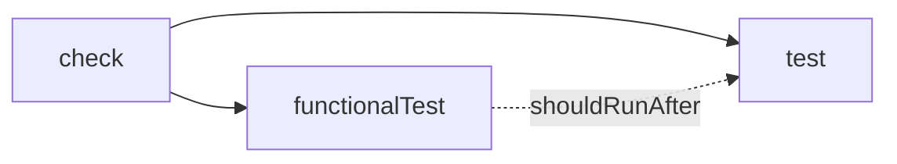

# Development Guide


This guide covers everything needed to build, test, and extend Mutaktor locally.

---

## Prerequisites

| Tool | Minimum | Notes |
|------|---------|-------|
| JDK | 17 | Tested with JDK 17, 21, and 25 (Temurin distribution) |
| Git | any | Required for functional tests that exercise `GitDiffAnalyzer` |
| Docker / Podman | optional | Only needed to run the dev container |

No other tools are required. Gradle and Kotlin are managed by the Gradle wrapper (`gradlew`).

---

## Getting Started

```bash
git clone https://github.com/dantte-lp/mutaktor.git
cd mutaktor
./gradlew check
```

`./gradlew check` runs compilation, unit tests, and functional tests. A clean checkout produces `BUILD SUCCESSFUL` in under two minutes on typical developer hardware.

---

## Project Structure

```
mutaktor/
├── mutaktor-gradle-plugin/            # Main Gradle plugin module
│   ├── build.gradle.kts
│   └── src/
│       ├── main/kotlin/io/github/dantte_lp/mutaktor/
│       │   ├── MutaktorPlugin.kt              # Plugin entry point
│       │   ├── MutaktorExtension.kt           # Type-safe DSL (32 properties)
│       │   ├── MutaktorTask.kt                # Main task: JavaExec + post-processing
│       │   ├── MutaktorAggregatePlugin.kt     # Multi-module aggregation
│       │   ├── git/
│       │   │   └── GitDiffAnalyzer.kt         # git diff → targetClasses
│       │   ├── toolchain/
│       │   │   └── GraalVmDetector.kt         # GraalVM + Quarkus detection
│       │   ├── extreme/
│       │   │   └── ExtremeMutationConfig.kt   # Method-body removal mutators
│       │   ├── ratchet/
│       │   │   ├── MutationRatchet.kt         # Per-package score floor
│       │   │   └── RatchetBaseline.kt         # JSON baseline persistence
│       │   ├── report/
│       │   │   ├── MutationElementsConverter.kt
│       │   │   ├── SarifConverter.kt
│       │   │   ├── GithubChecksReporter.kt
│       │   │   └── QualityGate.kt
│       │   └── util/
│       │       ├── XmlParser.kt               # Secure XML parsing
│       │       ├── JsonBuilder.kt             # Zero-dep JSON builder
│       │       └── SourcePathResolver.kt      # File path → FQN
│       ├── test/                              # Unit tests (JUnit 5 + Kotest)
│       └── functionalTest/                    # Gradle TestKit integration tests
│
├── mutaktor-pitest-filter/            # PIT plugin JAR
│   └── src/main/kotlin/io/github/dantte_lp/mutaktor/pitest/
│       └── KotlinJunkFilter.kt               # MutationInterceptor SPI (5 patterns)
│
├── mutaktor-annotations/              # Source-level annotation module
│   └── src/main/kotlin/io/github/dantte_lp/mutaktor/annotations/
│       ├── MutationCritical.kt
│       └── SuppressMutations.kt
│
├── build-logic/                       # Convention plugins (shared build config)
│   └── src/main/kotlin/
│       └── kotlin-conventions.gradle.kts
│
├── gradle/
│   └── libs.versions.toml             # Version catalog
├── gradle.properties                  # version, group
├── settings.gradle.kts
├── CHANGELOG.md
└── .github/workflows/
    ├── ci.yml
    └── release.yml
```

### Module Responsibilities

| Module | Artifact | Purpose |
|--------|----------|---------|
| `mutaktor-gradle-plugin` | `io.github.dantte-lp.mutaktor` | Gradle plugin applied in consumer builds |
| `mutaktor-pitest-filter` | `mutaktor-pitest-filter.jar` | PIT plugin JAR loaded at mutation-testing runtime |
| `mutaktor-annotations` | `mutaktor-annotations.jar` | `@MutationCritical` and `@SuppressMutations` annotations |
| `build-logic` | (internal) | Shared Kotlin + JVM toolchain conventions |

---

## Build Commands

```bash
# Full verification: compile + unit tests + functional tests
./gradlew check

# Unit tests only (fast feedback loop)
./gradlew test

# Gradle TestKit functional tests only
./gradlew functionalTest

# Filter module tests only
./gradlew :mutaktor-pitest-filter:test

# Annotations module tests only (currently no tests — annotations module only)
./gradlew :mutaktor-annotations:check

# Compile without running tests
./gradlew build

# Clean build outputs
./gradlew clean

# Run with verbose output to debug classpath issues
./gradlew check --info
```

The `check` task is wired as:



`functionalTest` uses `shouldRunAfter(test)`, not `dependsOn`, so both can run in parallel when capacity allows (e.g. `--parallel`).

---

## Dependency Versions

All versions are declared in `gradle/libs.versions.toml`:

```toml
[versions]
kotlin         = "2.3.0"
pitest         = "1.23.0"
pitest-junit5  = "1.2.3"
junit          = "5.12.2"
kotest         = "6.0.0.M4"
gradle-testkit = "9.4.1"

[libraries]
pitest-command-line   = { module = "org.pitest:pitest-command-line",   version.ref = "pitest" }
pitest-entry          = { module = "org.pitest:pitest-entry",           version.ref = "pitest" }
pitest-junit5-plugin  = { module = "org.pitest:pitest-junit5-plugin",  version.ref = "pitest-junit5" }
junit-jupiter         = { module = "org.junit.jupiter:junit-jupiter",  version.ref = "junit" }
kotest-assertions     = { module = "io.kotest:kotest-assertions-core", version.ref = "kotest" }
```

---

## Code Conventions

### Language

- **Kotlin only.** No Groovy, no Java in production code.
- Package names use underscores due to the GitHub username: `io.github.dantte_lp.mutaktor`.

### Gradle Provider API

All task properties must use the Provider API for lazy evaluation and configuration-cache compatibility:

```kotlin
// Correct — lazy, configuration-cache safe
public abstract val threads: Property<Int>
public abstract val targetClasses: SetProperty<String>

// Wrong — eager, breaks configuration cache
var threads: Int = 4
var targetClasses: MutableSet<String> = mutableSetOf()
```

| Type | Use Case |
|------|----------|
| `Property<T>` | Single scalar value |
| `SetProperty<T>` | Unordered set (e.g. class patterns) |
| `ListProperty<T>` | Ordered list (e.g. JVM args) |
| `MapProperty<K, V>` | Key-value pairs (e.g. plugin config) |
| `DirectoryProperty` | Output/input directory |
| `RegularFileProperty` | Single file |
| `ConfigurableFileCollection` | Multiple files or directories |

### Task API

```kotlin
// Correct — lazy registration, Gradle 9 compatible
tasks.register("mutate", MutaktorTask::class.java) { task -> ... }

// Wrong — eager creation, removed in Gradle 9
tasks.create("mutate", MutaktorTask::class.java) { ... }
```

Never store `Project` references in task fields — this breaks configuration cache serialization:

```kotlin
// Wrong — Project is not serializable
@get:Internal
val project: Project = ...

// Correct — capture only what is needed at configuration time
@get:Input
val projectGroup: Property<String> = ...
```

### Build Directory

```kotlin
// Correct — Gradle 9 compatible
task.reportDir.set(project.layout.buildDirectory.dir("reports/mutaktor"))

// Wrong — deprecated and removed in Gradle 9
task.reportDir = project.buildDir.resolve("reports/mutaktor")
```

### Zero External Dependencies

The production code in `mutaktor-gradle-plugin` has exactly **one** compile dependency: `org.pitest:pitest-command-line`. Everything else uses the JDK standard library:

| Operation | Implementation |
|-----------|---------------|
| HTTP requests | `java.net.http.HttpClient` (JDK 11+) |
| XML parsing | `javax.xml.parsers.DocumentBuilderFactory` |
| JSON generation | `StringBuilder` via `JsonBuilder` utility |
| File I/O | `java.io.File` |

Do not add third-party dependencies (Jackson, OkHttp, Gson, etc.) to `mutaktor-gradle-plugin` production code.

---

## Writing Tests

### Unit Tests

Unit tests live in `mutaktor-gradle-plugin/src/test/` and use JUnit 5 with Kotest assertions:

```kotlin
import io.kotest.matchers.shouldBe
import io.kotest.matchers.string.shouldContain
import org.junit.jupiter.api.Test

class SarifConverterTest {

    @Test
    fun `convert produces valid SARIF version field`() {
        val xml = buildMutationsXml(status = "SURVIVED")
        val sarif = SarifConverter.convert(xml, pitVersion = "1.23.0")
        sarif shouldContain """"version": "2.1.0""""
    }

    @Test
    fun `convert includes only survived mutations`() {
        val xml = buildMutationsXml(
            mutation("KILLED"),
            mutation("SURVIVED"),
            mutation("NO_COVERAGE"),
        )
        val sarif = SarifConverter.convert(xml, pitVersion = "1.23.0")
        sarif.occurrencesOf("mutation/survived") shouldBe 1
    }
}
```

### Functional Tests

Functional tests live in `mutaktor-gradle-plugin/src/functionalTest/` and use Gradle TestKit to run actual Gradle builds in a temporary directory:

```kotlin
import org.gradle.testkit.runner.GradleRunner
import org.junit.jupiter.api.Test
import org.junit.jupiter.api.io.TempDir
import java.io.File

class MutaktorPluginFunctionalTest {

    @TempDir
    lateinit var projectDir: File

    @Test
    fun `plugin applies and mutate task is registered`() {
        projectDir.resolve("settings.gradle.kts")
            .writeText("""rootProject.name = "test-project"""")
        projectDir.resolve("build.gradle.kts").writeText("""
            plugins {
                java
                id("io.github.dantte-lp.mutaktor")
            }
            mutaktor {
                targetClasses.set(setOf("com.example.*"))
            }
        """.trimIndent())

        val result = GradleRunner.create()
            .withProjectDir(projectDir)
            .withArguments("tasks", "--all")
            .withPluginClasspath()
            .build()

        result.output shouldContain "mutate"
    }
}
```

The `functionalTest` source set is configured in `mutaktor-gradle-plugin/build.gradle.kts` and wired into the `check` lifecycle.

---

## Adding New Filter Patterns

Kotlin junk-mutation filters live in `KotlinJunkFilter.kt` inside the `mutaktor-pitest-filter` module.

### Step 1 — Identify the pattern

Run PIT without filters on a Kotlin project and inspect `mutations.xml`. Look for mutations with status `SURVIVED` that appear in compiler-generated code. Note the values of `<mutatedClass>`, `<method>`, and `<description>`.

### Step 2 — Add a predicate to KotlinJunkFilter

Open `KotlinJunkFilter.kt` and add a private predicate method:

```kotlin
/**
 * Pattern 6 — sealed class $WhenMappings synthetic class.
 *
 * Kotlin compiles `when` on sealed classes into a `$WhenMappings` class
 * containing an int array. Mutations inside this class are unkillable.
 */
private fun isWhenMappingsClass(mutation: MutationDetails): Boolean {
    val className = mutation.className.asJavaName()
    return className.endsWith("\$WhenMappings")
}
```

### Step 3 — Wire the predicate into isKotlinJunk

```kotlin
private fun isKotlinJunk(mutation: MutationDetails): Boolean =
    isDefaultImplsClass(mutation)          ||
    isIntrinsicsNullCheck(mutation)        ||
    isDataClassGeneratedMethod(mutation)   ||
    isCoroutineStateMachine(mutation)      ||
    isWhenHashcodeDispatch(mutation)       ||
    isWhenMappingsClass(mutation)          // <-- new pattern
```

### Step 4 — Write unit tests

```kotlin
@Test
fun `isWhenMappingsClass filters WhenMappings synthetic class`() {
    val mutation = fakeMutation(className = "com.example.Status\$WhenMappings")
    KotlinJunkFilter().intercept(listOf(mutation), fakeMutater()) shouldBe emptyList()
}

@Test
fun `regular class with WhenMappings substring in package is not filtered`() {
    val mutation = fakeMutation(className = "com.example.WhenMappingsHelper")
    KotlinJunkFilter().intercept(listOf(mutation), fakeMutater()) shouldBe listOf(mutation)
}
```

### Step 5 — Update documentation

Add a row to the filter table in `docs/en/03-kotlin-filters.md` and update `CHANGELOG.md` under `[Unreleased] > Added`.

---

## Adding New Report Formats

Report converters live in `mutaktor-gradle-plugin/src/main/kotlin/io/github/dantte_lp/mutaktor/report/`.

### Step 1 — Create the converter object

```kotlin
package io.github.dantte_lp.mutaktor.report

import java.io.File

/**
 * Converts PIT mutations.xml to JUnit XML test result format.
 * Each survived mutation becomes a failing test case.
 */
public object JUnitXmlConverter {

    public fun convert(mutationsXml: File, pitVersion: String): String {
        // Use XmlParser.parseSecureXml() for safe DOM parsing
        // Use JsonBuilder or StringBuilder for output construction
        TODO("implement")
    }
}
```

Use only the JDK standard library. Do not add external XML or string-processing libraries.

### Step 2 — Add a property to MutaktorExtension

```kotlin
// In MutaktorExtension.kt — Reporting section

/** When true, produces a JUnit XML summary report (junit-summary.xml). */
public abstract val junitXmlReport: Property<Boolean>

// In init block:
junitXmlReport.convention(false)
```

### Step 3 — Wire into MutaktorTask.postProcess()

```kotlin
// In the postProcess() method, after existing steps:

if (junitXmlReport.getOrElse(false)) {
    val output = JUnitXmlConverter.convert(mutationsXml, pitVersion.getOrElse("unknown"))
    reportDirectory.resolve("junit-summary.xml").writeText(output)
    logger.lifecycle("Mutaktor: wrote JUnit XML summary to {}", ...)
}
```

### Step 4 — Also wire in MutaktorPlugin

```kotlin
// In configureTask():
task.junitXmlReport.set(extension.junitXmlReport)
```

### Step 5 — Write unit tests

Follow the pattern of `SarifConverterTest` — build a minimal `mutations.xml` string and assert structural properties of the output.

### Step 6 — Update documentation

Add the new property to the configuration table in `docs/en/02-configuration.md` and describe the new format in `docs/en/05-reporting.md`.

---

## Test Coverage Summary

| Test Class | Tests | What it covers |
|------------|-------|----------------|
| `MutaktorPluginTest` | — | Plugin application, task registration |
| `MutaktorTaskArgumentsTest` | — | `buildPitArguments()` CLI assembly |
| `MutaktorAggregatePluginTest` | — | Aggregate plugin task wiring |
| `SarifConverterTest` | — | SARIF structure, only-survived filter, XXE protection |
| `MutationElementsConverterTest` | — | JSON schema, status mapping |
| `QualityGateTest` | — | Score calculation, threshold boundary cases |
| `GithubChecksReporterTest` | — | Check Run creation, annotation batching |
| `GitDiffAnalyzerTest` | — | File path → FQN conversion, fallback behavior |
| `GraalVmDetectorTest` | — | `isGraalVm()` detection logic |
| `MutationRatchetTest` | — | Per-package score computation, regression detection |
| `RatchetBaselineTest` | — | JSON baseline save/load round-trip |
| `XmlParserTest` | — | Secure parsing, XXE rejection |
| `JsonBuilderTest` | — | String escaping, JSON construction |
| `SourcePathResolverTest` | — | Path resolution from multiple source roots |
| `ExtremeMutationConfigTest` | — | Extreme mutator set contents |
| `MutaktorPluginFunctionalTest` | — | Full Gradle TestKit integration |

Total: **135 tests** across all modules.

---

## Conventions Summary

| Rule | Detail |
|------|--------|
| Language | Kotlin only; no Groovy, no Java in production code |
| Gradle API | `tasks.register`, never `tasks.create` |
| Provider API | All task inputs/outputs use `Property<T>`, `SetProperty<T>`, etc. |
| Project references | Never store `Project` in task fields |
| Build directory | `layout.buildDirectory`, never `project.buildDir` |
| External deps | Zero in `mutaktor-gradle-plugin` production code |
| Source detection | Use `SourcePathResolver`; do not hardcode `src/main/java/` |
| Test framework | JUnit 5 + Kotest assertions |
| Functional tests | Gradle TestKit |
| Config cache | All task properties must be configuration-cache serializable |

---

## See Also

- [CI/CD Integration](./07-ci-cd.md)
- [Changelog Guide](./08-changelog.md)
- `CONTRIBUTING.md` — PR checklist and branching model
- `CLAUDE.md` — Constraints and project conventions for AI-assisted development
