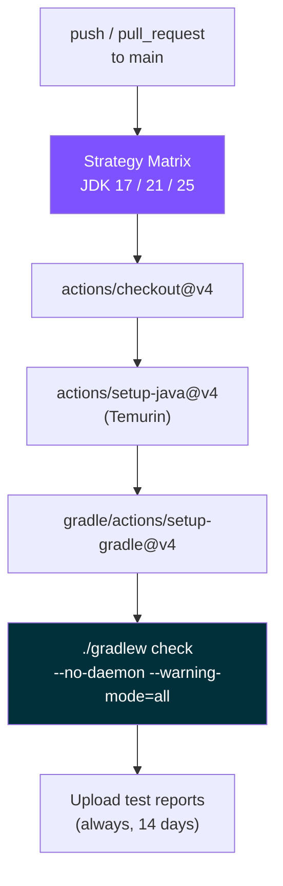
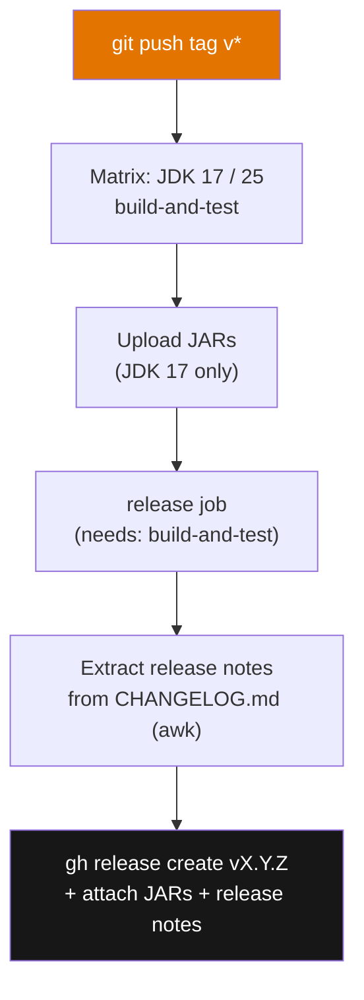
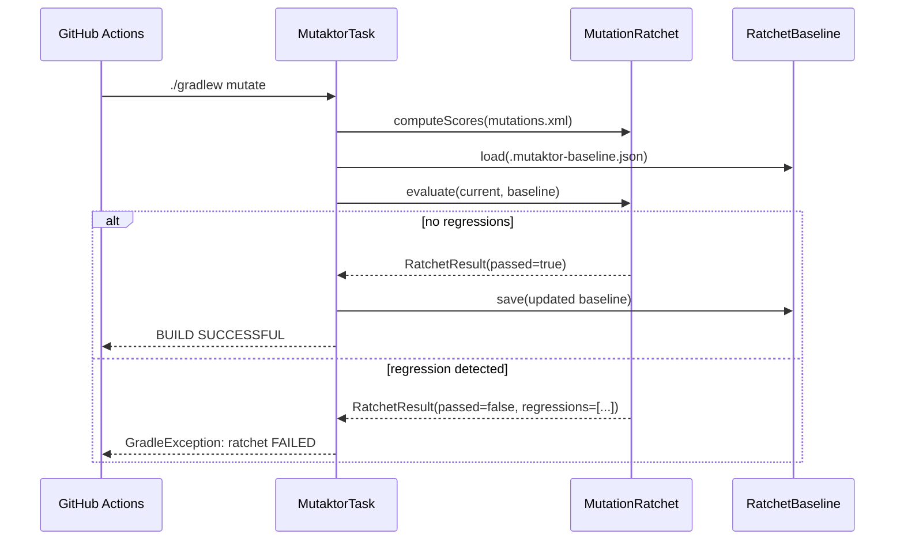

# CI/CD Integration


This document describes how Mutaktor itself is built and released in CI, and how to integrate the plugin into your own GitHub Actions workflows.

---

## Mutaktor's Own CI/CD Workflows

### CI Workflow (`.github/workflows/ci.yml`)

The CI workflow runs on every push to `main` and every pull request targeting `main`. It validates the plugin across a matrix of three JDK versions.

```yaml
name: CI

on:
  push:
    branches: [main]
  pull_request:
    branches: [main]

jobs:
  build:
    runs-on: ubuntu-latest
    strategy:
      matrix:
        java: [17, 21, 25]
    steps:
      - uses: actions/checkout@v4

      - name: Set up JDK ${{ matrix.java }}
        uses: actions/setup-java@v4
        with:
          distribution: temurin
          java-version: ${{ matrix.java }}

      - name: Set up Gradle
        uses: gradle/actions/setup-gradle@v4

      - name: Build and test
        run: ./gradlew check --no-daemon --warning-mode=all

      - name: Upload test reports
        if: always()
        uses: actions/upload-artifact@v4
        with:
          name: test-reports-jdk${{ matrix.java }}
          path: "**/build/reports/tests/"
          retention-days: 14
```

| Decision | Rationale |
|----------|-----------|
| JDK matrix: 17, 21, 25 | 17 is minimum, 21 is current LTS, 25 is maximum tested |
| `--no-daemon` | Avoids daemon state pollution between matrix jobs |
| `--warning-mode=all` | Surfaces deprecated API usage early |
| Test reports retained 14 days | Allows post-failure investigation without re-running |
| `if: always()` on upload | Reports are uploaded even when tests fail |



---

### Release Workflow (`.github/workflows/release.yml`)

The release workflow triggers on any tag matching `v*`. It runs a build-and-test job across JDK 17 and 25, then publishes a GitHub Release with the compiled JARs and extracted release notes.

```yaml
name: Release

on:
  push:
    tags:
      - "v*"

jobs:
  build-and-test:
    runs-on: ubuntu-latest
    permissions:
      contents: read
    strategy:
      matrix:
        java: [17, 25]
    steps:
      - uses: actions/checkout@v4
      - uses: actions/setup-java@v4
        with:
          distribution: temurin
          java-version: ${{ matrix.java }}
      - uses: gradle/actions/setup-gradle@v4
      - name: Build and test
        run: |
          VERSION="${GITHUB_REF_NAME#v}"
          ./gradlew check -Pversion="${VERSION}" --no-daemon
      - name: Upload JARs (JDK 17 only)
        if: matrix.java == 17
        uses: actions/upload-artifact@v4
        with:
          name: plugin-jars
          path: |
            mutaktor-gradle-plugin/build/libs/*.jar
            mutaktor-pitest-filter/build/libs/*.jar
            mutaktor-annotations/build/libs/*.jar

  release:
    runs-on: ubuntu-latest
    needs: build-and-test
    permissions:
      contents: write
    steps:
      - uses: actions/checkout@v4
        with:
          fetch-depth: 0
      - uses: actions/download-artifact@v4
        with:
          name: plugin-jars
          path: artifacts/
      - name: Extract release notes
        run: |
          VERSION="${GITHUB_REF_NAME#v}"
          awk -v ver="$VERSION" '
            /^## / { if (found) exit; if ($0 ~ ver) { found=1; next } }
            found { print }
          ' CHANGELOG.md > release-notes.md
      - name: Create GitHub Release
        run: |
          gh release create "$GITHUB_REF_NAME" \
            --title "mutaktor ${GITHUB_REF_NAME}" \
            --notes-file release-notes.md \
            artifacts/**/*.jar
        env:
          GH_TOKEN: ${{ secrets.GITHUB_TOKEN }}
```

| Decision | Rationale |
|----------|-----------|
| Version stripped from tag (`v0.2.0` → `0.2.0`) | `gradle.properties` version must match tag without `v` prefix |
| JARs collected from JDK 17 build only | Reproducible artifact; JDK version must not affect JAR contents |
| `fetch-depth: 0` in release job | `awk` script needs full CHANGELOG to find the correct version section |
| Release notes extracted by `awk` | Fully automated — no manual copy-paste between CHANGELOG and release body |



---

## Using Mutaktor in Your CI

### Minimal Example

The following workflow runs mutation testing on every pull request and uploads the HTML report as an artifact:

```yaml
name: Mutation Testing

on:
  pull_request:
    branches: [main]

jobs:
  mutation:
    runs-on: ubuntu-latest
    steps:
      - uses: actions/checkout@v4

      - uses: actions/setup-java@v4
        with:
          distribution: temurin
          java-version: 21

      - uses: gradle/actions/setup-gradle@v4

      - name: Run mutation tests
        run: ./gradlew mutate --no-daemon

      - name: Upload mutation report
        if: always()
        uses: actions/upload-artifact@v4
        with:
          name: mutation-report
          path: build/reports/mutaktor/
          retention-days: 7
```

### Git-Diff Scoped Analysis

For large codebases, restrict mutation to classes changed in the PR branch:

```yaml
- name: Run mutation tests (changed classes only)
  run: ./gradlew mutate --no-daemon
  env:
    MUTATION_SINCE: origin/main
```

In `build.gradle.kts`:

```kotlin
mutaktor {
    since = providers.environmentVariable("MUTATION_SINCE").orNull
    targetClasses = setOf("com.example.*")
    mutationScoreThreshold = 80
}
```

See [Git-Diff Scoped Analysis](./04-git-integration.md) for details on how the `since` property works and why `fetch-depth: 0` is required.

---

## GitHub Checks API

When `GITHUB_TOKEN`, `GITHUB_REPOSITORY`, and `GITHUB_SHA` are all set at task execution time, `GithubChecksReporter` automatically creates a GitHub Check Run with inline annotations for every survived mutant.

### Required Permissions

```yaml
jobs:
  mutation:
    runs-on: ubuntu-latest
    permissions:
      checks: write        # required for Check Run creation
      contents: read
```

### Full Example with Checks API, SARIF, and Quality Gate

```yaml
name: Mutation Testing — Full

on:
  pull_request:
    branches: [main]

jobs:
  mutation:
    runs-on: ubuntu-latest
    permissions:
      checks: write
      contents: read

    steps:
      - uses: actions/checkout@v4
        with:
          fetch-depth: 0    # required for git-diff scoped analysis

      - uses: actions/setup-java@v4
        with:
          distribution: temurin
          java-version: 21

      - uses: gradle/actions/setup-gradle@v4
        with:
          cache-read-only: ${{ github.ref != 'refs/heads/main' }}

      - name: Run mutation tests
        run: ./gradlew mutate --no-daemon
        env:
          MUTATION_SINCE: origin/main
          GITHUB_TOKEN: ${{ secrets.GITHUB_TOKEN }}
          GITHUB_REPOSITORY: ${{ github.repository }}
          GITHUB_SHA: ${{ github.sha }}

      - name: Upload HTML report
        if: always()
        uses: actions/upload-artifact@v4
        with:
          name: mutation-report
          path: build/reports/mutaktor/
          retention-days: 7

      - name: Upload SARIF to Code Scanning
        if: always()
        uses: github/codeql-action/upload-sarif@v3
        with:
          sarif_file: build/reports/mutaktor/mutations.sarif.json
          category: mutation-testing
```

> **Note:** `if: always()` on the upload steps ensures the SARIF file and HTML report are uploaded even when the quality gate fails or PIT produces no mutations.

---

## SARIF Upload to Code Scanning

SARIF output lets survived mutants appear as Code Scanning alerts in the **Security** tab of your repository. The alerts persist across runs and can be dismissed with a reason.

```kotlin
// build.gradle.kts — enable SARIF generation
mutaktor {
    outputFormats = setOf("HTML", "XML")  // XML is required as input for SARIF
    sarifReport = true
}
```

After `./gradlew mutate`, the SARIF file is written to `build/reports/mutaktor/mutations.sarif.json`. Only **survived** mutations appear as results — killed mutations are working correctly and do not need developer attention.

```yaml
- name: Upload SARIF to GitHub Code Scanning
  uses: github/codeql-action/upload-sarif@v3
  if: always()
  with:
    sarif_file: build/reports/mutaktor/mutations.sarif.json
    category: mutation-testing
```

---

## Quality Gate in CI

The quality gate is enforced inside `MutaktorTask.exec()` — no separate step is needed. Configure the threshold in `build.gradle.kts`:

```kotlin
mutaktor {
    mutationScoreThreshold = 80    // build fails if score < 80%
}
```

The `mutate` task will exit with a non-zero status and log:

```
Mutaktor: quality gate FAILED — mutation score 72% is below threshold 80%
```

---

## Ratchet in CI

Enable the per-package ratchet to prevent score regression across PRs:

```kotlin
// build.gradle.kts
mutaktor {
    ratchetEnabled = true
    ratchetBaseline = layout.projectDirectory.file(".mutaktor-baseline.json")
    ratchetAutoUpdate = true
}
```

Commit `.mutaktor-baseline.json` to the repository. On the main branch, the ratchet auto-updates the baseline whenever scores improve. On PR branches, a regression fails the build.



---

## Caching and Incremental Analysis

### Gradle Build Cache

`MutaktorTask` is annotated `@CacheableTask`. Gradle's build cache avoids re-running PIT when inputs (source files, classpath, configuration) have not changed since the last run.

Share the build cache between CI runs using `gradle/actions/setup-gradle`:

```yaml
- uses: gradle/actions/setup-gradle@v4
  with:
    cache-read-only: ${{ github.ref != 'refs/heads/main' }}
    # Main branch: read-write (populates cache)
    # PR branches: read-only (consumes cache, avoids cache pollution)
```

### PIT Incremental History

For incremental PIT analysis across separate CI runs, persist the `.mutation-history` file via Actions cache:

```kotlin
// build.gradle.kts
mutaktor {
    val historyFile = layout.projectDirectory.file(".mutation-history")
    historyInputLocation = historyFile
    historyOutputLocation = historyFile
}
```

```yaml
- name: Restore mutation history
  uses: actions/cache@v4
  with:
    path: .mutation-history
    key: mutation-history-${{ github.ref_name }}-${{ github.sha }}
    restore-keys: |
      mutation-history-${{ github.ref_name }}-
      mutation-history-main-

- name: Run mutation tests
  run: ./gradlew mutate --no-daemon
  env:
    MUTATION_SINCE: origin/main

- name: Save mutation history
  uses: actions/cache@v4
  with:
    path: .mutation-history
    key: mutation-history-${{ github.ref_name }}-${{ github.sha }}
```

PIT re-uses results from the cached history for mutants whose surrounding code has not changed, reducing analysis time on repeated runs.

---

## GraalVM in CI

If your CI uses GraalVM (e.g. for Quarkus native builds), and PIT fails with `jrt://` classpath errors, add the foojay toolchain resolver and let Mutaktor auto-detect the correct JDK:

```kotlin
// settings.gradle.kts
plugins {
    id("org.gradle.toolchains.foojay-resolver-convention") version "0.9.0"
}
```

Or configure `javaLauncher` explicitly:

```kotlin
// build.gradle.kts
mutaktor {
    javaLauncher.set(
        javaToolchains.launcherFor {
            languageVersion.set(JavaLanguageVersion.of(21))
            vendor.set(JvmVendorSpec.AZUL)
        }
    )
}
```

In CI, ensure the standard JDK is provisioned:

```yaml
- uses: actions/setup-java@v4
  with:
    distribution: temurin
    java-version: 21
    # GraalVM builds may also install: graalvm CE or GraalVM for JDK 21
```

---

## See Also

- [Development Guide](./06-development.md) — Local build setup and test commands
- [Changelog Guide](./08-changelog.md) — Release process: tagging and workflow trigger
- [Reports and Quality Gate](./05-reporting.md) — Post-processing pipeline details
- [Git-Diff Analysis](./04-git-integration.md) — `since` property and CI patterns
