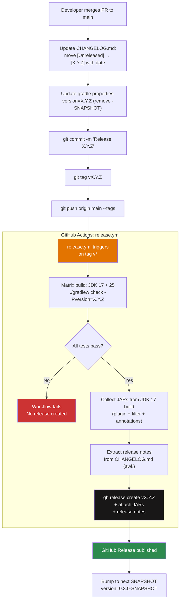

# Changelog Guide


This document explains the changelog format, versioning policy, and the automated release process for Mutaktor.

---

## Format

Mutaktor's `CHANGELOG.md` follows [Keep a Changelog 1.1.0](https://keepachangelog.com/en/1.1.0/).

### Structure

```markdown
# Changelog

All notable changes to this project will be documented in this file.

The format is based on [Keep a Changelog](https://keepachangelog.com/en/1.1.0/),
and this project adheres to [Semantic Versioning](https://semver.org/spec/v2.0.0.html).

## [Unreleased]

### Added
- New feature or enhancement

### Changed
- Change to existing behavior

### Deprecated
- Features that will be removed in a future release

### Removed
- Features removed in this release

### Fixed
- Bug fixes

### Security
- Security-related fixes

## [0.2.0] — 2026-03-21

### Added
- Post-processing pipeline: JSON, SARIF, quality gate, ratchet, GitHub Checks

[Unreleased]: https://github.com/ioplane/mutaktor/compare/v0.2.0...HEAD
[0.2.0]: https://github.com/ioplane/mutaktor/compare/v0.1.0...v0.2.0
```

### Section Usage Rules

| Section | When to use |
|---------|-------------|
| `Added` | New features, new DSL properties, new report formats, new modules |
| `Changed` | Behavior changes in existing features, default value changes |
| `Deprecated` | Properties or tasks scheduled for removal in a future MAJOR version |
| `Removed` | Properties or tasks that were previously deprecated |
| `Fixed` | Bug fixes — reference the issue number when applicable |
| `Security` | Any fix with security implications (e.g. XXE protection, token handling) |

Every user-facing change requires a `CHANGELOG.md` entry. Internal refactoring that does not affect the plugin API or user behavior does not require an entry.

---

## Versioning Policy

Mutaktor follows [Semantic Versioning 2.0.0](https://semver.org/spec/v2.0.0.html).

### Version Format

```
MAJOR.MINOR.PATCH[-SNAPSHOT]
```

| Version | Meaning |
|---------|---------|
| `0.1.0-SNAPSHOT` | Pre-release development build |
| `0.1.0` | First public release |
| `0.2.0` | New backward-compatible features (post-processing pipeline, ratchet, annotations) |
| `1.0.0` | Stable public API, first major release |
| `1.1.0` | New DSL property added (backward-compatible) |
| `2.0.0` | Breaking change to DSL or task API |

### Breaking vs. Non-Breaking Changes

| Change Type | Version Bump |
|-------------|-------------|
| Add new optional DSL property with convention default | MINOR |
| Add new task | MINOR |
| Add new module (`mutaktor-annotations`, etc.) | MINOR |
| Remove or rename existing DSL property | MAJOR |
| Change default value of existing property | MAJOR (if behavior changes) |
| Bug fix that does not change API surface | PATCH |
| New report format as opt-in property | MINOR |
| Require newer minimum Gradle or JDK version | MAJOR |

### Pre-1.0 Policy

While the version is `0.x.y`, the public API is not yet stable. MINOR version bumps (`0.1.0` → `0.2.0`) may include breaking changes. The DSL will stabilize at `1.0.0`.

---

## Current Version

The version is declared in `gradle.properties`:

```properties
version=0.2.0
group=io.github.ioplane.mutaktor
```

Snapshot builds are not published to the Gradle Plugin Portal. Only tagged releases produce published artifacts.

---

## Release Process

### Overview



### Step-by-Step Instructions

#### 1. Prepare the Changelog

Move all entries from `[Unreleased]` to a new dated version section. Keep `[Unreleased]` at the top — always empty after a release:

```markdown
## [Unreleased]

## [0.2.0] — 2026-03-21

### Added
- Post-processing pipeline: JSON, SARIF, quality gate, ratchet, GitHub Checks wired into `exec()` (Sprint 9)
- `mutationScoreThreshold` property: fail build when mutation score drops below threshold
- `jsonReport` property: first-class DSL control for mutation-testing-elements JSON (default: true)
- `sarifReport` property: first-class DSL control for SARIF 2.1.0 output (default: false)
- Per-package ratchet: `ratchetEnabled`, `ratchetBaseline`, `ratchetAutoUpdate` properties (Sprint 10)
- `mutaktor-annotations` module: `@MutationCritical` and `@SuppressMutations` (Sprint 11)
- GraalVM auto-detection: `GraalVmDetector` switches PIT to standard JDK for Quarkus + GraalVM projects (Sprint 12)
- `javaLauncher` property: Gradle Toolchain API integration for PIT child JVM (Sprint 12)
- Empty `targetClasses` guard: clear error message when no classes are configured (Sprint 9)

[Unreleased]: https://github.com/ioplane/mutaktor/compare/v0.2.0...HEAD
[0.2.0]: https://github.com/ioplane/mutaktor/compare/v0.1.0...v0.2.0
```

#### 2. Bump the Version

```properties
# gradle.properties
version=0.2.0
```

Remove the `-SNAPSHOT` suffix. The release workflow strips the `v` prefix from the tag and passes the version to Gradle via `-Pversion="${VERSION}"`.

#### 3. Commit and Tag

```bash
git add CHANGELOG.md gradle.properties
git commit -m "Release 0.2.0"
git tag v0.2.0
git push origin main --tags
```

The tag must match the pattern `v*` exactly. The workflow trigger is:

```yaml
on:
  push:
    tags:
      - "v*"
```

#### 4. Verify the Release Workflow

Navigate to **Actions → Release** in the GitHub repository. The workflow:

1. Runs `./gradlew check -Pversion="0.2.0"` on JDK 17 and 25
2. Uploads JARs from the JDK 17 build as a workflow artifact
3. Extracts the `[0.2.0]` section from `CHANGELOG.md` using the `awk` script
4. Creates a GitHub Release named `mutaktor v0.2.0` with the extracted notes and JARs attached

If the `awk` script finds no matching section (e.g. changelog entry is missing), it falls back to a link to `CHANGELOG.md`.

#### 5. Post-Release: Restore SNAPSHOT

After the release workflow completes successfully, bump the version to the next SNAPSHOT:

```properties
# gradle.properties
version=0.3.0-SNAPSHOT
```

```bash
git add gradle.properties
git commit -m "Begin 0.3.0-SNAPSHOT development"
git push origin main
```

---

## Release Notes Extraction

The release workflow extracts the matching changelog section automatically using `awk`:

```bash
VERSION="${GITHUB_REF_NAME#v}"   # strips leading 'v' from the tag

awk -v ver="$VERSION" '
  /^## / { if (found) exit; if ($0 ~ ver) { found=1; next } }
  found { print }
' CHANGELOG.md > release-notes.md
```

This script prints all lines between the `## [X.Y.Z]` heading and the next `## ` heading. The output is used verbatim as the GitHub Release body.

For tag `v0.2.0` and a changelog that looks like:

```markdown
## [0.2.0] — 2026-03-21

### Added
- Post-processing pipeline

## [0.1.0] — 2025-12-01
```

The script produces:

```markdown

### Added
- Post-processing pipeline

```

---

## Changelog Best Practices

### Write User-Facing Descriptions

```markdown
# Good — explains what the user gets
- Per-package mutation ratchet: `ratchetEnabled = true` prevents score regression on a per-package basis

# Too internal — describes implementation, not user impact
- Added MutationRatchet.computeScores() using DOM parsing of mutations.xml
```

### Reference Sprint or Issue Numbers

```markdown
### Added
- GraalVM auto-detect: switches PIT child JVM to standard HotSpot when building under GraalVM + Quarkus (Sprint 12)
- `@MutationCritical` annotation: mark classes/methods that require 100% mutation score (#87)
```

### Group Related Entries Under Correct Sections

Every change must be placed under the appropriate section header (`Added`, `Changed`, `Fixed`, etc.) within the same version block. Do not add free-form text outside section headers.

### Do Not Edit Released Sections

Once a version is tagged and released, its changelog section is immutable. If a released note contains an error, add a correction entry under the next version.

---

## v0.2.0 Complete Change Set

| Section | Entry |
|---------|-------|
| Added | Post-processing pipeline: JSON + SARIF + quality gate + ratchet + GitHub Checks wired into `exec()` |
| Added | `mutationScoreThreshold` property (0–100): fail build if mutation score drops below threshold |
| Added | `jsonReport` property: first-class DSL control for mutation-testing-elements JSON (default: `true`) |
| Added | `sarifReport` property: first-class DSL control for SARIF 2.1.0 (default: `false`) |
| Added | Per-package ratchet: `ratchetEnabled`, `ratchetBaseline`, `ratchetAutoUpdate` properties |
| Added | `mutaktor-annotations` module: `@MutationCritical` and `@SuppressMutations` source annotations |
| Added | `GraalVmDetector`: auto-select standard JDK when building with GraalVM + Quarkus |
| Added | `javaLauncher` property: full Gradle Toolchain API integration for PIT child JVM |
| Added | Empty `targetClasses` guard: `GradleException` with clear message when no classes are configured |
| Added | `util/XmlParser.kt`: shared secure XML parsing (XXE protection across all converters) |
| Added | `util/JsonBuilder.kt`: shared zero-dependency JSON construction |
| Added | `util/SourcePathResolver.kt`: shared file path → FQN resolution (fixes hardcoded `src/main/java/`) |
| Fixed | Report converters hardcoded `src/main/java/` — now uses `SourcePathResolver` with all source roots |
| Fixed | `MutationRatchet` counts `TIMED_OUT` and `MEMORY_ERROR` as killed (not only `KILLED`) |

---

## See Also

- [CI/CD Integration](./07-ci-cd.md) — Release workflow implementation details
- `CHANGELOG.md` — The actual changelog
- `gradle.properties` — Current version declaration
- [Keep a Changelog 1.1.0](https://keepachangelog.com/en/1.1.0/)
- [Semantic Versioning 2.0.0](https://semver.org/spec/v2.0.0.html)
