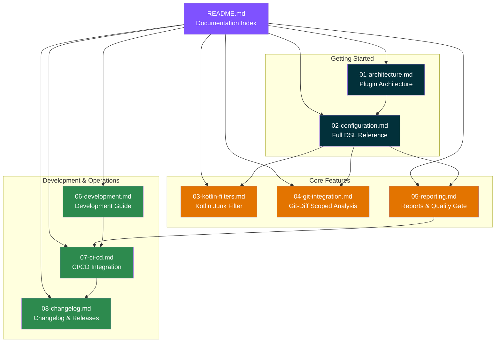
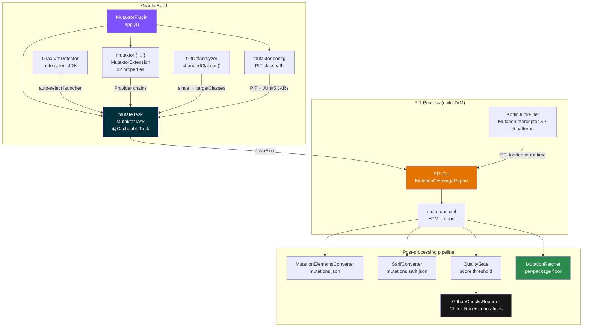

# Mutaktor Documentation


> Also available in: [Russian](../ru/README.md)

**Mutaktor** is a Kotlin-first Gradle plugin for [PIT](https://pitest.org/) mutation testing. It wraps PIT's proven mutation engine with git-aware scoping, Kotlin junk-mutation filtering, a fully wired post-processing pipeline (JSON, SARIF, quality gate, ratchet, GitHub Checks), and GraalVM auto-detection — all with zero external runtime dependencies.

---

## What Is Mutation Testing?

Mutation testing validates test suite quality by systematically introducing small changes — **mutants** — into source code and verifying that at least one test fails for each change. A mutant that no test detects is a **survived mutant**: a gap in test coverage that statement coverage cannot reveal.

The **mutation score** is the percentage of mutants that were killed:

```
mutation score = (killed mutants / total mutants) × 100
```

---

## v0.2.0 Feature Highlights

| Feature | Description |
|---------|-------------|
| Post-processing pipeline | JSON + SARIF + quality gate + ratchet + GitHub Checks wired into `exec()` |
| `mutationScoreThreshold` | Fail the build when the mutation score drops below a configurable percentage |
| `jsonReport` / `sarifReport` | First-class DSL properties for opt-in report formats |
| Per-package ratchet | `ratchetEnabled`, `ratchetBaseline`, `ratchetAutoUpdate` prevent score regression |
| `@MutationCritical` annotation | Mark code that must achieve 100% mutation score |
| `@SuppressMutations` annotation | Exclude specific methods or classes from analysis |
| `mutaktor-annotations` module | Standalone annotation JAR, no Gradle dependency |
| GraalVM auto-detect | `GraalVmDetector` switches PIT to standard JDK when building under GraalVM + Quarkus |
| `javaLauncher` property | Full Gradle Toolchain API integration for PIT child JVM |
| Empty `targetClasses` guard | Fails fast with a clear message when no classes are configured |

---

## Documentation Map



---

## Document Index

| # | Document | Audience | Description |
|---|----------|----------|-------------|
| 01 | [Architecture](01-architecture.md) | All users | Plugin modules, data flow, classpath design, lifecycle |
| 02 | [Configuration](02-configuration.md) | All users | Complete DSL reference: all 32 properties, types, defaults, examples |
| 03 | [Kotlin Junk Filter](03-kotlin-filters.md) | Kotlin developers | How `KotlinJunkFilter` eliminates false-positive mutations from compiler-generated bytecode |
| 04 | [Git-Diff Analysis](04-git-integration.md) | CI/CD users | Scoping mutation to changed classes using `since` and `GitDiffAnalyzer` |
| 05 | [Reports & Quality Gate](05-reporting.md) | CI/CD users | HTML, XML, SARIF, JSON, quality gate, ratchet, GitHub Checks |
| 06 | [Development Guide](06-development.md) | Contributors | Build commands, project structure, conventions, extending the plugin |
| 07 | [CI/CD Integration](07-ci-cd.md) | DevOps / contributors | GitHub Actions CI and release workflows; SARIF upload; GitHub Checks setup |
| 08 | [Changelog Guide](08-changelog.md) | Contributors | Keep a Changelog format, SemVer policy, release process |

---

## Quick Start

### Kotlin DSL

```kotlin
// build.gradle.kts
plugins {
    kotlin("jvm") version "2.3.0"
    id("io.github.ioplane.mutaktor") version "0.2.0"
}

mutaktor {
    targetClasses = setOf("com.example.*")
    mutationScoreThreshold = 80          // fail build below 80%
    since = "main"                       // only mutate changed classes
    kotlinFilters = true                 // suppress Kotlin compiler noise
    jsonReport = true                    // mutation-testing-elements JSON
    sarifReport = true                   // SARIF for GitHub Code Scanning
}
```

```bash
./gradlew mutate
```

### Groovy DSL

```groovy
// build.gradle
plugins {
    id 'org.jetbrains.kotlin.jvm' version '2.3.0'
    id 'io.github.ioplane.mutaktor' version '0.2.0'
}

mutaktor {
    targetClasses = ['com.example.*'] as Set
    mutationScoreThreshold = 80
    since = 'main'
    kotlinFilters = true
}
```

---

## Quick Links

### For plugin users

- **Configure mutation scope** — [Configuration: targetClasses](02-configuration.md#targetclasses)
- **Only mutate changed code** — [Git-Diff Analysis](04-git-integration.md)
- **Fail build below threshold** — [Configuration: mutationScoreThreshold](02-configuration.md#mutationscorethreshold)
- **Prevent score regression** — [Reports: Ratchet](05-reporting.md#per-package-ratchet)
- **Upload SARIF to Code Scanning** — [CI/CD: SARIF Upload](07-ci-cd.md#sarif-upload-to-code-scanning)
- **Integrate with GitHub PR checks** — [CI/CD: GitHub Checks API](07-ci-cd.md#github-checks-api)
- **Skip GraalVM classpath errors** — [Configuration: javaLauncher](02-configuration.md#javalauncher)
- **Mark critical code** — [Configuration: Annotations](02-configuration.md#annotations-module)

### For contributors

- **Set up local development** — [Development Guide: Getting Started](06-development.md#getting-started)
- **Run the tests** — [Development Guide: Build Commands](06-development.md#build-commands)
- **Add a new filter pattern** — [Development Guide: Adding New Filter Patterns](06-development.md#adding-new-filter-patterns)
- **Add a new report format** — [Development Guide: Adding New Report Formats](06-development.md#adding-new-report-formats)
- **Release a new version** — [Changelog Guide: Release Process](08-changelog.md#release-process)

---

## Architecture Overview



---

## Module Overview

| Module | Plugin ID / Artifact | Purpose |
|--------|----------------------|---------|
| `mutaktor-gradle-plugin` | `io.github.ioplane.mutaktor` | Applied to consumer projects; registers `mutate` task |
| `mutaktor-gradle-plugin` | `io.github.ioplane.mutaktor.aggregate` | Applied to root project; registers `mutateAggregate` task |
| `mutaktor-pitest-filter` | PIT SPI JAR | Loaded by PIT at runtime; filters Kotlin compiler-generated mutations |
| `mutaktor-annotations` | `mutaktor-annotations.jar` | `@MutationCritical` and `@SuppressMutations` annotations |
| `build-logic` | internal | Shared Kotlin + JVM toolchain convention plugin |

---

## Requirements

| Requirement | Minimum | Tested with |
|-------------|---------|-------------|
| Gradle | 9.0 | 9.4.1 |
| JDK | 17 | 17, 21, 25 (Temurin) |
| Kotlin | 1.8+ | 2.3.0 |
| PIT | 1.19.0 | 1.23.0 |
| pitest-junit5-plugin | 1.1.0 | 1.2.3 |

> **Note:** GraalVM is supported as the build JDK when `javaLauncher` is configured or GraalVM + Quarkus is auto-detected. PIT itself requires a standard HotSpot JVM for the child minion process.

---

## License

Apache License 2.0. See [LICENSE](../../LICENSE).
