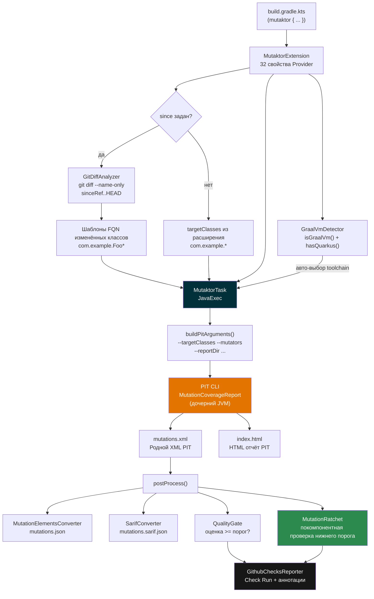
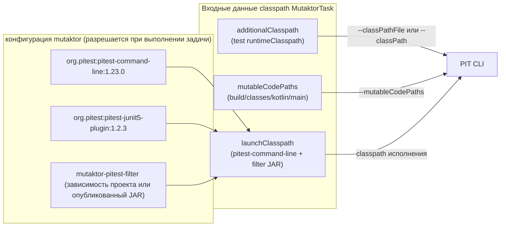
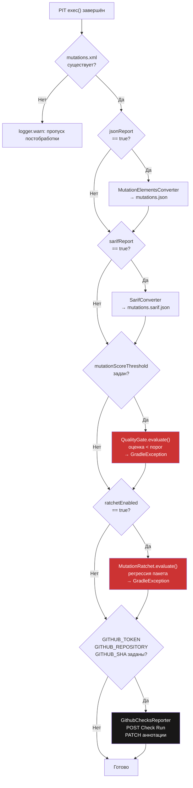
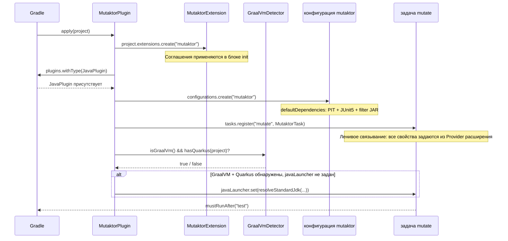
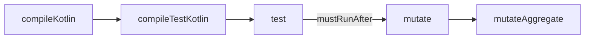
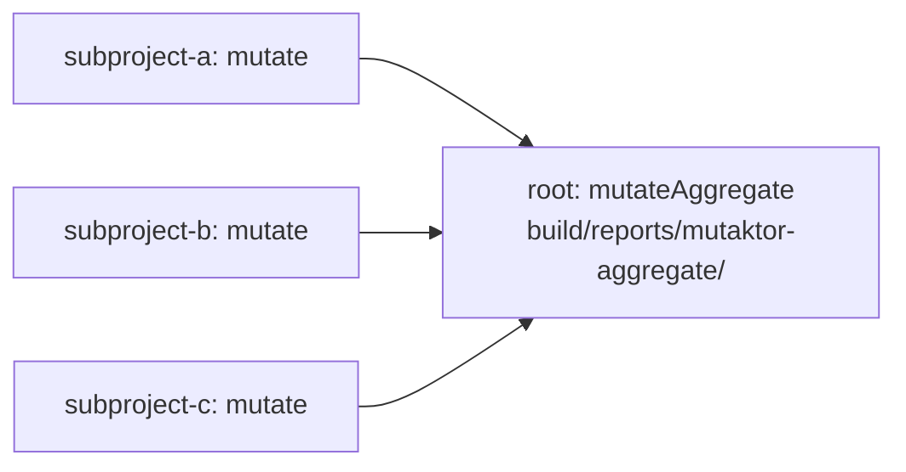

# Архитектура плагина


## Обзор

Mutaktor — это Kotlin-first плагин для Gradle, предназначенный для мутационного тестирования с помощью [PIT](https://pitest.org/). Он оборачивает командную строку PIT в полностью ленивую, совместимую с configuration cache задачу Gradle, добавляет фильтрацию мусорных мутаций, специфичных для Kotlin, анализ в рамках git-diff, автоопределение GraalVM и полный конвейер постобработки (JSON, SARIF, quality gate, покомпонентный ratchet, GitHub Checks API) — без каких-либо внешних зависимостей во время выполнения.

Плагин состоит из четырёх публикуемых или сопутствующих модулей плюс общего конвенционного плагина build-logic.

---

## Структура модулей

| Модуль | Артефакт | Назначение |
|--------|----------|------------|
| `mutaktor-gradle-plugin` | `io.github.ioplane.mutaktor` | Плагин Gradle, DSL-расширение, задача `mutate`, конвертеры отчётов, ratchet, определение toolchain |
| `mutaktor-pitest-filter` | сопутствующий JAR на classpath PIT | SPI `MutationInterceptor` для PIT, фильтрующий мусорные мутации, генерируемые компилятором Kotlin |
| `mutaktor-annotations` | `mutaktor-annotations.jar` | Аннотации уровня исходного кода `@MutationCritical` и `@SuppressMutations` |
| `build-logic` | только внутренний | Конвенционные плагины для общей конфигурации Kotlin и публикации |

### Дерево исходников

```
mutaktor/
├── mutaktor-gradle-plugin/
│   └── src/main/kotlin/io/github/ioplane/mutaktor/
│       ├── MutaktorPlugin.kt              # Точка входа плагина
│       ├── MutaktorExtension.kt           # DSL-расширение (32 свойства)
│       ├── MutaktorTask.kt                # Задача JavaExec + конвейер постобработки
│       ├── MutaktorAggregatePlugin.kt     # Агрегирование отчётов multi-module
│       ├── git/
│       │   └── GitDiffAnalyzer.kt         # git diff → шаблоны FQN классов
│       ├── extreme/
│       │   └── ExtremeMutationConfig.kt   # Мутаторы удаления тела метода
│       ├── toolchain/
│       │   └── GraalVmDetector.kt         # Определение GraalVM + Quarkus
│       ├── ratchet/
│       │   ├── MutationRatchet.kt         # Покомпонентный нижний порог оценки
│       │   └── RatchetBaseline.kt         # Сохранение базового JSON
│       ├── report/
│       │   ├── MutationElementsConverter.kt  # XML → JSON mutation-testing-elements
│       │   ├── SarifConverter.kt             # XML → SARIF 2.1.0
│       │   ├── QualityGate.kt                # Проверка порогового значения оценки мутаций
│       │   └── GithubChecksReporter.kt       # Аннотации через GitHub Checks API
│       └── util/
│           ├── XmlParser.kt               # Утилиты безопасного разбора SAX/DOM
│           ├── JsonBuilder.kt             # Построение JSON без зависимостей
│           └── SourcePathResolver.kt      # Преобразование пути файла в FQN
│
├── mutaktor-pitest-filter/
│   └── src/main/kotlin/io/github/ioplane/mutaktor/pitest/
│       └── KotlinJunkFilter.kt            # MutationInterceptorFactory + 5 фильтров
│
├── mutaktor-annotations/
│   └── src/main/kotlin/io/github/ioplane/mutaktor/annotations/
│       ├── MutationCritical.kt            # Требует 100% оценки мутаций
│       └── SuppressMutations.kt           # Исключает код из анализа
│
└── build-logic/
    └── src/main/kotlin/
        └── kotlin-conventions.gradle.kts  # Общая конфигурация Kotlin + JVM toolchain
```

---

## Поток данных

Следующая диаграмма показывает, как конфигурация передаётся из `build.gradle.kts` через плагин в PIT и затем через конвейер постобработки.



---

## Архитектура classpath

Mutaktor создаёт выделенную конфигурацию Gradle `mutaktor` для управления classpath PIT. Это полностью отделяет зависимости PIT от собственных зависимостей компиляции и выполнения проекта.



Когда `useClasspathFile = true` (значение по умолчанию), записи `additionalClasspath` и `mutableCodePaths` записываются в `build/mutaktor/pitClasspath` (по одному пути в строке) и передаются через `--classPathFile`. Это позволяет избежать ограничений длины командной строки ОС в Windows и крупных монорепозиторных сборках.

---

## Конвейер постобработки

После завершения PIT выполняются пять последовательных шагов `MutaktorTask.postProcess()`. Каждый шаг защищён: если `mutations.xml` не существует (PIT не произвёл вывода или завершился с ошибкой), весь этап постобработки пропускается с предупреждением.



---

## Ключевые классы

| Класс | Пакет | Роль |
|-------|-------|------|
| `MutaktorPlugin` | `io.github.ioplane.mutaktor` | Точка входа `Plugin<Project>`; создаёт конфигурацию `mutaktor` и регистрирует задачу `mutate` с ленивым связыванием |
| `MutaktorExtension` | `io.github.ioplane.mutaktor` | Типобезопасный DSL; все 32 свойства используют Provider API для ленивого вычисления и совместимости с configuration cache |
| `MutaktorTask` | `io.github.ioplane.mutaktor` | `@CacheableTask`, расширяющий `JavaExec`; собирает список аргументов PIT CLI из значений Provider, делегирует `super.exec()`, затем запускает конвейер постобработки |
| `MutaktorAggregatePlugin` | `io.github.ioplane.mutaktor` | Опциональный плагин корневого проекта; регистрирует `mutateAggregate` (задача `Copy`), собирающую отчёты подпроектов |
| `GitDiffAnalyzer` | `io.github.ioplane.mutaktor.git` | Выполняет `git diff --name-only --diff-filter=ACMR sinceRef..HEAD` и преобразует пути файлов в glob-шаблоны FQN |
| `GraalVmDetector` | `io.github.ioplane.mutaktor.toolchain` | Определяет комбинацию GraalVM + Quarkus; автоматически разрешает стандартный JDK через `JavaToolchainService` для дочернего процесса PIT |
| `ExtremeMutationConfig` | `io.github.ioplane.mutaktor.extreme` | Содержит 6 мутаторов удаления тела метода, используемых в экстремальном режиме |
| `KotlinJunkFilter` | `io.github.ioplane.mutaktor.pitest` | `MutationInterceptor` для PIT с 5 предикатами, отбрасывающими шумовые мутации, генерируемые компилятором |
| `KotlinJunkFilterFactory` | `io.github.ioplane.mutaktor.pitest` | `MutationInterceptorFactory`, обнаруживаемая через `META-INF/services`; регистрирует флаг фичи `KOTLIN_JUNK` |
| `MutationElementsConverter` | `io.github.ioplane.mutaktor.report` | Разбирает `mutations.xml` и генерирует JSON mutation-testing-elements (схема Stryker Dashboard v2) |
| `SarifConverter` | `io.github.ioplane.mutaktor.report` | Разбирает `mutations.xml` и генерирует SARIF 2.1.0; только выжившие мутации включаются в результаты |
| `QualityGate` | `io.github.ioplane.mutaktor.report` | Вычисляет коэффициент уничтожения и сравнивает с пороговым значением; возвращает типизированный `Result` |
| `MutationRatchet` | `io.github.ioplane.mutaktor.ratchet` | Вычисляет покомпонентные оценки из `mutations.xml`; завершается с ошибкой, если любой пакет опустился ниже базовой оценки |
| `RatchetBaseline` | `io.github.ioplane.mutaktor.ratchet` | Читает и записывает файл базовой оценки в формате JSON (`.mutaktor-baseline.json`) |
| `GithubChecksReporter` | `io.github.ioplane.mutaktor.report` | Публикует Check Run в GitHub с предупреждающими аннотациями для каждого выжившего мутанта через GitHub Checks API |

---

## Жизненный цикл применения плагина



---

## Граф задач Gradle



`mustRunAfter` (не `dependsOn`) означает, что `mutate` не запускает `test` автоматически. В большинстве рабочих процессов вы вызываете `./gradlew test mutate` или встраиваете `mutate` в шаг CI, который выполняется после тестов.

---

## Совместимость с configuration cache

Все свойства в `MutaktorTask` используют Provider API Gradle (`Property`, `SetProperty`, `ListProperty`, `MapProperty`, `DirectoryProperty`, `RegularFileProperty`, `ConfigurableFileCollection`). Ни одна ссылка на `Project` не хранится в полях задачи. Задача аннотирована `@CacheableTask`, и все файловые входные данные имеют аннотации `@PathSensitive` с соответствующим уровнем чувствительности.

| Тип Provider | Сценарий использования |
|--------------|------------------------|
| `Property<T>` | Одиночное скалярное значение (количество потоков, булевы флаги, строки) |
| `SetProperty<T>` | Неупорядоченное множество (шаблоны классов, имена мутаторов) |
| `ListProperty<T>` | Упорядоченный список (аргументы JVM, флаги фичей PIT) |
| `MapProperty<K, V>` | Пары ключ-значение (конфигурация плагинов) |
| `DirectoryProperty` | Выходная/входная директория |
| `RegularFileProperty` | Одиночный файл (файлы истории, базовая оценка, файл classpath) |
| `ConfigurableFileCollection` | Несколько файлов (исходные директории, classpath, пути к коду) |

> **Предупреждение:** Никогда не храните ссылки на `Project` в полях задачи. `Project` не сериализуется для configuration cache и вызовет промах кэша или жёсткий сбой на Gradle 9+.

---

## Отсутствие внешних зависимостей

Производственный код в `mutaktor-gradle-plugin` имеет ровно **одну** compile-зависимость: `org.pitest:pitest-command-line`. Всё остальное использует стандартную библиотеку JDK:

| Операция | Реализация |
|----------|-----------|
| HTTP-запросы | `java.net.http.HttpClient` (JDK 11+) |
| Разбор XML | `javax.xml.parsers.DocumentBuilderFactory` (SAX/DOM) |
| Генерация JSON | `StringBuilder` с ручным экранированием через `JsonBuilder` |
| Файловый ввод-вывод | `java.io.File` |
| Выполнение процессов | Тип задачи Gradle `JavaExec` |

> **Примечание:** Это ограничение намеренное. Добавление Jackson, OkHttp, Gson или любой другой сторонней библиотеки в JAR плагина увеличило бы риск конфликтов зависимостей с classpath проектов-потребителей.

---

## Агрегирующий плагин

Для multi-module сборок примените агрегирующий плагин к корневому проекту:

```kotlin
// root build.gradle.kts
plugins {
    id("io.github.ioplane.mutaktor.aggregate")
}
```

Задача `mutateAggregate` копирует `build/reports/mutaktor/` каждого подпроекта в `build/reports/mutaktor-aggregate/<subprojectName>/` и автоматически выполняется после задачи `mutate` каждого подпроекта.



---

## См. также

- [Справочник по конфигурационному DSL](./02-configuration.md)
- [Фильтр мусорных мутаций Kotlin](./03-kotlin-filters.md)
- [Анализ в рамках git-diff](./04-git-integration.md)
- [Форматы отчётов и Quality Gate](./05-reporting.md)
- [Руководство разработчика](./06-development.md)
