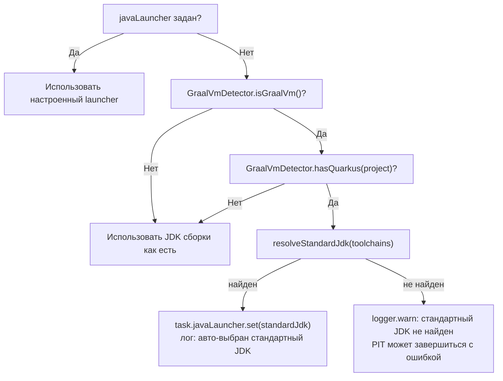

# Справочник по конфигурационному DSL


## Обзор

Все параметры плагина объявляются в блоке расширения `mutaktor` внутри `build.gradle.kts` (или `build.gradle`). Каждое свойство поддерживается Provider API Gradle, что означает ленивое вычисление значений во время выполнения задачи, а не во время конфигурирования. Это делает плагин полностью совместимым с configuration cache Gradle и режимом изолированных проектов.

---

## Быстрый старт

### Kotlin DSL

```kotlin
// build.gradle.kts
plugins {
    kotlin("jvm") version "2.3.0"
    id("io.github.dantte-lp.mutaktor") version "0.2.0"
}

mutaktor {
    targetClasses = setOf("com.example.*")
    mutationScoreThreshold = 80          // завершить сборку ниже 80%
    since = "main"                       // анализ в рамках git-diff
    kotlinFilters = true                 // фильтрация шума компилятора Kotlin
    jsonReport = true                    // JSON mutation-testing-elements
    sarifReport = true                   // SARIF для GitHub Code Scanning
}
```

### Groovy DSL

```groovy
// build.gradle
plugins {
    id 'org.jetbrains.kotlin.jvm' version '2.3.0'
    id 'io.github.dantte-lp.mutaktor' version '0.2.0'
}

mutaktor {
    targetClasses = ['com.example.*'] as Set
    mutationScoreThreshold = 80
    since = 'main'
    kotlinFilters = true
    jsonReport = true
    sarifReport = true
}
```

---

## Справочник свойств

### Основные

Управляют тем, какие классы мутируются, сколько потоков используется и какая версия PIT разрешается.

| Свойство | Тип | По умолчанию | Описание |
|----------|-----|--------------|----------|
| `pitVersion` | `Property<String>` | `"1.23.0"` | Версия PIT, разрешаемая из Maven Central |
| `targetClasses` | `SetProperty<String>` | `setOf("$group.*")` | Glob-шаблоны для выбора классов для мутации; **обязательно** |
| `targetTests` | `SetProperty<String>` | _(автоопределение PIT)_ | Glob-шаблоны для выбора тестовых классов для запуска |
| `threads` | `Property<Int>` | `availableProcessors()` | Количество параллельных потоков анализа мутаций |
| `mutators` | `SetProperty<String>` | `setOf("DEFAULTS")` | Группы мутаторов или имена отдельных мутаторов |
| `timeoutFactor` | `Property<BigDecimal>` | `1.25` | Множитель, применяемый к нормальному времени выполнения тестов для таймаута мутанта |
| `timeoutConstant` | `Property<Int>` | `4000` | Постоянные миллисекунды, добавляемые к вычисленному таймауту мутанта |

> **Предупреждение:** `targetClasses` должно быть непустым. Если ни `targetClasses`, ни `project.group` не заданы, задача `mutate` немедленно выбросит `GradleException` при выполнении:
> ```
> Mutaktor: targetClasses is empty. Set mutaktor.targetClasses or project.group.
> ```

#### Группы мутаторов

| Группа | Описание |
|--------|----------|
| `DEFAULTS` | Стандартные операторы мутации — базовый вариант для большинства проектов |
| `STRONGER` | Более агрессивные операторы; производит больше мутантов, может увеличить время анализа |
| `ALL` | Все доступные мутаторы; используйте только на небольших кодовых базах |

Отдельные мутаторы можно смешивать с группами:

```kotlin
mutaktor {
    mutators = setOf("DEFAULTS", "UOI", "AOR")
}
```

```groovy
mutaktor {
    mutators = ['DEFAULTS', 'UOI', 'AOR'] as Set
}
```

---

### Фильтрация

Исключает сгенерированный код, шаблонный код фреймворков и инфраструктурные классы, которые не являются значимыми целями для мутационного тестирования.

| Свойство | Тип | По умолчанию | Описание |
|----------|-----|--------------|----------|
| `excludedClasses` | `SetProperty<String>` | _(пусто)_ | Glob-шаблоны для классов, исключённых из мутации |
| `excludedMethods` | `SetProperty<String>` | _(пусто)_ | Шаблоны имён методов, исключённых из мутации; поддерживаются простые wildcards |
| `excludedTestClasses` | `SetProperty<String>` | _(пусто)_ | Glob-шаблоны для тестовых классов, исключённых из выполнения тестов |
| `avoidCallsTo` | `SetProperty<String>` | _(пусто)_ | FQN-префиксы пакетов, вызовы методов которых заменяются на NO-OP (например, логирование) |

```kotlin
// Kotlin DSL
mutaktor {
    excludedClasses = setOf(
        "com.example.generated.*",
        "com.example.config.*",
        "*\$Companion",
    )
    excludedMethods = setOf("toString", "hashCode", "equals")
    avoidCallsTo = setOf(
        "kotlin.jvm.internal",
        "org.slf4j",
        "org.apache.logging",
    )
}
```

```groovy
// Groovy DSL
mutaktor {
    excludedClasses = ['com.example.generated.*', 'com.example.config.*'] as Set
    excludedMethods = ['toString', 'hashCode', 'equals'] as Set
    avoidCallsTo = ['kotlin.jvm.internal', 'org.slf4j'] as Set
}
```

---

### Отчётность

| Свойство | Тип | По умолчанию | Описание |
|----------|-----|--------------|----------|
| `reportDir` | `DirectoryProperty` | `build/reports/mutaktor` | Директория, в которую PIT записывает результаты |
| `outputFormats` | `SetProperty<String>` | `setOf("HTML", "XML")` | Форматы вывода PIT для генерации; `XML` обязателен для постобработки |
| `timestampedReports` | `Property<Boolean>` | `false` | Если `true`, PIT создаёт поддиректорию с временной меткой для каждого запуска |
| `jsonReport` | `Property<Boolean>` | `true` | Если `true`, создаёт `mutations.json` (схема mutation-testing-elements v2) |
| `sarifReport` | `Property<Boolean>` | `false` | Если `true`, создаёт `mutations.sarif.json` (SARIF 2.1.0) |
| `mutationScoreThreshold` | `Property<Int>` | _(не задано)_ | Минимально допустимая оценка мутаций (0–100); сборка завершается с ошибкой, если оценка ниже этого значения |

> **Примечание:** `jsonReport` по умолчанию `true` в v0.2.0 — файл JSON mutation-testing-elements автоматически генерируется после каждого успешного запуска PIT, если явно не задать `jsonReport = false`.

> **Примечание:** `sarifReport = false` по умолчанию, чтобы не генерировать SARIF-файлы в каждой локальной сборке разработчика. Включайте в CI, где загружаете в GitHub Code Scanning.

#### Форматы вывода (родные форматы PIT)

| Значение | Описание |
|----------|----------|
| `HTML` | Интерактивный HTML-отчёт с подсветкой мутаций на уровне строк |
| `XML` | Машиночитаемый отчёт `mutations.xml`; **обязателен** для `jsonReport` и `sarifReport` |
| `CSV` | Сводный файл с разделителями-табуляциями |

#### mutationScoreThreshold

```kotlin
// Kotlin DSL
mutaktor {
    mutationScoreThreshold = 80   // завершить сборку, если оценка < 80%
}
```

```groovy
// Groovy DSL
mutaktor {
    mutationScoreThreshold = 80
}
```

Когда `mutationScoreThreshold` задан, `MutaktorTask` вызывает `QualityGate.evaluate()` после завершения PIT и выбрасывает `GradleException`, если оценка ниже порога:

```
Mutaktor: quality gate FAILED — mutation score 72% is below threshold 80%
```

Если `totalMutations == 0` (ничего не мутировалось, например, все изменённые классы были исключены), оценка считается равной `100` и проверка проходит.

---

### Конфигурация тестов

| Свойство | Тип | По умолчанию | Описание |
|----------|-----|--------------|----------|
| `junit5PluginVersion` | `Property<String>` | `"1.2.3"` | Версия `org.pitest:pitest-junit5-plugin` |
| `includedGroups` | `SetProperty<String>` | _(пусто)_ | Выражения тегов JUnit 5 для включаемых тестов |
| `excludedGroups` | `SetProperty<String>` | _(пусто)_ | Выражения тегов JUnit 5 для исключаемых тестов |
| `fullMutationMatrix` | `Property<Boolean>` | `false` | Если `true`, каждый мутант тестируется против каждого теста без раннего выхода |

```kotlin
// Kotlin DSL
mutaktor {
    junit5PluginVersion = "1.2.3"
    includedGroups = setOf("unit", "integration")
    excludedGroups = setOf("slow", "e2e")
    fullMutationMatrix = false
}
```

> **Предупреждение:** `fullMutationMatrix = true` значительно увеличивает время выполнения. Используйте только когда нужно точно определить, какие тесты уничтожают каких мутантов в целях анализа покрытия.

---

### Расширенные настройки / JVM

| Свойство | Тип | По умолчанию | Описание |
|----------|-----|--------------|----------|
| `jvmArgs` | `ListProperty<String>` | _(пусто)_ | Дополнительные аргументы JVM, передаваемые в **разветвлённые** дочерние тестовые процессы |
| `mainProcessJvmArgs` | `ListProperty<String>` | _(пусто)_ | Дополнительные аргументы JVM, передаваемые в **главный** процесс анализа PIT |
| `pluginConfiguration` | `MapProperty<String, String>` | _(пусто)_ | Пары ключ-значение, перенаправляемые в плагины PIT через `--pluginConfiguration` |
| `features` | `ListProperty<String>` | _(пусто)_ | Флаги фичей PIT для включения (`+flagName`) или отключения (`-flagName`) |
| `verbose` | `Property<Boolean>` | `false` | Включить подробный вывод PIT в консоль |
| `useClasspathFile` | `Property<Boolean>` | `true` | Записать classpath в `build/mutaktor/pitClasspath` и передать через `--classPathFile` |

```kotlin
// Kotlin DSL
mutaktor {
    jvmArgs = listOf(
        "--add-opens=java.base/java.lang=ALL-UNNAMED",
        "-Xmx2g",
    )
    features = listOf("+auto_threads", "-FLOGIC")
    pluginConfiguration = mapOf(
        "ARCMUTATE_ENGINE.limit" to "100",
    )
    verbose = false
    useClasspathFile = true
}
```

```groovy
// Groovy DSL
mutaktor {
    jvmArgs = ['--add-opens=java.base/java.lang=ALL-UNNAMED', '-Xmx2g']
    features = ['+auto_threads', '-FLOGIC']
    pluginConfiguration = ['ARCMUTATE_ENGINE.limit': '100']
}
```

---

### javaLauncher

Свойство `javaLauncher` управляет тем, какой JDK используется для дочернего процесса PIT (JVM minion, запускающий тесты под мутацией). Это отдельно от JVM сборки Gradle.

| Свойство | Тип | По умолчанию | Описание |
|----------|-----|--------------|----------|
| `javaLauncher` | `Property<JavaLauncher>` | _(JDK сборки)_ | Java launcher для дочернего процесса PIT через Gradle Toolchain API |

#### Когда использовать javaLauncher

Наиболее важный сценарий — сборка с GraalVM. GraalVM использует схемы URL `jrt://` в своём classpath, что приводит к сбоям JVM minion PIT. Задайте `javaLauncher` для стандартного HotSpot JDK:

```kotlin
// Kotlin DSL — явный выбор toolchain
mutaktor {
    javaLauncher.set(
        javaToolchains.launcherFor {
            languageVersion.set(JavaLanguageVersion.of(21))
            vendor.set(JvmVendorSpec.AZUL)
        }
    )
}
```

```groovy
// Groovy DSL
mutaktor {
    javaLauncher.set(
        javaToolchains.launcherFor {
            languageVersion = JavaLanguageVersion.of(21)
            vendor = JvmVendorSpec.AZUL
        }
    )
}
```

#### Автоопределение GraalVM

Когда `javaLauncher` **не** задан явно, `MutaktorPlugin` автоматически проверяет, является ли текущий JDK сборки GraalVM и использует ли проект Quarkus. Если оба условия выполнены, `GraalVmDetector` пытается разрешить стандартный JDK через `JavaToolchainService` (последовательно пробуя поставщиков Azul, Adoptium и Amazon):



> **Совет:** Чтобы автоопределение GraalVM могло скачивать JDK по требованию, добавьте резолвер toolchain foojay в `settings.gradle.kts`:
> ```kotlin
> plugins {
>     id("org.gradle.toolchains.foojay-resolver-convention") version "0.9.0"
> }
> ```

---

### Анализ с учётом git

| Свойство | Тип | По умолчанию | Описание |
|----------|-----|--------------|----------|
| `since` | `Property<String>` | _(не задано)_ | Git-ссылка для сравнения. Если задана, мутируются только классы, изменённые с этой ссылки. |

Свойство `since` принимает любую git-ссылку:

| Значение | Значение |
|----------|----------|
| `"main"` | Все коммиты в текущей ветке, ещё не слитые в `main` |
| `"develop"` | Все коммиты, ещё не слитые в `develop` |
| `"HEAD~5"` | Последние 5 коммитов в текущей ветке |
| `"v1.2.3"` | Все коммиты с момента тега `v1.2.3` |
| `"a1b2c3d"` | Все коммиты с конкретного SHA коммита |

```kotlin
// Kotlin DSL — чтение из переменной окружения CI
mutaktor {
    since = providers.environmentVariable("MUTATION_SINCE").orNull
    targetClasses = setOf("com.example.*")  // fallback, когда since не задан
}
```

Подробности см. в [Анализ в рамках git-diff](./04-git-integration.md).

---

### Фильтр мусорных мутаций Kotlin

| Свойство | Тип | По умолчанию | Описание |
|----------|-----|--------------|----------|
| `kotlinFilters` | `Property<Boolean>` | `true` | Включить `KotlinJunkFilter`, подавляющий мутации в байткоде, генерируемом компилятором Kotlin |

Когда включён, JAR `mutaktor-pitest-filter` добавляется в classpath PIT. Фильтр охватывает 5 шаблонов: null-check intrinsics, методы, генерируемые data-классами, конечные автоматы сопрограмм, бриджевые классы `$DefaultImpls` и диспетчеризацию хеш-кода выражений `when`.

```kotlin
mutaktor {
    kotlinFilters = true   // по умолчанию; подавить шум data-класса, сопрограмм и null-check
}
```

Подробнее см. [Фильтр мусорных мутаций Kotlin](./03-kotlin-filters.md).

---

### Экстремальный режим мутаций

| Свойство | Тип | По умолчанию | Описание |
|----------|-----|--------------|----------|
| `extreme` | `Property<Boolean>` | `false` | Заменить детализированные мутаторы операторами удаления тела метода (~1 мутант на метод вместо ~10) |

Когда `extreme = true`, свойство `mutators` переопределяется следующими 6 операторами удаления тела метода:

| Мутатор | Эффект |
|---------|--------|
| `VOID_METHOD_CALLS` | Удаляет вызовы void-методов |
| `EMPTY_RETURNS` | Заменяет возврат объектов пустыми/значениями по умолчанию |
| `FALSE_RETURNS` | Заменяет возврат булевых значений на `false` |
| `TRUE_RETURNS` | Заменяет возврат булевых значений на `true` |
| `NULL_RETURNS` | Заменяет возврат объектов на `null` |
| `PRIMITIVE_RETURNS` | Заменяет возврат примитивов на `0` |

```kotlin
mutaktor {
    extreme = true   // переопределяет mutators; любой mutators = setOf(...) игнорируется
}
```

> **Совет:** Экстремальный режим практичен для крупных кодовых баз, где полное мутационное тестирование заняло бы часы. Он обнаруживает псевдо-тестируемые методы — методы, которые вызываются тестами, но чья логика никогда не проверяется фактически.

---

### Покомпонентный ratchet

Ratchet предотвращает регрессию оценки мутаций. При каждом запуске покомпонентные оценки сравниваются с сохранённой базовой оценкой. Если любой пакет опускается ниже своей базовой оценки, сборка завершается с ошибкой.

| Свойство | Тип | По умолчанию | Описание |
|----------|-----|--------------|----------|
| `ratchetEnabled` | `Property<Boolean>` | `false` | Включить покомпонентный ratchet оценки мутаций |
| `ratchetBaseline` | `RegularFileProperty` | `.mutaktor-baseline.json` | Файл базовой оценки для сравнения |
| `ratchetAutoUpdate` | `Property<Boolean>` | `true` | Автоматически обновлять базовую оценку при улучшении оценок |

```kotlin
// Kotlin DSL
mutaktor {
    ratchetEnabled = true
    ratchetBaseline = layout.projectDirectory.file(".mutaktor-baseline.json")
    ratchetAutoUpdate = true   // автоматически обновлять при улучшении оценок
}
```

```groovy
// Groovy DSL
mutaktor {
    ratchetEnabled = true
    ratchetAutoUpdate = true
}
```

При обнаружении регрессии:

```
Mutaktor: ratchet FAILED — mutation score regression detected:
  com.example.service: 85% → 72%
  com.example.domain: 90% → 87%
```

> **Совет:** Зафиксируйте `.mutaktor-baseline.json` в репозитории. Когда `ratchetAutoUpdate = true`, файл базовой оценки автоматически обновляется при улучшении любого пакета, поэтому только регрессии приводят к ошибке сборки.

Подробности реализации см. в [Форматы отчётов и Quality Gate](./05-reporting.md#per-package-ratchet).

---

### Инкрементальный анализ

| Свойство | Тип | По умолчанию | Описание |
|----------|-----|--------------|----------|
| `historyInputLocation` | `RegularFileProperty` | _(не задано)_ | Файл для чтения предыдущего состояния анализа мутаций |
| `historyOutputLocation` | `RegularFileProperty` | _(не задано)_ | Файл для записи состояния анализа мутаций после запуска |

```kotlin
// Kotlin DSL
mutaktor {
    val historyFile = layout.projectDirectory.file(".mutation-history")
    historyInputLocation = historyFile
    historyOutputLocation = historyFile
}
```

PIT повторно использует предыдущие результаты для мутантов, чей окружающий код не изменился, что значительно сокращает время выполнения при повторных сборках. Подробности о сохранении файла истории между запусками GitHub Actions см. в [CI/CD: Кэширование и инкрементальный анализ](./07-ci-cd.md#caching-and-incremental-analysis).

---

## Модуль аннотаций

Модуль `mutaktor-annotations` предоставляет аннотации уровня исходного кода для детального управления мутационным тестированием. JAR не имеет зависимостей и может быть добавлен в любой модуль без включения Gradle API.

### Добавление зависимости

```kotlin
// build.gradle.kts
dependencies {
    implementation("io.github.dantte-lp.mutaktor:mutaktor-annotations:0.2.0")
}
```

```groovy
// build.gradle
dependencies {
    implementation 'io.github.dantte-lp.mutaktor:mutaktor-annotations:0.2.0'
}
```

### @MutationCritical

Помечает код, который должен достичь 100% оценки мутаций. Сборка завершается с ошибкой, если любой мутант выживает в аннотированном коде.

```kotlin
import io.github.dantte_lp.mutaktor.annotations.MutationCritical

@MutationCritical(reason = "Core authentication logic — all mutations must be killed")
class AuthService {
    fun authenticate(token: String): Boolean {
        // Каждая мутация здесь должна быть обнаружена тестами
    }
}

@MutationCritical
fun computeHash(input: String): String {
    // Аннотация на уровне метода
}
```

### @SuppressMutations

Полностью исключает класс или метод из анализа мутаций. Используйте экономно и всегда документируйте причину.

```kotlin
import io.github.dantte_lp.mutaktor.annotations.SuppressMutations

@SuppressMutations(reason = "Adapter for legacy API — logic is integration-tested externally")
class LegacyApiAdapter {
    // Не мутируется
}

@SuppressMutations(reason = "Formatting only — no business logic")
fun formatDisplayName(first: String, last: String): String = "$last, $first"
```

| Аннотация | Цель | `reason` | Эффект |
|-----------|------|----------|--------|
| `@MutationCritical` | CLASS, FUNCTION, CONSTRUCTOR | необязательно | Сборка завершается с ошибкой, если любой мутант выживает |
| `@SuppressMutations` | CLASS, FUNCTION, CONSTRUCTOR | обязательно | Код исключается из анализа |

> **Предупреждение:** `@SuppressMutations` требует параметр `reason` по замыслу. Это намеренный выбор API, препятствующий случайному подавлению — каждое подавление должно быть обосновано и видно при code review.

---

## Полный пример конфигурации

### Kotlin DSL — Полный

```kotlin
// build.gradle.kts
plugins {
    kotlin("jvm") version "2.3.0"
    id("io.github.dantte-lp.mutaktor") version "0.2.0"
}

mutaktor {
    // Основные
    pitVersion = "1.23.0"
    targetClasses = setOf("com.example.*")
    threads = Runtime.getRuntime().availableProcessors()
    mutators = setOf("DEFAULTS")
    timeoutFactor = java.math.BigDecimal("1.25")
    timeoutConstant = 4000

    // Фильтрация
    excludedClasses = setOf("com.example.generated.*")
    excludedMethods = setOf("toString", "hashCode", "equals")
    avoidCallsTo = setOf("kotlin.jvm.internal", "org.slf4j")

    // Отчётность
    outputFormats = setOf("HTML", "XML")
    timestampedReports = false
    jsonReport = true
    sarifReport = true
    mutationScoreThreshold = 80

    // Тесты
    junit5PluginVersion = "1.2.3"
    includedGroups = setOf("unit")
    excludedGroups = setOf("slow", "e2e")

    // Расширенные
    jvmArgs = listOf("-Xmx2g")
    useClasspathFile = true
    verbose = false

    // Анализ с учётом git
    since = providers.environmentVariable("MUTATION_SINCE").orNull

    // Фильтр Kotlin
    kotlinFilters = true

    // Ratchet
    ratchetEnabled = true
    ratchetBaseline = layout.projectDirectory.file(".mutaktor-baseline.json")
    ratchetAutoUpdate = true

    // Инкрементальный
    val historyFile = layout.projectDirectory.file(".mutation-history")
    historyInputLocation = historyFile
    historyOutputLocation = historyFile
}
```

### Groovy DSL — Полный

```groovy
// build.gradle
plugins {
    id 'org.jetbrains.kotlin.jvm' version '2.3.0'
    id 'io.github.dantte-lp.mutaktor' version '0.2.0'
}

mutaktor {
    pitVersion = '1.23.0'
    targetClasses = ['com.example.*'] as Set
    threads = Runtime.runtime.availableProcessors()
    mutators = ['DEFAULTS'] as Set
    timeoutFactor = 1.25
    timeoutConstant = 4000

    excludedClasses = ['com.example.generated.*'] as Set
    excludedMethods = ['toString', 'hashCode', 'equals'] as Set
    avoidCallsTo = ['kotlin.jvm.internal', 'org.slf4j'] as Set

    outputFormats = ['HTML', 'XML'] as Set
    timestampedReports = false
    jsonReport = true
    sarifReport = true
    mutationScoreThreshold = 80

    junit5PluginVersion = '1.2.3'

    jvmArgs = ['-Xmx2g']
    useClasspathFile = true
    verbose = false

    since = System.getenv('MUTATION_SINCE')
    kotlinFilters = true

    ratchetEnabled = true
    ratchetAutoUpdate = true
}
```

---

## Полная таблица значений по умолчанию

| Свойство | Значение по умолчанию |
|----------|----------------------|
| `pitVersion` | `"1.23.0"` |
| `targetClasses` | `setOf("$project.group.*")` |
| `targetTests` | Автоопределение PIT из `targetClasses` |
| `threads` | `Runtime.getRuntime().availableProcessors()` |
| `mutators` | `setOf("DEFAULTS")` |
| `timeoutFactor` | `BigDecimal("1.25")` |
| `timeoutConstant` | `4000` |
| `excludedClasses` | _(пусто)_ |
| `excludedMethods` | _(пусто)_ |
| `excludedTestClasses` | _(пусто)_ |
| `avoidCallsTo` | _(пусто)_ |
| `reportDir` | `build/reports/mutaktor` |
| `outputFormats` | `setOf("HTML", "XML")` |
| `timestampedReports` | `false` |
| `jsonReport` | `true` |
| `sarifReport` | `false` |
| `mutationScoreThreshold` | _(не задано — проверка отключена)_ |
| `junit5PluginVersion` | `"1.2.3"` |
| `includedGroups` | _(пусто)_ |
| `excludedGroups` | _(пусто)_ |
| `fullMutationMatrix` | `false` |
| `jvmArgs` | _(пусто)_ |
| `mainProcessJvmArgs` | _(пусто)_ |
| `pluginConfiguration` | _(пусто)_ |
| `features` | _(пусто)_ |
| `verbose` | `false` |
| `useClasspathFile` | `true` |
| `javaLauncher` | _(JDK сборки или авто-выбранный для GraalVM)_ |
| `since` | _(не задано)_ |
| `kotlinFilters` | `true` |
| `extreme` | `false` |
| `ratchetEnabled` | `false` |
| `ratchetBaseline` | `.mutaktor-baseline.json` |
| `ratchetAutoUpdate` | `true` |
| `historyInputLocation` | _(не задано)_ |
| `historyOutputLocation` | _(не задано)_ |

---

## См. также

- [Архитектура плагина](./01-architecture.md)
- [Фильтр мусорных мутаций Kotlin](./03-kotlin-filters.md)
- [Анализ в рамках git-diff](./04-git-integration.md)
- [Форматы отчётов и Quality Gate](./05-reporting.md)
