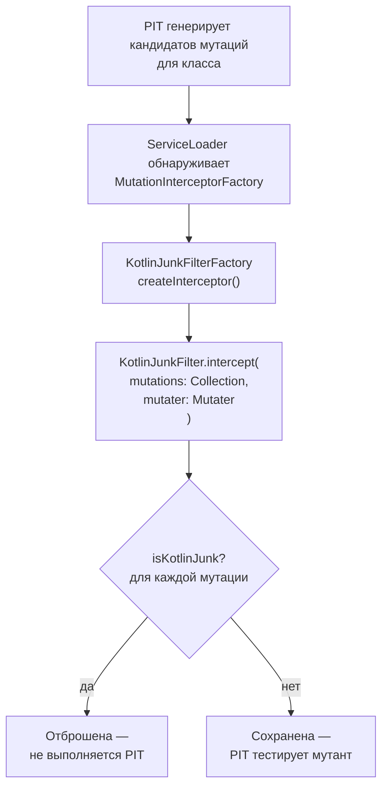

# Фильтр мусорных мутаций Kotlin


## Обзор

Компилятор Kotlin генерирует значительный объём байткода, не имеющего прямого эквивалента в исходном коде: null-check intrinsics, реализации методов data-классов, конечные автоматы сопрограмм, бриджевые классы реализаций интерфейсных методов по умолчанию и таблицы диспетчеризации выражений `when`. PIT инструментирует скомпилированный байткод напрямую и не осведомлён о Kotlin, поэтому он создаёт большое количество мутаций в этом сгенерированном коде.

Эти мутации почти всегда **неубиваемы**: ни один тест, который можно разумно написать, никогда не уничтожит мутацию в `Intrinsics.checkNotNullParameter`, бридже `copy$default` или таблице диспетчеризации `$Continuation.invokeSuspend`. Они раздувают общее количество мутантов, снижают сообщаемую оценку мутаций и тратят процессорное время на прогоны анализа.

`KotlinJunkFilter` — это `MutationInterceptor` для PIT, который идентифицирует и отбрасывает такие мутации **до** того, как PIT попытается создать и запустить соответствующих мутантов — полностью устраняя процессорные затраты.

---

## Как работает SPI MutationInterceptor в PIT

Конвейер перехватчиков PIT выполняется между генерацией мутаций и выполнением мутантов. Перехватчики типа `FILTER` удаляют мутации из набора, который PIT фактически протестирует.



Фабрика обнаруживается через стандартный механизм Java `ServiceLoader`. Фильтрующий JAR содержит запись `META-INF/services/org.pitest.mutationtest.build.MutationInterceptorFactory`, указывающую на `KotlinJunkFilterFactory`.

Фабрика регистрирует фичу как `KOTLIN_JUNK` с `withOnByDefault(true)`. Это означает, что фильтр активен всякий раз, когда JAR находится в classpath PIT — дополнительный флаг фичи PIT не требуется.

### Интерфейс MutationInterceptor

| Метод | Описание |
|-------|----------|
| `type()` | Возвращает `InterceptorType.FILTER` — мутации, не возвращённые `intercept`, удаляются из конвейера |
| `begin(ClassTree)` | Вызывается один раз на класс перед обработкой мутаций; `KotlinJunkFilter` не хранит состояние для каждого класса |
| `intercept(Collection<MutationDetails>, Mutater)` | Точка входа фильтрации; возвращает только те мутации, которые следует сохранить |
| `end()` | Вызывается после обработки всех мутаций для класса |

---

## 5 шаблонов фильтрации

### Шаблон 1: Kotlin null-check intrinsics

**Что фильтруется:** Мутации, описание которых ссылается на методы проверки null из `kotlin/jvm/internal/Intrinsics`.

**Происхождение в байткоде:** Каждый ненулевой параметр Kotlin генерирует вызов `Intrinsics.checkNotNullParameter` в начале тела функции. Компилятор Kotlin генерирует это как обычный вызов метода в байткоде.

**Почему это мусор:** PIT может мутировать сам null-check (например, удалив вызов). Полученный мутант будет уничтожен только тестом, передающим `null` для ненулевого параметра — что является ошибкой компиляции в Kotlin. Такой тест не может существовать в правильно типизированной кодовой базе.

**Эвристика обнаружения:** Описание мутации содержит любой из: `Intrinsics`, `checkNotNull`, `checkParameterIsNotNull`, `checkNotNullParameter`, `checkNotNullExpressionValue`.

```kotlin
// Исходный код (Kotlin)
fun process(name: String): String {
    return name.uppercase()
}

// Эквивалент в байткоде (что видит PIT)
public static String process(String name) {
    Intrinsics.checkNotNullParameter(name, "name");  // <-- мутация здесь фильтруется
    return name.toUpperCase();                        // <-- мутация здесь сохраняется
}
```

---

### Шаблон 2: Методы, генерируемые data-классами

**Что фильтруется:** Мутации внутри методов `copy`, `copy$default`, `component1` — `componentN`, `toString`, `hashCode` и `equals`.

**Происхождение в байткоде:** Объявления `data class` в Kotlin автоматически генерируют эти методы на основе свойств основного конструктора.

**Почему это мусор:** Эти методы являются чисто механическими реализациями стандартного контракта. Тестирование того, что `data class User(val name: String)` правильно копирует `name` в своём сгенерированном `copy()`, не добавляет никакой ценности — логика тривиально корректна по конструкции.

**Эвристика обнаружения:** Имя метода мутации соответствует регулярному выражению `^(copy|copy\$default|component\d+|toString|hashCode|equals)$`.

```kotlin
// Исходный код
data class User(val id: Long, val name: String, val email: String)

// Компилятор генерирует: copy(), copy$default(), component1(), component2(), component3(),
// toString(), hashCode(), equals() — все мутации в этих методах фильтруются.
// Любой написанный пользователем метод, добавленный в User, мутируется в обычном режиме.
```

| Метод | Фильтруется? | Причина |
|-------|-------------|---------|
| `copy()` | Да | Шаблон 2 — метод `data class`, генерируемый компилятором |
| `component1()` | Да | Шаблон 2 — accessor для деструктуризации |
| `hashCode()` | Да | Шаблон 2 — метод контракта, генерируемый компилятором |
| `validate()` (написан пользователем) | Нет | Не генерируется; применяется обычная мутация |

---

### Шаблон 3: Диспетчеризация конечного автомата сопрограммы

**Что фильтруется:** Мутации в методах `invokeSuspend` внутри классов continuation, генерируемых компилятором (имена классов содержат `$`).

**Происхождение в байткоде:** Каждая функция `suspend` компилируется в конечный автомат. Компилятор Kotlin создаёт анонимный внутренний класс (например, `MyService$fetchUser$1`), реализующий `Continuation<T>`. Метод `invokeSuspend` содержит таблицу диспетчеризации состояний — большой блок `when`, переключающийся на точке возобновления сопрограммы.

**Почему это мусор:** Структура конечного автомата — это деталь реализации среды выполнения сопрограмм. Мутации в таблице диспетчеризации не могут быть уничтожены тестами бизнес-логики; они потребовали бы тестов, специально зондирующих внутреннее состояние сопрограммы, что ни практично, ни желательно.

**Эвристика обнаружения:** Имя метода — `invokeSuspend` И имя класса содержит `$`.

```kotlin
// Исходный код
suspend fun fetchUser(id: Long): User {
    val data = repository.load(id)   // точка приостановки
    return User(data)
}

// Компилятор генерирует примерно:
// class MyService$fetchUser$1 : Continuation<Any?> {
//     var label = 0
//     override fun invokeSuspend(result: Any?): Any? {
//         when (label) {     // <-- все мутации здесь фильтруются
//             0 -> { ... }
//             1 -> { ... }
//         }
//     }
// }
```

---

### Шаблон 4: Бриджевые классы DefaultImpls

**Что фильтруется:** Все мутации в классах, чьё полностью квалифицированное имя заканчивается на `$DefaultImpls`.

**Происхождение в байткоде:** Когда интерфейс Kotlin объявляет метод с телом по умолчанию, компилятор Kotlin генерирует статический внутренний класс `InterfaceName$DefaultImpls`, содержащий фактическую реализацию. Классы JVM, реализующие интерфейс, делегируют в `DefaultImpls`, если не переопределяют метод.

**Почему это мусор:** `$DefaultImpls` — это шим JVM-совместимости для байткода Java 8. Фактическая бизнес-логика находится в объявлении интерфейса, видимом в исходном коде Kotlin. Тестирование мутаций в бриджевом классе дублирует усилия и производит неубиваемых мутантов.

**Эвристика обнаружения:** `mutation.className.asJavaName().endsWith("\$DefaultImpls")`.

```kotlin
// Исходный код
interface Repository {
    fun findAll(): List<String> = emptyList()   // тело по умолчанию
}

// Компилятор генерирует:
// class Repository$DefaultImpls {
//     static List findAll(Repository $this) { return CollectionsKt.emptyList(); }
// }
// Все мутации внутри Repository$DefaultImpls фильтруются.
```

---

### Шаблон 5: Диспетчеризация хеш-кода выражений when

**Что фильтруется:** Мутации, описание которых упоминает одновременно `hashCode` и `equals`.

**Происхождение в байткоде:** Выражения `when` в Kotlin, переключающиеся на значениях `String`, компилируются с использованием `hashCode()` для выбора bucket с последующим `equals()` для уточнения — идентично тому, как работает Java switch-on-String на уровне байткода.

**Почему это мусор:** Хеш-диспетчеризация — это шаблон, генерируемый компилятором. Мутация, инвертирующая проверку `equals` в диспетчеризации switch, — в отличие от фактической бизнес-логики — неубиваема никаким обычным тестом, поскольку механизм вычисления хеша не тестируется.

**Эвристика обнаружения:** Описание мутации содержит одновременно `hashCode` и `equals`.

```kotlin
// Исходный код
fun describe(status: String): String = when (status) {
    "active"   -> "User is active"
    "inactive" -> "User is inactive"
    else       -> "Unknown status"
}

// Скомпилированный байткод содержит логику диспетчеризации hashCode()+equals().
// Мутации в логике диспетчеризации фильтруются.
// Мутации в ветвях со строковыми литералами ("User is active") сохраняются.
```

---

## Сводная таблица фильтров

| № | Шаблон | Предикат обнаружения | Причина |
|---|--------|----------------------|---------|
| 1 | Null-check intrinsics | Описание содержит `Intrinsics` / `checkNotNull*` | `Intrinsics.checkNotNullParameter` для каждого ненулевого параметра |
| 2 | Методы, генерируемые data-классами | Имя метода совпадает с `copy`, `componentN`, `toString`, `hashCode`, `equals` | Реализации `data class`, генерируемые компилятором |
| 3 | Конечный автомат сопрограммы | Метод == `invokeSuspend` И имя класса содержит `$` | Функция `suspend`, скомпилированная в конечный автомат continuation |
| 4 | Бридж DefaultImpls | Имя класса заканчивается на `$DefaultImpls` | Бридж JVM-совместимости для методов интерфейса по умолчанию |
| 5 | Хеш-диспетчеризация when | Описание содержит одновременно `hashCode` и `equals` | `when(String)` скомпилированный в хеш-bucket + проверку равенства |

---

## Фильтруется и сохраняется: примеры

### Мутации null-check

| Описание мутации | Фильтруется? | Шаблон |
|------------------|-------------|--------|
| `removed call to kotlin/jvm/internal/Intrinsics.checkNotNullParameter` | Да | 1 — неубиваемый null-check intrinsic |
| `replaced return value with null in String process(String)` | Нет | Обычная мутация в пользовательском коде |
| `negated conditional in String process(String)` | Нет | Обычная мутация в пользовательском коде |

### Мутации data-классов

| Описание мутации | Фильтруется? | Шаблон |
|------------------|-------------|--------|
| `negated conditional in data class User.hashCode()` | Да | 2 — метод, генерируемый компилятором |
| `negated conditional in data class User.equals()` | Да | 2 — метод, генерируемый компилятором |
| `removed call in User.validate()` | Нет | Метод, написанный пользователем, обычная мутация |

### Мутации сопрограмм

| Описание мутации | Фильтруется? | Шаблон |
|------------------|-------------|--------|
| `changed conditional boundary in MyService$fetchUser$1.invokeSuspend` | Да | 3 — конечный автомат сопрограммы |
| `changed conditional boundary in MyService.processData` | Нет | Бизнес-логика в обычной функции |

---

## Отключение фильтра

### Полное отключение

Полностью удалить фильтрующий JAR из classpath PIT:

```kotlin
// Kotlin DSL
mutaktor {
    kotlinFilters = false
}
```

### Отключение на уровне фичи PIT

Оставить JAR в classpath, но отключить перехватчик `KOTLIN_JUNK` (полезно, когда нужно проверить, что иначе было бы отфильтровано):

```kotlin
// Kotlin DSL
mutaktor {
    features = listOf("-KOTLIN_JUNK")
}
```

```groovy
// Groovy DSL
mutaktor {
    features = ['-KOTLIN_JUNK']
}
```

---

## Влияние на оценку мутаций

Без фильтра Kotlin-проекты, как правило, видят 15–40% своих мутаций в коде, генерируемом компилятором — мутаций, которые не могут быть уничтожены никаким разумным тестом. `KotlinJunkFilter` удаляет эти мутации до запуска PIT, что даёт два полезных эффекта:

1. **Точная оценка мутаций**: Сообщаемая оценка отражает реальное покрытие тестируемого кода, не завышенное неубиваемым шумом.
2. **Более быстрые прогоны**: Отфильтрованные мутации отбрасываются до разветвления дочернего JVM. Время процессора масштабируется с количеством убиваемых мутаций, а не с общим количеством мутаций байткода.

---

## Добавление нового шаблона фильтра

Пошаговые инструкции по определению новых шаблонов в `mutations.xml`, добавлению предиката в `KotlinJunkFilter`, написанию модульных тестов и обновлению документации см. в [Руководстве разработчика: Добавление новых шаблонов фильтров](./06-development.md#adding-new-filter-patterns).

---

## См. также

- [Архитектура плагина](./01-architecture.md)
- [Справочник по конфигурационному DSL](./02-configuration.md#kotlin-junk-mutation-filter)
- [Руководство разработчика](./06-development.md#adding-new-filter-patterns)
- [Документация PIT MutationInterceptor](https://pitest.org/javadoc/)
