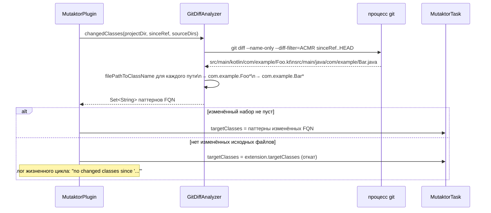

# Анализ в рамках git-диффа


## Обзор

Полное мутационное тестирование большой кодовой базы может занимать минуты или часы. На feature-ветке, где изменилось лишь несколько файлов, запускать PIT против всего glob `com.example.*` расточительно: подавляющая часть времени тратится на мутирование кода, которого не касается рассматриваемое изменение.

Свойство `since` включает **анализ в рамках git-диффа**: Mutaktor выполняет `git diff` между текущим `HEAD` и опорным коммитом, собирает файлы `.kt` и `.java`, которые были добавлены, скопированы, изменены или переименованы, конвертирует их пути в паттерны полностью квалифицированных имён классов и передаёт только эти паттерны в PIT как `--targetClasses`.

В результате стоимость запуска мутационного тестирования пропорциональна размеру изменения, а не размеру всей кодовой базы.

## Как это работает



### Команда git diff

`GitDiffAnalyzer` выполняет именно эту команду:

```
git diff --name-only --diff-filter=ACMR sinceRef..HEAD
```

| Флаг | Значение |
|---|---|
| `--name-only` | Выводить только имена файлов, по одному на строку |
| `--diff-filter=ACMR` | Включать только добавленные (Added), скопированные (Copied), изменённые (Modified) и переименованные (Renamed) файлы; удалённые файлы исключаются, так как мутировать нечего |
| `sinceRef..HEAD` | Диапазон с двумя точками: все коммиты, достижимые из `HEAD`, но не из `sinceRef` |

Команда выполняется в директории проекта (`projectDir`). Если git завершается с ненулевым кодом, генерируется `RuntimeException` с выводом stderr, что приводит к сбою сборки с понятным сообщением.

### Конвертация пути файла в имя класса

Для каждого пути файла, возвращённого `git diff`, `GitDiffAnalyzer.filePathToClassName` выполняет следующие шаги:

1. Проверяет, что расширение файла — `kt` или `java`. Другие файлы (ресурсы, скрипты сборки, markdown) игнорируются.
2. Разрешает путь в абсолютный канонический путь.
3. Перебирает все настроенные исходные директории (`src/main/kotlin`, `src/main/java`, любые пользовательские корни исходников Kotlin) и находит ту, которая является родителем файла.
4. Вычисляет путь относительно этой исходной директории.
5. Убирает расширение файла и заменяет разделители пути на `.`, формируя полностью квалифицированное имя класса.
6. Добавляет `*` для соответствия самому классу и любым внутренним классам (например, companion-объектам, вложенным классам).

#### Пример

Дано:
- Исходная директория: `/project/src/main/kotlin`
- Изменённый файл: `src/main/kotlin/com/example/service/UserService.kt`

Результат конвертации: `com.example.service.UserService*`

PIT получает `--targetClasses=com.example.service.UserService*`, что соответствует `UserService`, `UserService$Companion`, `UserService$1` и любым другим внутренним/анонимным классам.

## Конфигурация

```kotlin
mutaktor {
    since = "main"
}
```

Свойство `since` принимает любой git-реф:

| Значение | Значение |
|---|---|
| `"main"` | Все коммиты в текущей ветке, ещё не слитые в `main` |
| `"develop"` | Все коммиты, ещё не слитые в `develop` |
| `"HEAD~5"` | Последние 5 коммитов в текущей ветке |
| `"v1.2.3"` | Все коммиты, появившиеся после тега `v1.2.3` |
| `"a1b2c3d"` | Все коммиты, появившиеся после конкретного SHA коммита |

## Выигрыш в производительности

Выигрыш в производительности масштабируется с отношением изменённого кода к общему размеру кодовой базы.

| Сценарий | Без `since` | С `since` |
|---|---|---|
| 2 изменённых файла в кодовой базе из 500 классов | Мутирует все 500 классов | Мутирует 2 класса |
| Полная feature-ветка (20 изменённых файлов) | Мутирует все 500 классов | Мутирует ~20 классов |
| Нет изменений в исходниках (только документация/конфигурация) | Мутирует все 500 классов | Откатывается к полному `targetClasses` |

Типичное ускорение CI-запуска: **от 10 до 50 раз** для PR, затрагивающего небольшое количество файлов.

## Использование в CI с GitHub Actions

### Область мутаций для PR

Наиболее распространённый паттерн — ограничивать мутационное тестирование изменениями, вносимыми pull request'ом. Используйте `origin/main` (или вашу ветку по умолчанию) в качестве опорного рефа.

```yaml
# .github/workflows/mutation.yml
name: Mutation Testing

on:
  pull_request:
    branches: [main]

jobs:
  mutate:
    runs-on: ubuntu-latest
    steps:
      - uses: actions/checkout@v4
        with:
          # Получить достаточно истории для работы диффа
          fetch-depth: 0

      - uses: actions/setup-java@v4
        with:
          distribution: temurin
          java-version: 17

      - name: Run scoped mutation testing
        run: ./gradlew mutate
        env:
          MUTATION_SINCE: origin/main

      - name: Upload mutation report
        uses: actions/upload-artifact@v4
        with:
          name: mutation-report
          path: build/reports/mutaktor/
```

В вашем `build.gradle.kts` читайте переменную окружения:

```kotlin
mutaktor {
    since = providers.environmentVariable("MUTATION_SINCE").orNull
    targetClasses = setOf("com.example.*")  // откат, когда MUTATION_SINCE не задан
}
```

### Полное сканирование в основной ветке

В основной ветке (после слияния) запускайте полное сканирование без ограничения области. Так как `since` не задан, `targetClasses` используется как есть.

```yaml
name: Full Mutation Scan

on:
  push:
    branches: [main]

jobs:
  mutate:
    runs-on: ubuntu-latest
    steps:
      - uses: actions/checkout@v4
        with:
          fetch-depth: 0

      - uses: actions/setup-java@v4
        with:
          distribution: temurin
          java-version: 17

      - name: Run full mutation testing
        run: ./gradlew mutate
        # Нет MUTATION_SINCE → полное сканирование по targetClasses
```

### Запланированное еженедельное полное сканирование

```yaml
name: Weekly Mutation Baseline

on:
  schedule:
    - cron: '0 3 * * 1'  # Понедельник 03:00 UTC

jobs:
  baseline:
    runs-on: ubuntu-latest
    steps:
      - uses: actions/checkout@v4
        with:
          fetch-depth: 0

      - uses: actions/setup-java@v4
        with:
          distribution: temurin
          java-version: 17

      - name: Full mutation scan
        run: ./gradlew mutate

      - name: Upload baseline report
        uses: actions/upload-artifact@v4
        with:
          name: mutation-baseline-${{ github.run_id }}
          path: build/reports/mutaktor/
          retention-days: 90
```

### Комбинирование с инкрементальной историей

Для ещё более быстрых повторных запусков в основной ветке комбинируйте `since` с инкрементальной историей анализа. PIT будет повторно использовать результаты предыдущего запуска для мутантов, окружающий код которых не изменился.

```kotlin
mutaktor {
    since = providers.environmentVariable("MUTATION_SINCE").orNull

    // Хранить историю между запусками с использованием кэша GitHub Actions
    val historyFile = layout.projectDirectory.file(".mutation-history")
    historyInputLocation = historyFile
    historyOutputLocation = historyFile
}
```

```yaml
- name: Restore mutation history
  uses: actions/cache@v4
  with:
    path: .mutation-history
    key: mutation-history-${{ github.ref_name }}
    restore-keys: mutation-history-main

- name: Run mutation testing
  run: ./gradlew mutate
  env:
    MUTATION_SINCE: origin/main

- name: Save mutation history
  uses: actions/cache@v4
  with:
    path: .mutation-history
    key: mutation-history-${{ github.ref_name }}
```

## Граничные случаи и поведение отката

| Ситуация | Поведение |
|---|---|
| `since` не задан | `targetClasses` из расширения используется без изменений |
| `git diff` не возвращает файлов `.kt` или `.java` (например, изменена только документация) | Откат к `targetClasses`; в лог записывается `"no changed classes since '...'"` |
| `git` отсутствует в `PATH` | `RuntimeException` выбрасывается во время выполнения задачи с сообщением об ошибке |
| `sinceRef` не существует (опечатка, удалённая ветка) | `git diff` завершается с ненулевым кодом; `RuntimeException` с stderr git |
| Файл находится за пределами всех настроенных исходных директорий | Путь молча пропускается; только файлы под известными корнями исходников обрабатываются |

## API GitDiffAnalyzer

`GitDiffAnalyzer` — это Kotlin `object` (синглтон). Его публичный API состоит из одного метода:

```kotlin
object GitDiffAnalyzer {

    /**
     * Возвращает набор glob-паттернов (например, "com.example.Foo*") для классов,
     * исходные файлы которых изменились между sinceRef и HEAD.
     *
     * @param projectDir  корневая директория проекта
     * @param sinceRef    git-реф для сравнения (ветка, тег, SHA)
     * @param sourceDirs  исходные директории для сопоставления путей файлов с именами классов
     * @return набор паттернов полностью квалифицированных имён классов для targetClasses PIT
     */
    fun changedClasses(
        projectDir: File,
        sinceRef: String,
        sourceDirs: Set<File>,
    ): Set<String>
}
```

Функция `filePathToClassName` является `internal` и доступна для модульного тестирования.

## Требования

- `git` должен быть доступен в `PATH` процесса, запускающего Gradle.
- Директория проекта должна находиться внутри git-репозитория.
- `sinceRef` должен разрешаться в коммит, достижимый из текущего HEAD. Используйте `fetch-depth: 0` в `actions/checkout@v4`, чтобы неглубокие клоны не усекали историю.

## См. также

- [Архитектура плагина](./01-architecture.md)
- [Справочник по конфигурационному DSL](./02-configuration.md)
- [Форматы отчётов и Quality Gate](./05-reporting.md)
