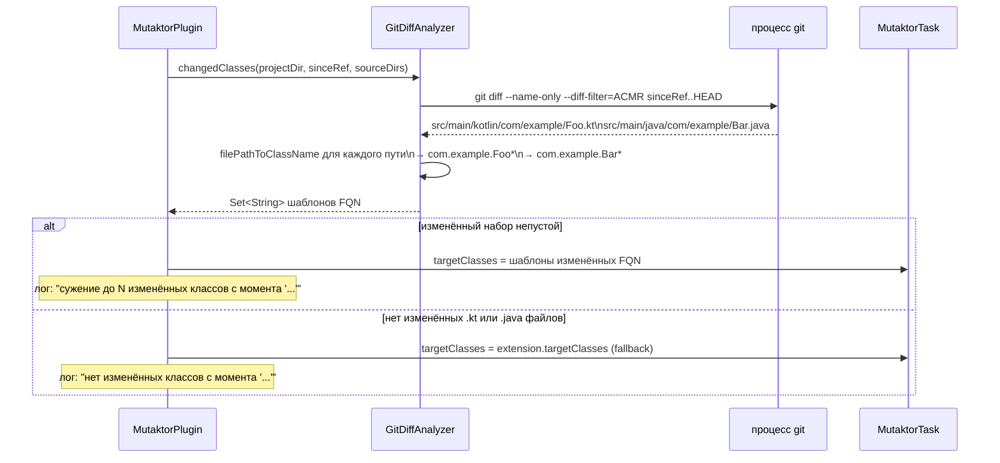

# Анализ в рамках git-diff


## Обзор

Полное мутационное тестирование крупной кодовой базы может занять минуты или часы. На feature-ветке, где изменились лишь несколько файлов, запуск PIT против всего glob `com.example.*` — это расточительство: подавляющая часть времени тратится на мутирование кода, которого не касалось рассматриваемое изменение.

Свойство `since` включает **анализ в рамках git-diff**: Mutaktor запускает `git diff` между текущим `HEAD` и ссылочным коммитом, собирает файлы `.kt` и `.java`, которые были добавлены, скопированы, изменены или переименованы, преобразует эти пути файлов в шаблоны полностью квалифицированных имён классов и передаёт только эти шаблоны в PIT в виде `--targetClasses`.

В результате стоимость прогона мутаций пропорциональна **размеру изменения**, а не размеру всей кодовой базы.

---

## Как это работает



### Команда git diff

`GitDiffAnalyzer` выполняет ровно эту команду в директории проекта:

```
git diff --name-only --diff-filter=ACMR sinceRef..HEAD
```

| Флаг | Значение |
|------|----------|
| `--name-only` | Выводить только имена файлов, по одному на строку |
| `--diff-filter=ACMR` | Включать Added (добавленные), Copied (скопированные), Modified (изменённые) и Renamed (переименованные) файлы; удалённые файлы исключаются (мутировать нечего) |
| `sinceRef..HEAD` | Двухточечный диапазон: все коммиты, достижимые из `HEAD`, но не из `sinceRef` |

Если git завершается с ненулевым кодом, выбрасывается `RuntimeException` с выводом stderr, завершая сборку с понятным сообщением об ошибке.

### Преобразование пути файла в имя класса

Для каждого пути файла, возвращённого `git diff`, `GitDiffAnalyzer.filePathToClassName` выполняет следующие шаги:

1. Проверяет, что расширение файла — `kt` или `java`. Другие файлы (ресурсы, build-скрипты, markdown) тихо пропускаются.
2. Разрешает путь до абсолютного канонического пути.
3. Перебирает все настроенные исходные директории (`src/main/kotlin`, `src/main/java` и любые пользовательские корни исходников Kotlin) и находит ту, которая является родительской для файла.
4. Вычисляет путь относительно этой исходной директории.
5. Удаляет расширение файла и заменяет разделители пути на `.` для получения полностью квалифицированного имени класса.
6. Добавляет `*` для соответствия самому классу и любым внутренним классам (companion-объекты, вложенные классы, анонимные классы).

#### Пример преобразования

```
Исходная директория:  /project/src/main/kotlin
Изменённый файл:      src/main/kotlin/com/example/service/UserService.kt

Полученный шаблон:   com.example.service.UserService*
```

PIT получает `--targetClasses=com.example.service.UserService*`, что соответствует:
- `UserService`
- `UserService$Companion`
- `UserService$1` (анонимный класс)
- `UserService$Builder` (внутренний класс)

---

## Конфигурация

```kotlin
// Kotlin DSL
mutaktor {
    since = "main"
}
```

```groovy
// Groovy DSL
mutaktor {
    since = 'main'
}
```

Свойство `since` принимает любую git-ссылку:

| Значение | Значение |
|----------|----------|
| `"main"` | Все коммиты в текущей ветке, ещё не слитые в `main` |
| `"develop"` | Все коммиты, ещё не слитые в `develop` |
| `"HEAD~5"` | Последние 5 коммитов в текущей ветке |
| `"v1.2.3"` | Все коммиты с момента тега `v1.2.3` |
| `"a1b2c3d"` | Все коммиты с конкретного SHA коммита (7 или 40 символов) |
| `"origin/main"` | Все коммиты с момента удалённой главной ветки (полезно в CI с `fetch-depth: 0`) |

---

## Преимущества в производительности

Прирост производительности масштабируется с соотношением изменённого кода к общему объёму кодовой базы.

| Сценарий | Без `since` | С `since` | Типичное ускорение |
|----------|-------------|-----------|-------------------|
| 2 изменённых файла в кодовой базе из 500 классов | Мутирует все 500 классов | Мутирует 2 класса | ~250x |
| Feature-ветка, изменены 20 файлов | Мутирует все 500 классов | Мутирует ~20 классов | ~25x |
| Нет изменений в исходниках (только документация/конфиг) | Мутирует все 500 классов | Откатывается к полному `targetClasses` | 1x |
| Hotfix PR для одного класса | Мутирует все N классов | Мутирует 1 класс | ~N x |

> **Совет:** Типичный прогон CI на PR, затрагивающем 3–5 файлов, завершится за 30–90 секунд вместо 10–30 минут на кодовой базе среднего размера.

---

## Использование в CI с GitHub Actions

### Область мутаций для PR

Наиболее распространённый шаблон — ограничение мутационного тестирования изменениями, внесёнными pull request, используя `origin/main` в качестве ссылки:

```yaml
# .github/workflows/mutation.yml
name: Mutation Testing

on:
  pull_request:
    branches: [main]

jobs:
  mutate:
    runs-on: ubuntu-latest
    permissions:
      checks: write
      contents: read

    steps:
      - uses: actions/checkout@v4
        with:
          fetch-depth: 0     # обязательно: git diff требует полной истории

      - uses: actions/setup-java@v4
        with:
          distribution: temurin
          java-version: 21

      - uses: gradle/actions/setup-gradle@v4

      - name: Run scoped mutation testing
        run: ./gradlew mutate --no-daemon
        env:
          MUTATION_SINCE: origin/main
          GITHUB_TOKEN: ${{ secrets.GITHUB_TOKEN }}
          GITHUB_REPOSITORY: ${{ github.repository }}
          GITHUB_SHA: ${{ github.sha }}

      - name: Upload mutation report
        uses: actions/upload-artifact@v4
        if: always()
        with:
          name: mutation-report
          path: build/reports/mutaktor/
          retention-days: 7
```

В `build.gradle.kts` прочитайте переменную окружения:

```kotlin
mutaktor {
    since = providers.environmentVariable("MUTATION_SINCE").orNull
    targetClasses = setOf("com.example.*")   // fallback, когда MUTATION_SINCE не задан
    mutationScoreThreshold = 80
}
```

> **Примечание:** `fetch-depth: 0` **обязателен**. Без него `actions/checkout` выполняет поверхностное клонирование, и `git diff sinceRef..HEAD` может завершиться с ошибкой, поскольку `sinceRef` отсутствует в локальной истории.

### Полное сканирование на главной ветке

На главной ветке (после слияния) выполните полное сканирование без ограничения области:

```yaml
name: Full Mutation Scan

on:
  push:
    branches: [main]

jobs:
  mutate:
    runs-on: ubuntu-latest
    steps:
      - uses: actions/checkout@v4
        with:
          fetch-depth: 0

      - uses: actions/setup-java@v4
        with:
          distribution: temurin
          java-version: 21

      - uses: gradle/actions/setup-gradle@v4

      - name: Run full mutation scan
        run: ./gradlew mutate --no-daemon
        # Нет MUTATION_SINCE → полное сканирование против targetClasses
```

### Запланированное еженедельное полное сканирование

```yaml
name: Weekly Mutation Baseline

on:
  schedule:
    - cron: '0 3 * * 1'   # Понедельник 03:00 UTC

jobs:
  baseline:
    runs-on: ubuntu-latest
    steps:
      - uses: actions/checkout@v4
        with:
          fetch-depth: 0

      - uses: actions/setup-java@v4
        with:
          distribution: temurin
          java-version: 21

      - uses: gradle/actions/setup-gradle@v4

      - name: Full mutation scan
        run: ./gradlew mutate --no-daemon

      - name: Upload baseline report
        uses: actions/upload-artifact@v4
        with:
          name: mutation-baseline-${{ github.run_id }}
          path: build/reports/mutaktor/
          retention-days: 90
```

---

## Комбинирование с инкрементальной историей

Для ещё более быстрых повторных прогонов на главной ветке объедините `since` с инкрементальной историей анализа PIT. PIT повторно использует результаты предыдущего прогона для мутантов, чей окружающий код не изменился.

```kotlin
// build.gradle.kts
mutaktor {
    since = providers.environmentVariable("MUTATION_SINCE").orNull

    val historyFile = layout.projectDirectory.file(".mutation-history")
    historyInputLocation = historyFile
    historyOutputLocation = historyFile
}
```

```yaml
# .github/workflows/mutation.yml
- name: Restore mutation history
  uses: actions/cache@v4
  with:
    path: .mutation-history
    key: mutation-history-${{ github.ref_name }}-${{ github.sha }}
    restore-keys: |
      mutation-history-${{ github.ref_name }}-
      mutation-history-main-

- name: Run mutation testing
  run: ./gradlew mutate --no-daemon
  env:
    MUTATION_SINCE: origin/main

- name: Save mutation history
  uses: actions/cache@v4
  with:
    path: .mutation-history
    key: mutation-history-${{ github.ref_name }}-${{ github.sha }}
```

---

## Граничные случаи и поведение fallback

| Ситуация | Поведение |
|----------|-----------|
| `since` не задан | Используется `targetClasses` из расширения без изменений |
| `git diff` не возвращает `.kt` или `.java` файлов (изменились только документация, конфиг или build-скрипты) | Откатывается к `targetClasses`; логирует `"нет изменённых классов с момента '...'"` |
| Изменённый файл находится вне всех настроенных исходных директорий | Файл тихо пропускается; только файлы в известных корнях исходников отображаются на шаблоны классов |
| `git` отсутствует в `PATH` | `RuntimeException` выбрасывается при выполнении задачи с сообщением об ошибке |
| `sinceRef` не существует (опечатка, удалённая ветка) | `git diff` завершается с ненулевым кодом; `RuntimeException` выбрасывается со stderr git |
| Поверхностное клонирование без `fetch-depth: 0` | `git diff` может завершиться с ошибкой, поскольку коммит `sinceRef` отсутствует в локальной истории |

---

## API GitDiffAnalyzer

`GitDiffAnalyzer` — это `object` Kotlin (синглтон). Его публичный интерфейс состоит из одного метода:

```kotlin
object GitDiffAnalyzer {

    /**
     * Возвращает набор glob-шаблонов (например, "com.example.Foo*") для классов,
     * чьи исходные файлы изменились между sinceRef и HEAD.
     *
     * Возвращает пустой набор, если не изменились релевантные исходные файлы — вызывающий
     * должен откатиться к targetClasses расширения в этом случае.
     *
     * @param projectDir  корневая директория проекта (рабочее дерево git)
     * @param sinceRef    git-ссылка для сравнения (имя ветки, тег или SHA коммита)
     * @param sourceDirs  исходные директории для отображения путей файлов в имена классов
     */
    fun changedClasses(
        projectDir: File,
        sinceRef: String,
        sourceDirs: Set<File>,
    ): Set<String>
}
```

Функция `filePathToClassName` является `internal` и покрыта модульными тестами в `GitDiffAnalyzerTest`.

---

## Требования

- `git` должен быть доступен в `PATH` процесса, запускающего Gradle.
- Директория проекта должна находиться внутри git-репозитория.
- `sinceRef` должен разрешаться в коммит, достижимый из текущего HEAD.
- Используйте `fetch-depth: 0` в `actions/checkout@v4`, чтобы поверхностные клоны не усекали релевантную историю.

---

## См. также

- [Архитектура плагина](./01-architecture.md)
- [Справочник по конфигурационному DSL](./02-configuration.md#git-aware-analysis)
- [Форматы отчётов и Quality Gate](./05-reporting.md)
- [Интеграция с CI/CD](./07-ci-cd.md)
