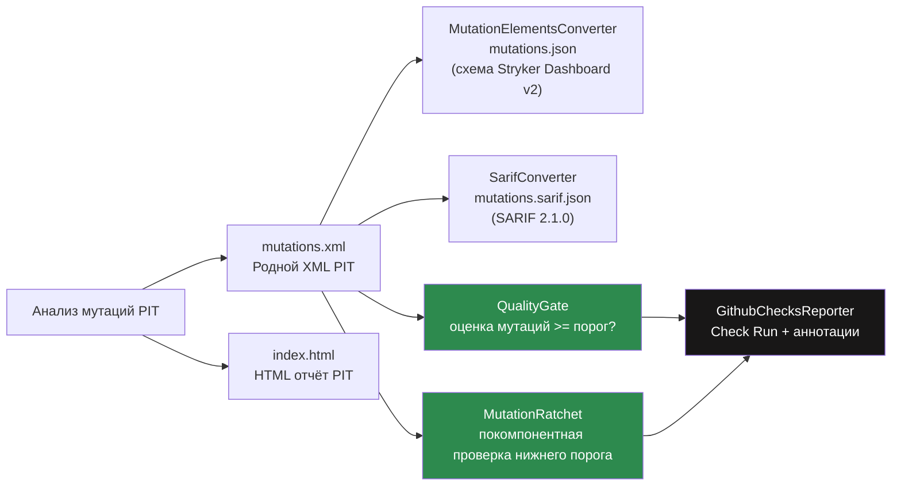
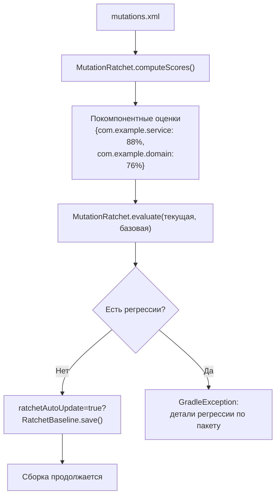
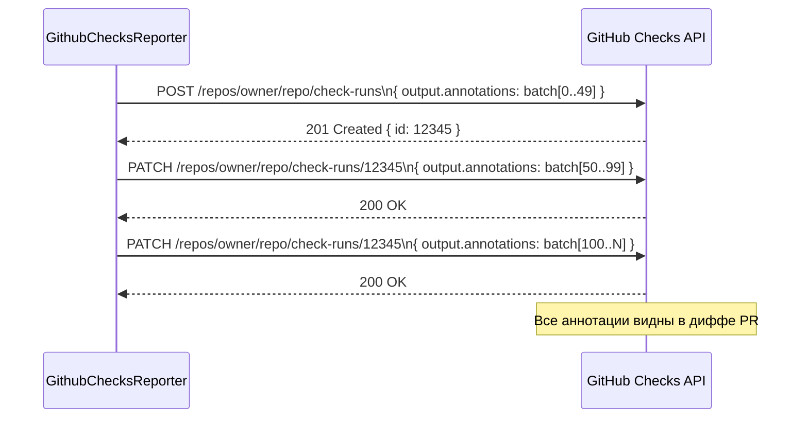

# Форматы отчётов и Quality Gate


## Обзор

После завершения анализа мутаций PIT Mutaktor запускает **конвейер постобработки**, который производит несколько форматов вывода из родного XML PIT и применяет настраиваемые политики качества. Каждый компонент ориентирован на разного потребителя: HTML для ручной проверки, JSON mutation-testing-elements для Stryker Dashboard, SARIF для GitHub Code Scanning, quality gate для прохождения/провала CI, ratchet для предотвращения регрессий и GitHub Checks для встроенных аннотаций PR.



Все шаги постобработки выполняются внутри `MutaktorTask.postProcess()` сразу после выхода PIT. Шаги защищены индивидуально: отсутствующий `mutations.xml` пропускает весь конвейер с предупреждением; свойство `sarifReport = false` пропускает только шаг SARIF.

---

## Структура директории отчётов

По умолчанию все отчёты записываются в `build/reports/mutaktor/`. После полного прогона:

```
build/reports/mutaktor/
├── index.html                          # Интерактивный HTML-обзор PIT
├── mutations.xml                       # Машиночитаемый XML PIT (обязателен для конвейера)
├── mutations.json                      # JSON mutation-testing-elements (jsonReport=true)
├── mutations.sarif.json                # SARIF 2.1.0 (sarifReport=true)
└── com/
    └── example/
        └── UserService.java.html       # HTML на уровне строк для каждого класса
```

Изменить выходную директорию:

```kotlin
mutaktor {
    reportDir = layout.buildDirectory.dir("reports/mutation")
}
```

---

## HTML-отчёт (родной PIT)

HTML-отчёт генерируется непосредственно PIT. Постобработка Mutaktor не требуется. Включается путём добавления `"HTML"` в `outputFormats` (по умолчанию).

### Что содержит HTML-отчёт

- Страница сводки (`index.html`) с покомпонентными оценками мутаций и цветными значками
- Страницы для каждого класса с аннотированными строками исходного кода по статусу мутации:
  - Зелёный: все мутации на этой строке были уничтожены
  - Красный: одна или более мутаций на этой строке выжили
  - Серый: строка не была мутирована
- Детализация до отдельных описаний мутаций и имён уничтожающих тестов

### Открытие локально

```bash
./gradlew mutate
open build/reports/mutaktor/index.html          # macOS
xdg-open build/reports/mutaktor/index.html      # Linux
start build\reports\mutaktor\index.html         # Windows
```

---

## JSON mutation-testing-elements

`MutationElementsConverter` разбирает `mutations.xml` и производит `mutations.json`, соответствующий [схеме mutation-testing-elements версии 2](https://github.com/stryker-mutator/mutation-testing-elements/tree/master/packages/report-schema). Этот формат потребляется [Stryker Dashboard](https://dashboard.stryker-mutator.io/).

Включается через `jsonReport = true` (по умолчанию в v0.2.0).

### Структура JSON

```json
{
  "schemaVersion": "2",
  "thresholds": { "high": 80, "low": 60 },
  "projectRoot": ".",
  "files": {
    "src/main/kotlin/com/example/UserService.kt": {
      "language": "kotlin",
      "source": "package com.example;\n...",
      "mutants": [
        {
          "id": "1001",
          "mutatorName": "ConditionalsBoundaryMutator",
          "replacement": "changed conditional boundary",
          "location": {
            "start": { "line": 42, "column": 1 },
            "end":   { "line": 42, "column": 100 }
          },
          "status": "Killed",
          "killedBy": ["shouldRejectNegativeAge"]
        },
        {
          "id": "1002",
          "mutatorName": "NegateConditionalsMutator",
          "replacement": "negated conditional",
          "location": {
            "start": { "line": 58, "column": 1 },
            "end":   { "line": 58, "column": 100 }
          },
          "status": "Survived",
          "killedBy": []
        }
      ]
    }
  }
}
```

### Маппинг статусов PIT → Stryker

| Статус PIT | Статус Stryker |
|------------|----------------|
| `KILLED` | `Killed` |
| `SURVIVED` | `Survived` |
| `NO_COVERAGE` | `NoCoverage` |
| `TIMED_OUT` | `Timeout` |
| `MEMORY_ERROR` | `RuntimeError` |
| `RUN_ERROR` | `RuntimeError` |

---

## SARIF 2.1.0 (GitHub Code Scanning)

`SarifConverter` разбирает `mutations.xml` и производит `mutations.sarif.json` в формате [SARIF 2.1.0](https://docs.oasis-open.org/sarif/sarif/v2.1.0/sarif-v2.1.0.html). Только **выжившие** мутации включаются в результаты — уничтоженные мутации означают корректное покрытие тестами и не требуют внимания разработчика.

Включается через `sarifReport = true` (по умолчанию `false`).

Загрузите SARIF-файл в API Code Scanning GitHub для отображения выживших мутантов в виде аннотаций непосредственно в диффах pull request, сохраняемых между прогонами во вкладке Security.

### Структура вывода SARIF

```json
{
  "$schema": "https://raw.githubusercontent.com/oasis-tcs/sarif-spec/main/sarif-2.1/schema/sarif-schema-2.1.0.json",
  "version": "2.1.0",
  "runs": [{
    "tool": {
      "driver": {
        "name": "Mutaktor (PIT)",
        "version": "1.23.0",
        "informationUri": "https://github.com/dantte-lp/mutaktor"
      }
    },
    "results": [
      {
        "ruleId": "mutation/survived",
        "level": "warning",
        "message": {
          "text": "Survived mutation: negated conditional"
        },
        "locations": [{
          "physicalLocation": {
            "artifactLocation": {
              "uri": "src/main/kotlin/com/example/UserService.kt"
            },
            "region": { "startLine": 58 }
          }
        }]
      }
    ]
  }]
}
```

### Маппинг полей SARIF

| Поле SARIF | Значение |
|------------|---------|
| `ruleId` | `mutation/survived` |
| `level` | `warning` |
| `message.text` | `Survived mutation: <описание PIT>` |
| `artifactLocation.uri` | Относительный путь к исходному файлу |
| `region.startLine` | Номер строки из XML PIT |
| `driver.name` | `Mutaktor (PIT)` |
| `driver.version` | Версия PIT (например, `1.23.0`) |

### Загрузка в GitHub Code Scanning

```yaml
# .github/workflows/mutation.yml
- name: Run mutation tests
  run: ./gradlew mutate --no-daemon

- name: Upload SARIF to GitHub Code Scanning
  uses: github/codeql-action/upload-sarif@v3
  if: always()    # загружать даже при провале quality gate
  with:
    sarif_file: build/reports/mutaktor/mutations.sarif.json
    category: mutation-testing
```

---

## Quality Gate

`QualityGate` читает `mutations.xml`, подсчитывает мутации по статусу и вычисляет оценку мутаций:

```
оценка = уничтоженные мутации × 100 / всего мутаций
```

Когда `mutationScoreThreshold` задан в DSL, `MutaktorTask` вызывает `QualityGate.evaluate()` и выбрасывает `GradleException`, если оценка ниже порога.

Если `totalMutations == 0` (ничего не мутировалось — например, изменились только исключённые классы), оценка считается равной `100` и проверка проходит.

### QualityGate.Result

```kotlin
data class Result(
    val totalMutations: Int,
    val killedMutations: Int,
    val survivedMutations: Int,
    val mutationScore: Int,    // целочисленный процент 0–100
    val passed: Boolean,
    val threshold: Int,
)
```

### Примеры вычисления оценки

| Всего | Уничтожено | Оценка | Порог | Прошло? |
|-------|-----------|--------|-------|---------|
| 100 | 85 | 85% | 80% | Да |
| 100 | 75 | 75% | 80% | Нет |
| 0 | 0 | 100% | 80% | Да (нет мутаций) |
| 50 | 40 | 80% | 80% | Да (ровно на пороге) |
| 50 | 39 | 78% | 80% | Нет |

### Конфигурация

```kotlin
// Kotlin DSL
mutaktor {
    mutationScoreThreshold = 80   // 0–100
}
```

```groovy
// Groovy DSL
mutaktor {
    mutationScoreThreshold = 80
}
```

При провале проверки:

```
Mutaktor: quality gate FAILED — mutation score 72% is below threshold 80%
```

---

## Покомпонентный ratchet

Ratchet предотвращает регрессию оценки мутаций на покомпонентной основе. При каждом прогоне `MutationRatchet` вычисляет покомпонентные оценки из `mutations.xml` и сравнивает их с сохранённой базовой оценкой в формате JSON. Если любой пакет опускается ниже ранее зафиксированной оценки, сборка завершается с ошибкой.

### Как это работает



### Файл базовой оценки

Базовая оценка хранится как JSON в `.mutaktor-baseline.json` (или по пути, настроенному через `ratchetBaseline`):

```json
{
  "com.example.service": { "packageName": "com.example.service", "score": 88, "total": 52, "killed": 46 },
  "com.example.domain": { "packageName": "com.example.domain", "score": 76, "total": 25, "killed": 19 }
}
```

> **Совет:** Зафиксируйте `.mutaktor-baseline.json` в репозитории, чтобы базовая оценка ratchet была общей для разработчиков и прогонов CI. Файл небольшой (несколько КБ) и изменяется только при улучшении оценок пакетов.

### Вывод при регрессии

```
Mutaktor: ratchet FAILED — mutation score regression detected:
  com.example.service: 88% → 72%
  com.example.domain: 76% → 68%
```

### Поведение автоматического обновления

Когда `ratchetAutoUpdate = true` (по умолчанию), базовая оценка автоматически обновляется после успешного прогона для фиксации любых улучшений оценки. Это означает, что ratchet — это **нижний порог**, а не потолок: оценки могут только расти.

```
До:   com.example.service: 85%
После: com.example.service: 91%  (улучшение)
→ Базовая оценка обновлена до 91%
Следующий PR: должен поддерживать ≥ 91% для com.example.service
```

### Конфигурация

```kotlin
// Kotlin DSL
mutaktor {
    ratchetEnabled = true
    ratchetBaseline = layout.projectDirectory.file(".mutaktor-baseline.json")
    ratchetAutoUpdate = true
}
```

---

## Репортер GitHub Checks API

`GithubChecksReporter` создаёт Check Run в GitHub с именем **Mutaktor** на текущем коммите и публикует предупреждающую аннотацию для каждого выжившего мутанта. Заключение проверки — `success`, если `mutationScore >= threshold`, иначе `failure`.

Этот репортер активируется автоматически, когда присутствуют все три переменные окружения: `GITHUB_TOKEN`, `GITHUB_REPOSITORY` и `GITHUB_SHA`.

### Обязательные переменные окружения

| Переменная | Источник | Описание |
|------------|---------|----------|
| `GITHUB_TOKEN` | `${{ secrets.GITHUB_TOKEN }}` | Персональный токен доступа или токен рабочего процесса с разрешением `checks: write` |
| `GITHUB_REPOSITORY` | Встроенная переменная GitHub Actions | Формат `owner/repo`, например `dantte-lp/mutaktor` |
| `GITHUB_SHA` | Встроенная переменная GitHub Actions | SHA коммита, запустившего рабочий процесс |

### Пакетная обработка аннотаций

GitHub Checks API принимает максимум 50 аннотаций за запрос. Когда выживают более 50 мутантов, `GithubChecksReporter` автоматически группирует их в пакеты:



### Шаблоны вывода Check Run

Когда мутанты выживают:

```
Mutation Score: 74% (threshold: 80%)

26 survived mutant(s) detected. Review the annotations below for details.
```

Когда все мутанты уничтожены:

```
Mutation Score: 100% (threshold: 80%)

All mutants were killed. Excellent test coverage!
```

### Настройка GitHub Actions

Задание рабочего процесса должно объявить разрешение `checks: write`:

```yaml
jobs:
  mutation:
    runs-on: ubuntu-latest
    permissions:
      checks: write
      contents: read

    steps:
      - uses: actions/checkout@v4
        with:
          fetch-depth: 0

      - uses: actions/setup-java@v4
        with:
          distribution: temurin
          java-version: 21

      - uses: gradle/actions/setup-gradle@v4

      - name: Run mutation tests
        run: ./gradlew mutate --no-daemon
        env:
          GITHUB_TOKEN: ${{ secrets.GITHUB_TOKEN }}
          GITHUB_REPOSITORY: ${{ github.repository }}
          GITHUB_SHA: ${{ github.sha }}
          MUTATION_SINCE: origin/main

      - name: Upload HTML report
        uses: actions/upload-artifact@v4
        if: always()
        with:
          name: mutation-report
          path: build/reports/mutaktor/

      - name: Upload SARIF
        uses: github/codeql-action/upload-sarif@v3
        if: always()
        with:
          sarif_file: build/reports/mutaktor/mutations.sarif.json
          category: mutation-testing
```

---

## Безопасность XML

Как `MutationElementsConverter`, так и `SarifConverter` отключают обработку внешних сущностей XML при разборе `mutations.xml`:

```kotlin
factory.setFeature("http://apache.org/xml/features/disallow-doctype-decl", true)
```

Это предотвращает XXE (XML External Entity) инъекционные атаки. Хотя `mutations.xml` генерируется локально PIT, эта защита важна в общих средах сборки, где файл может поступать из сетевого расположения или кэша артефактов.

---

## Руководство по выбору формата отчёта

| Потребность | Формат | Свойство |
|-------------|--------|----------|
| Интерактивный просмотр мутаций | HTML | `outputFormats = setOf("HTML", "XML")` (по умолчанию) |
| Передача в Stryker Dashboard | JSON | `jsonReport = true` (по умолчанию) |
| Оповещения GitHub Code Scanning | SARIF | `sarifReport = true` |
| Провал CI ниже порога | Quality gate | `mutationScoreThreshold = 80` |
| Предотвращение регрессии оценки | Ratchet | `ratchetEnabled = true` |
| Встроенные аннотации PR | GitHub Checks | Задать переменную окружения `GITHUB_TOKEN` |
| Машиночитаемый конвейер CI | XML | Всегда генерируется при наличии `"XML"` в `outputFormats` |

---

## См. также

- [Архитектура плагина](./01-architecture.md)
- [Справочник по конфигурационному DSL](./02-configuration.md#reporting)
- [Фильтр мусорных мутаций Kotlin](./03-kotlin-filters.md)
- [Анализ в рамках git-diff](./04-git-integration.md)
- [Интеграция с CI/CD](./07-ci-cd.md)
- [Схема mutation-testing-elements](https://github.com/stryker-mutator/mutation-testing-elements/tree/master/packages/report-schema)
- [Спецификация SARIF 2.1.0](https://docs.oasis-open.org/sarif/sarif/v2.1.0/sarif-v2.1.0.html)
- [GitHub Checks API](https://docs.github.com/en/rest/checks)
