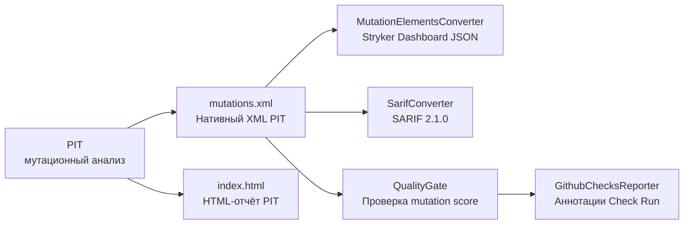
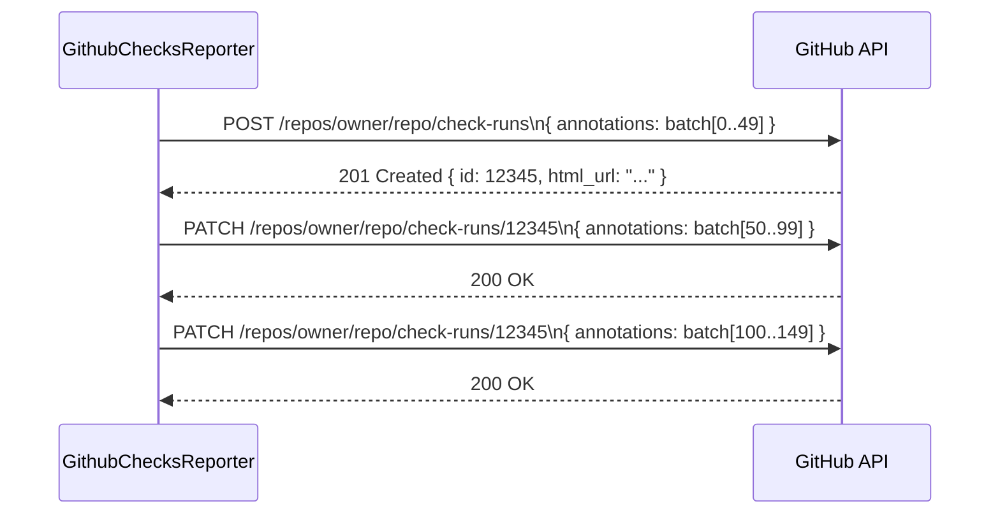

# Форматы отчётов и Quality Gate


## Обзор

После завершения мутирования и прогона тестов Mutaktor создаёт несколько форматов отчётов из нативного XML-вывода PIT. Каждый формат ориентирован на конкретного потребителя: HTML-отчёт — для ручного просмотра, mutation-testing-elements JSON питает Stryker Dashboard, SARIF-файл интегрируется с GitHub Code Scanning, а GitHub Checks API выводит отдельных выживших мутантов как встроенные аннотации в PR.



## Структура директории отчётов

По умолчанию все отчёты записываются в `build/reports/mutaktor/`.

```
build/reports/mutaktor/
├── index.html              # Интерактивный HTML-отчёт PIT
├── mutations.xml           # Машиночитаемый XML PIT
└── com/
    └── example/
        └── MyClass.java.html   # HTML на уровне строк для каждого класса
```

Директория управляется свойством `reportDir` в расширении и может быть изменена:

```kotlin
mutaktor {
    reportDir = layout.buildDirectory.dir("reports/mutation")
}
```

## HTML-отчёт (нативный PIT)

HTML-отчёт генерируется непосредственно PIT. Никакой пост-обработки Mutaktor не требуется.

Включите его, добавив `"HTML"` в `outputFormats` (значение по умолчанию):

```kotlin
mutaktor {
    outputFormats = setOf("HTML", "XML")
}
```

### Что содержит HTML-отчёт

- Сводная страница (`index.html`) с mutation score на уровне пакетов с цветовой кодировкой
- Страницы для каждого класса с аннотированными исходными строками и статусами мутаций:
  - Зелёная подсветка: все мутации на этой строке уничтожены
  - Красная подсветка: одна или несколько мутаций на этой строке выжили
  - Серый: строка не мутировалась (исключена или недостижима)
- Детализация до описания отдельной мутации и имени уничтожившего теста

### Открытие отчёта локально

```bash
./gradlew mutate
open build/reports/mutaktor/index.html  # macOS
xdg-open build/reports/mutaktor/index.html  # Linux
start build/reports/mutaktor/index.html  # Windows
```

## Mutation-Testing-Elements JSON (Stryker Dashboard)

`MutationElementsConverter` разбирает `mutations.xml` и создаёт JSON-файл, соответствующий [схеме mutation-testing-elements версии 2](https://github.com/stryker-mutator/mutation-testing-elements/tree/master/packages/report-schema).

Этот формат используется [Stryker Dashboard](https://dashboard.stryker-mutator.io/) — размещённым сервисом для отслеживания mutation score во времени.

### Вызов

```kotlin
import io.github.dantte_lp.mutaktor.report.MutationElementsConverter
import java.io.File

val json = MutationElementsConverter.convert(
    mutationsXml = File("build/reports/mutaktor/mutations.xml"),
    sourceRoot = projectDir,
)
File("build/reports/mutaktor/mutation-report.json").writeText(json)
```

### Структура JSON

```json
{
  "schemaVersion": "2",
  "thresholds": { "high": 80, "low": 60 },
  "projectRoot": ".",
  "files": {
    "src/main/java/com/example/UserService.java": {
      "language": "java",
      "source": "package com.example;\n...",
      "mutants": [
        {
          "id": "1001",
          "mutatorName": "ConditionalsBoundaryMutator",
          "replacement": "changed conditional boundary",
          "location": {
            "start": { "line": 42, "column": 1 },
            "end":   { "line": 42, "column": 100 }
          },
          "status": "Killed",
          "killedBy": ["shouldRejectNegativeAge"]
        },
        {
          "id": "1002",
          "mutatorName": "NegateConditionalsMutator",
          "replacement": "negated conditional",
          "location": {
            "start": { "line": 58, "column": 1 },
            "end":   { "line": 58, "column": 100 }
          },
          "status": "Survived",
          "killedBy": []
        }
      ]
    }
  }
}
```

### Сопоставление статусов PIT и Stryker

| Статус PIT | Статус Stryker |
|---|---|
| `KILLED` | `Killed` |
| `SURVIVED` | `Survived` |
| `NO_COVERAGE` | `NoCoverage` |
| `TIMED_OUT` | `Timeout` |
| `MEMORY_ERROR` | `RuntimeError` |
| `RUN_ERROR` | `RuntimeError` |

## SARIF 2.1.0 (GitHub Code Scanning)

`SarifConverter` разбирает `mutations.xml` и создаёт JSON-файл [SARIF 2.1.0](https://docs.oasis-open.org/sarif/sarif/v2.1.0/sarif-v2.1.0.html). В результаты включаются только **выжившие** мутации — уничтоженные мутации свидетельствуют о корректном тестовом покрытии и не требуют внимания разработчика.

Загрузите SARIF-файл в API GitHub Code Scanning, чтобы выжившие мутации отображались как аннотации непосредственно в диффах pull request'ов.

### Вызов

```kotlin
import io.github.dantte_lp.mutaktor.report.SarifConverter
import java.io.File

val sarif = SarifConverter.convert(
    mutationsXml = File("build/reports/mutaktor/mutations.xml"),
    pitVersion = "1.23.0",
)
File("build/reports/mutaktor/mutation-results.sarif").writeText(sarif)
```

### Структура вывода SARIF

```json
{
  "$schema": "https://raw.githubusercontent.com/oasis-tcs/sarif-spec/main/sarif-2.1/schema/sarif-schema-2.1.0.json",
  "version": "2.1.0",
  "runs": [{
    "tool": {
      "driver": {
        "name": "Mutaktor (PIT)",
        "version": "1.23.0",
        "informationUri": "https://github.com/dantte-lp/mutaktor"
      }
    },
    "results": [
      {
        "ruleId": "mutation/survived",
        "level": "warning",
        "message": {
          "text": "Survived mutation: negated conditional"
        },
        "locations": [{
          "physicalLocation": {
            "artifactLocation": {
              "uri": "src/main/java/com/example/UserService.java"
            },
            "region": { "startLine": 58 }
          }
        }]
      }
    ]
  }]
}
```

### Загрузка в GitHub Code Scanning

```yaml
# .github/workflows/mutation.yml
- name: Run mutation testing
  run: ./gradlew mutate

- name: Generate SARIF
  run: |
    # Вызов конвертации SARIF (обычно подключается как post-task action)
    ./gradlew generateMutationSarif

- name: Upload SARIF to GitHub Code Scanning
  uses: github/codeql-action/upload-sarif@v3
  with:
    sarif_file: build/reports/mutaktor/mutation-results.sarif
    category: mutation-testing
  if: always()
```

`if: always()` гарантирует загрузку SARIF даже при сбое quality gate, чтобы аннотации были видны в PR.

## Quality Gate

`QualityGate` читает `mutations.xml`, подсчитывает мутации по статусам и вычисляет mutation score:

```
score = killedMutations * 100 / totalMutations
```

Если `totalMutations == 0` (ничего не мутировалось), score равен `100` — холостой запуск не штрафуется.

### Data-класс Result

```kotlin
data class Result(
    val totalMutations: Int,
    val killedMutations: Int,
    val survivedMutations: Int,
    val mutationScore: Int,    // 0–100
    val passed: Boolean,
    val threshold: Int,
)
```

### Вызов

```kotlin
import io.github.dantte_lp.mutaktor.report.QualityGate
import java.io.File

val result = QualityGate.evaluate(
    mutationsXml = File("build/reports/mutaktor/mutations.xml"),
    threshold = 80,
)

println("Mutation score: ${result.mutationScore}% (threshold: ${result.threshold}%)")
println("Total: ${result.totalMutations}, Killed: ${result.killedMutations}, Survived: ${result.survivedMutations}")

if (!result.passed) {
    throw GradleException("Quality gate failed: score ${result.mutationScore}% < threshold ${result.threshold}%")
}
```

### Quality Gate в CI

```yaml
- name: Check mutation quality gate
  run: |
    ./gradlew mutate checkMutationScore -Pmutation.threshold=80
```

### Примеры расчёта score

| Всего | Уничтожено | Score | Порог | Пройден? |
|---|---|---|---|---|
| 100 | 85 | 85% | 80% | Да |
| 100 | 75 | 75% | 80% | Нет |
| 0 | 0 | 100% | 80% | Да (нет мутаций) |
| 50 | 40 | 80% | 80% | Да (ровно на пороге) |

## Репортер GitHub Checks API

`GithubChecksReporter` создаёт GitHub Check Run с именем **Mutaktor** для текущего коммита и добавляет предупреждающую аннотацию для каждого выжившего мутанта. Результат check run — `success`, если `mutationScore >= threshold`, иначе `failure`.

### Необходимые переменные окружения

| Переменная | Источник | Описание |
|---|---|---|
| `GITHUB_TOKEN` | Секрет GitHub Actions | Personal access token или `secrets.GITHUB_TOKEN` с разрешением `checks: write` |
| `GITHUB_REPOSITORY` | Встроенная переменная GitHub Actions | Формат `owner/repo`, например `dantte-lp/mutaktor` |
| `GITHUB_SHA` | Встроенная переменная GitHub Actions | SHA коммита, запустившего воркфлоу |

### Вызов

```kotlin
import io.github.dantte_lp.mutaktor.report.GithubChecksReporter
import io.github.dantte_lp.mutaktor.report.QualityGate
import java.io.File

val mutationsXml = File("build/reports/mutaktor/mutations.xml")
val result = QualityGate.evaluate(mutationsXml, threshold = 80)
val survived = QualityGate.survivedMutants(mutationsXml)

GithubChecksReporter.report(
    token = System.getenv("GITHUB_TOKEN"),
    repository = System.getenv("GITHUB_REPOSITORY"),
    sha = System.getenv("GITHUB_SHA"),
    mutants = survived,
    mutationScore = result.mutationScore,
    threshold = 80,
)
```

### Пакетирование аннотаций

GitHub Checks API принимает максимум 50 аннотаций за один запрос. Когда выживших мутантов больше 50, `GithubChecksReporter` автоматически разбивает их на пакеты:

1. Первый запрос `POST /repos/{owner}/{repo}/check-runs` создаёт Check Run с первыми 50 аннотациями.
2. Последующие запросы `PATCH /repos/{owner}/{repo}/check-runs/{id}` добавляют оставшиеся пакеты.



### Вывод Check Run

В сводке Check Run используется следующий шаблон:

```
**Mutation Score:** 74% (threshold: 80%)

26 survived mutant(s) detected. Review the annotations below for details.
```

Или, когда все мутанты уничтожены:

```
**Mutation Score:** 100% (threshold: 80%)

All mutants were killed. Great test coverage!
```

### Полный воркфлоу GitHub Actions

```yaml
name: Mutation Testing with GitHub Checks

on:
  pull_request:
    branches: [main]

permissions:
  checks: write
  contents: read

jobs:
  mutate:
    runs-on: ubuntu-latest
    steps:
      - uses: actions/checkout@v4
        with:
          fetch-depth: 0

      - uses: actions/setup-java@v4
        with:
          distribution: temurin
          java-version: 17

      - name: Setup Gradle
        uses: gradle/actions/setup-gradle@v4

      - name: Run scoped mutation testing
        run: ./gradlew mutate
        env:
          MUTATION_SINCE: origin/main

      - name: Evaluate quality gate and post GitHub Check
        run: ./gradlew checkMutationGate
        env:
          GITHUB_TOKEN: ${{ secrets.GITHUB_TOKEN }}
          GITHUB_REPOSITORY: ${{ github.repository }}
          GITHUB_SHA: ${{ github.sha }}
          MUTATION_THRESHOLD: "80"
        if: always()

      - name: Upload HTML report
        uses: actions/upload-artifact@v4
        with:
          name: mutation-report
          path: build/reports/mutaktor/
        if: always()

      - name: Upload SARIF
        uses: github/codeql-action/upload-sarif@v3
        with:
          sarif_file: build/reports/mutaktor/mutation-results.sarif
          category: mutation-testing
        if: always()
```

## Замечания по безопасности конвертеров отчётов

Оба — `MutationElementsConverter` и `SarifConverter` — отключают обработку XML External Entity при разборе `mutations.xml`:

```kotlin
factory.setFeature("http://apache.org/xml/features/disallow-doctype-decl", true)
```

Это предотвращает XXE-атаки (XML External Entity injection), если файл `mutations.xml` получен из ненадёжного источника.

## См. также

- [Архитектура плагина](./01-architecture.md)
- [Справочник по конфигурационному DSL](./02-configuration.md)
- [Фильтр мусорных мутаций Kotlin](./03-kotlin-filters.md)
- [Анализ в рамках git-диффа](./04-git-integration.md)
- [Схема mutation-testing-elements](https://github.com/stryker-mutator/mutation-testing-elements/tree/master/packages/report-schema)
- [Спецификация SARIF 2.1.0](https://docs.oasis-open.org/sarif/sarif/v2.1.0/sarif-v2.1.0.html)
- [GitHub Checks API](https://docs.github.com/en/rest/checks)
