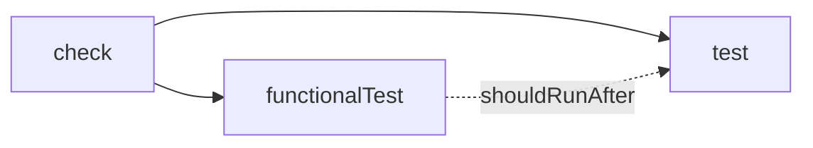

# Руководство по разработке


В этом руководстве описано всё необходимое для локальной сборки, тестирования и расширения Mutaktor.

---

## Предварительные требования

| Инструмент | Минимум | Примечания |
|------------|---------|------------|
| JDK | 17 | Протестировано с JDK 17, 21 и 25 (дистрибутив Temurin) |
| Git | любая | Требуется для функциональных тестов, проверяющих `GitDiffAnalyzer` |
| Docker / Podman | необязательно | Нужен только для запуска dev-контейнера |

Никаких других инструментов не требуется. Gradle и Kotlin управляются обёрткой Gradle (`gradlew`).

---

## Начало работы

```bash
git clone https://github.com/dantte-lp/mutaktor.git
cd mutaktor
./gradlew check
```

`./gradlew check` запускает компиляцию, модульные тесты и функциональные тесты. Чистое клонирование даёт `BUILD SUCCESSFUL` менее чем за две минуты на типичном оборудовании разработчика.

---

## Структура проекта

```
mutaktor/
├── mutaktor-gradle-plugin/            # Основной модуль плагина Gradle
│   ├── build.gradle.kts
│   └── src/
│       ├── main/kotlin/io/github/dantte_lp/mutaktor/
│       │   ├── MutaktorPlugin.kt              # Точка входа плагина
│       │   ├── MutaktorExtension.kt           # Типобезопасный DSL (32 свойства)
│       │   ├── MutaktorTask.kt                # Основная задача: JavaExec + постобработка
│       │   ├── MutaktorAggregatePlugin.kt     # Агрегирование multi-module
│       │   ├── git/
│       │   │   └── GitDiffAnalyzer.kt         # git diff → targetClasses
│       │   ├── toolchain/
│       │   │   └── GraalVmDetector.kt         # Определение GraalVM + Quarkus
│       │   ├── extreme/
│       │   │   └── ExtremeMutationConfig.kt   # Мутаторы удаления тела метода
│       │   ├── ratchet/
│       │   │   ├── MutationRatchet.kt         # Покомпонентный нижний порог оценки
│       │   │   └── RatchetBaseline.kt         # Сохранение базовой оценки JSON
│       │   ├── report/
│       │   │   ├── MutationElementsConverter.kt
│       │   │   ├── SarifConverter.kt
│       │   │   ├── GithubChecksReporter.kt
│       │   │   └── QualityGate.kt
│       │   └── util/
│       │       ├── XmlParser.kt               # Безопасный разбор XML
│       │       ├── JsonBuilder.kt             # Построитель JSON без зависимостей
│       │       └── SourcePathResolver.kt      # Путь файла → FQN
│       ├── test/                              # Модульные тесты (JUnit 5 + Kotest)
│       └── functionalTest/                    # Интеграционные тесты Gradle TestKit
│
├── mutaktor-pitest-filter/            # JAR плагина PIT
│   └── src/main/kotlin/io/github/dantte_lp/mutaktor/pitest/
│       └── KotlinJunkFilter.kt               # MutationInterceptor SPI (5 шаблонов)
│
├── mutaktor-annotations/              # Модуль аннотаций уровня исходного кода
│   └── src/main/kotlin/io/github/dantte_lp/mutaktor/annotations/
│       ├── MutationCritical.kt
│       └── SuppressMutations.kt
│
├── build-logic/                       # Конвенционные плагины (общая конфигурация сборки)
│   └── src/main/kotlin/
│       └── kotlin-conventions.gradle.kts
│
├── gradle/
│   └── libs.versions.toml             # Каталог версий
├── gradle.properties                  # version, group
├── settings.gradle.kts
├── CHANGELOG.md
└── .github/workflows/
    ├── ci.yml
    └── release.yml
```

### Ответственность модулей

| Модуль | Артефакт | Назначение |
|--------|----------|------------|
| `mutaktor-gradle-plugin` | `io.github.dantte-lp.mutaktor` | Плагин Gradle, применяемый в потребительских сборках |
| `mutaktor-pitest-filter` | `mutaktor-pitest-filter.jar` | JAR плагина PIT, загружаемый во время выполнения мутационного тестирования |
| `mutaktor-annotations` | `mutaktor-annotations.jar` | Аннотации `@MutationCritical` и `@SuppressMutations` |
| `build-logic` | (внутренний) | Общие соглашения Kotlin + JVM toolchain |

---

## Команды сборки

```bash
# Полная верификация: компиляция + модульные тесты + функциональные тесты
./gradlew check

# Только модульные тесты (быстрая обратная связь)
./gradlew test

# Только функциональные тесты Gradle TestKit
./gradlew functionalTest

# Только тесты модуля фильтра
./gradlew :mutaktor-pitest-filter:test

# Только тесты модуля аннотаций (сейчас нет тестов — только модуль аннотаций)
./gradlew :mutaktor-annotations:check

# Компиляция без запуска тестов
./gradlew build

# Очистка результатов сборки
./gradlew clean

# Запуск с подробным выводом для отладки проблем classpath
./gradlew check --info
```

Задача `check` настроена следующим образом:



`functionalTest` использует `shouldRunAfter(test)`, а не `dependsOn`, поэтому обе задачи могут выполняться параллельно при наличии ресурсов (например, с `--parallel`).

---

## Версии зависимостей

Все версии объявлены в `gradle/libs.versions.toml`:

```toml
[versions]
kotlin         = "2.3.0"
pitest         = "1.23.0"
pitest-junit5  = "1.2.3"
junit          = "5.12.2"
kotest         = "6.0.0.M4"
gradle-testkit = "9.4.1"

[libraries]
pitest-command-line   = { module = "org.pitest:pitest-command-line",   version.ref = "pitest" }
pitest-entry          = { module = "org.pitest:pitest-entry",           version.ref = "pitest" }
pitest-junit5-plugin  = { module = "org.pitest:pitest-junit5-plugin",  version.ref = "pitest-junit5" }
junit-jupiter         = { module = "org.junit.jupiter:junit-jupiter",  version.ref = "junit" }
kotest-assertions     = { module = "io.kotest:kotest-assertions-core", version.ref = "kotest" }
```

---

## Соглашения кода

### Язык

- **Только Kotlin.** Никакого Groovy, никакой Java в production-коде.
- Имена пакетов используют подчёркивания из-за имени пользователя GitHub: `io.github.dantte_lp.mutaktor`.

### Provider API Gradle

Все свойства задачи должны использовать Provider API для ленивого вычисления и совместимости с configuration cache:

```kotlin
// Правильно — ленивое вычисление, безопасно для configuration cache
public abstract val threads: Property<Int>
public abstract val targetClasses: SetProperty<String>

// Неправильно — немедленное вычисление, нарушает configuration cache
var threads: Int = 4
var targetClasses: MutableSet<String> = mutableSetOf()
```

| Тип | Сценарий использования |
|-----|------------------------|
| `Property<T>` | Одиночное скалярное значение |
| `SetProperty<T>` | Неупорядоченное множество (например, шаблоны классов) |
| `ListProperty<T>` | Упорядоченный список (например, аргументы JVM) |
| `MapProperty<K, V>` | Пары ключ-значение (например, конфигурация плагина) |
| `DirectoryProperty` | Выходная/входная директория |
| `RegularFileProperty` | Одиночный файл |
| `ConfigurableFileCollection` | Несколько файлов или директорий |

### Task API

```kotlin
// Правильно — ленивая регистрация, совместимо с Gradle 9
tasks.register("mutate", MutaktorTask::class.java) { task -> ... }

// Неправильно — немедленное создание, удалено в Gradle 9
tasks.create("mutate", MutaktorTask::class.java) { ... }
```

Никогда не храните ссылки на `Project` в полях задачи — это нарушает сериализацию configuration cache:

```kotlin
// Неправильно — Project не сериализуем
@get:Internal
val project: Project = ...

// Правильно — захватывать только то, что нужно во время конфигурации
@get:Input
val projectGroup: Property<String> = ...
```

### Директория сборки

```kotlin
// Правильно — совместимо с Gradle 9
task.reportDir.set(project.layout.buildDirectory.dir("reports/mutaktor"))

// Неправильно — устарело и удалено в Gradle 9
task.reportDir = project.buildDir.resolve("reports/mutaktor")
```

### Отсутствие внешних зависимостей

Production-код в `mutaktor-gradle-plugin` имеет ровно **одну** compile-зависимость: `org.pitest:pitest-command-line`. Всё остальное использует стандартную библиотеку JDK:

| Операция | Реализация |
|----------|-----------|
| HTTP-запросы | `java.net.http.HttpClient` (JDK 11+) |
| Разбор XML | `javax.xml.parsers.DocumentBuilderFactory` |
| Генерация JSON | `StringBuilder` через утилиту `JsonBuilder` |
| Файловый ввод-вывод | `java.io.File` |

Не добавляйте сторонние зависимости (Jackson, OkHttp, Gson и т.д.) в production-код `mutaktor-gradle-plugin`.

---

## Написание тестов

### Модульные тесты

Модульные тесты находятся в `mutaktor-gradle-plugin/src/test/` и используют JUnit 5 с assertions Kotest:

```kotlin
import io.kotest.matchers.shouldBe
import io.kotest.matchers.string.shouldContain
import org.junit.jupiter.api.Test

class SarifConverterTest {

    @Test
    fun `convert produces valid SARIF version field`() {
        val xml = buildMutationsXml(status = "SURVIVED")
        val sarif = SarifConverter.convert(xml, pitVersion = "1.23.0")
        sarif shouldContain """"version": "2.1.0""""
    }

    @Test
    fun `convert includes only survived mutations`() {
        val xml = buildMutationsXml(
            mutation("KILLED"),
            mutation("SURVIVED"),
            mutation("NO_COVERAGE"),
        )
        val sarif = SarifConverter.convert(xml, pitVersion = "1.23.0")
        sarif.occurrencesOf("mutation/survived") shouldBe 1
    }
}
```

### Функциональные тесты

Функциональные тесты находятся в `mutaktor-gradle-plugin/src/functionalTest/` и используют Gradle TestKit для запуска реальных сборок Gradle во временной директории:

```kotlin
import org.gradle.testkit.runner.GradleRunner
import org.junit.jupiter.api.Test
import org.junit.jupiter.api.io.TempDir
import java.io.File

class MutaktorPluginFunctionalTest {

    @TempDir
    lateinit var projectDir: File

    @Test
    fun `plugin applies and mutate task is registered`() {
        projectDir.resolve("settings.gradle.kts")
            .writeText("""rootProject.name = "test-project"""")
        projectDir.resolve("build.gradle.kts").writeText("""
            plugins {
                java
                id("io.github.dantte-lp.mutaktor")
            }
            mutaktor {
                targetClasses.set(setOf("com.example.*"))
            }
        """.trimIndent())

        val result = GradleRunner.create()
            .withProjectDir(projectDir)
            .withArguments("tasks", "--all")
            .withPluginClasspath()
            .build()

        result.output shouldContain "mutate"
    }
}
```

Набор тестов `functionalTest` настроен в `mutaktor-gradle-plugin/build.gradle.kts` и встроен в жизненный цикл `check`.

---

## Добавление новых шаблонов фильтров

Фильтры мусорных мутаций Kotlin находятся в `KotlinJunkFilter.kt` внутри модуля `mutaktor-pitest-filter`.

### Шаг 1 — Определить шаблон

Запустите PIT без фильтров на Kotlin-проекте и изучите `mutations.xml`. Ищите мутации со статусом `SURVIVED`, появляющиеся в коде, генерируемом компилятором. Зафиксируйте значения `<mutatedClass>`, `<method>` и `<description>`.

### Шаг 2 — Добавить предикат в KotlinJunkFilter

Откройте `KotlinJunkFilter.kt` и добавьте приватный метод-предикат:

```kotlin
/**
 * Шаблон 6 — синтетический класс $WhenMappings для sealed-класса.
 *
 * Kotlin компилирует `when` по sealed-классам в класс `$WhenMappings`,
 * содержащий int-массив. Мутации внутри этого класса неубиваемы.
 */
private fun isWhenMappingsClass(mutation: MutationDetails): Boolean {
    val className = mutation.className.asJavaName()
    return className.endsWith("\$WhenMappings")
}
```

### Шаг 3 — Встроить предикат в isKotlinJunk

```kotlin
private fun isKotlinJunk(mutation: MutationDetails): Boolean =
    isDefaultImplsClass(mutation)          ||
    isIntrinsicsNullCheck(mutation)        ||
    isDataClassGeneratedMethod(mutation)   ||
    isCoroutineStateMachine(mutation)      ||
    isWhenHashcodeDispatch(mutation)       ||
    isWhenMappingsClass(mutation)          // <-- новый шаблон
```

### Шаг 4 — Написать модульные тесты

```kotlin
@Test
fun `isWhenMappingsClass filters WhenMappings synthetic class`() {
    val mutation = fakeMutation(className = "com.example.Status\$WhenMappings")
    KotlinJunkFilter().intercept(listOf(mutation), fakeMutater()) shouldBe emptyList()
}

@Test
fun `regular class with WhenMappings substring in package is not filtered`() {
    val mutation = fakeMutation(className = "com.example.WhenMappingsHelper")
    KotlinJunkFilter().intercept(listOf(mutation), fakeMutater()) shouldBe listOf(mutation)
}
```

### Шаг 5 — Обновить документацию

Добавьте строку в таблицу фильтров в `docs/ru/03-kotlin-filters.md` и обновите `CHANGELOG.md` в разделе `[Unreleased] > Added`.

---

## Добавление новых форматов отчётов

Конвертеры отчётов находятся в `mutaktor-gradle-plugin/src/main/kotlin/io/github/dantte_lp/mutaktor/report/`.

### Шаг 1 — Создать объект-конвертер

```kotlin
package io.github.dantte_lp.mutaktor.report

import java.io.File

/**
 * Конвертирует mutations.xml PIT в формат тестовых результатов JUnit XML.
 * Каждый выживший мутант становится проваленным тест-кейсом.
 */
public object JUnitXmlConverter {

    public fun convert(mutationsXml: File, pitVersion: String): String {
        // Используйте XmlParser.parseSecureXml() для безопасного DOM-разбора
        // Используйте JsonBuilder или StringBuilder для построения вывода
        TODO("implement")
    }
}
```

Используйте только стандартную библиотеку JDK. Не добавляйте внешние библиотеки XML или строковой обработки.

### Шаг 2 — Добавить свойство в MutaktorExtension

```kotlin
// В MutaktorExtension.kt — раздел Reporting

/** Если true, создаёт сводный отчёт JUnit XML (junit-summary.xml). */
public abstract val junitXmlReport: Property<Boolean>

// В блоке init:
junitXmlReport.convention(false)
```

### Шаг 3 — Встроить в MutaktorTask.postProcess()

```kotlin
// В методе postProcess(), после существующих шагов:

if (junitXmlReport.getOrElse(false)) {
    val output = JUnitXmlConverter.convert(mutationsXml, pitVersion.getOrElse("unknown"))
    reportDirectory.resolve("junit-summary.xml").writeText(output)
    logger.lifecycle("Mutaktor: wrote JUnit XML summary to {}", ...)
}
```

### Шаг 4 — Также встроить в MutaktorPlugin

```kotlin
// В configureTask():
task.junitXmlReport.set(extension.junitXmlReport)
```

### Шаг 5 — Написать модульные тесты

Следуйте шаблону `SarifConverterTest` — постройте минимальную строку `mutations.xml` и проверяйте структурные свойства вывода.

### Шаг 6 — Обновить документацию

Добавьте новое свойство в таблицу конфигурации в `docs/ru/02-configuration.md` и опишите новый формат в `docs/ru/05-reporting.md`.

---

## Сводка по покрытию тестами

| Тестовый класс | Тесты | Что покрывает |
|----------------|-------|---------------|
| `MutaktorPluginTest` | — | Применение плагина, регистрация задач |
| `MutaktorTaskArgumentsTest` | — | Сборка CLI `buildPitArguments()` |
| `MutaktorAggregatePluginTest` | — | Связывание задач агрегирующего плагина |
| `SarifConverterTest` | — | Структура SARIF, фильтр только-выживших, защита от XXE |
| `MutationElementsConverterTest` | — | Схема JSON, маппинг статусов |
| `QualityGateTest` | — | Вычисление оценки, граничные случаи порога |
| `GithubChecksReporterTest` | — | Создание Check Run, пакетная обработка аннотаций |
| `GitDiffAnalyzerTest` | — | Преобразование пути файла → FQN, поведение fallback |
| `GraalVmDetectorTest` | — | Логика обнаружения `isGraalVm()` |
| `MutationRatchetTest` | — | Покомпонентное вычисление оценки, обнаружение регрессий |
| `RatchetBaselineTest` | — | Цикл сохранения/загрузки базовой оценки JSON |
| `XmlParserTest` | — | Безопасный разбор, отклонение XXE |
| `JsonBuilderTest` | — | Экранирование строк, построение JSON |
| `SourcePathResolverTest` | — | Разрешение пути из нескольких корней исходников |
| `ExtremeMutationConfigTest` | — | Содержимое набора экстремальных мутаторов |
| `MutaktorPluginFunctionalTest` | — | Полная интеграция Gradle TestKit |

Всего: **135 тестов** по всем модулям.

---

## Сводка соглашений

| Правило | Детали |
|---------|--------|
| Язык | Только Kotlin; никакого Groovy, никакой Java в production-коде |
| Gradle API | `tasks.register`, никогда `tasks.create` |
| Provider API | Все входные/выходные данные задачи используют `Property<T>`, `SetProperty<T>` и т.д. |
| Ссылки на Project | Никогда не хранить `Project` в полях задачи |
| Директория сборки | `layout.buildDirectory`, никогда `project.buildDir` |
| Внешние зависимости | Нуль в production-коде `mutaktor-gradle-plugin` |
| Определение исходников | Использовать `SourcePathResolver`; не хардкодить `src/main/java/` |
| Тестовый фреймворк | JUnit 5 + Kotest assertions |
| Функциональные тесты | Gradle TestKit |
| Config cache | Все свойства задачи должны быть сериализуемы для configuration cache |

---

## См. также

- [Интеграция с CI/CD](./07-ci-cd.md)
- [Руководство по Changelog](./08-changelog.md)
- `CONTRIBUTING.md` — Чеклист PR и модель ветвления
- `CLAUDE.md` — Ограничения и соглашения проекта для разработки с использованием ИИ
