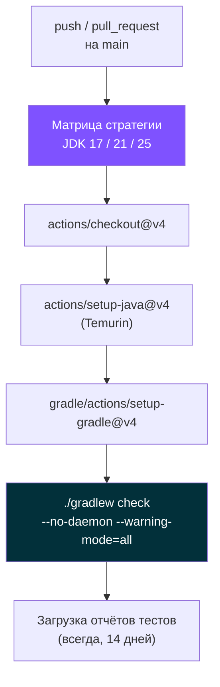
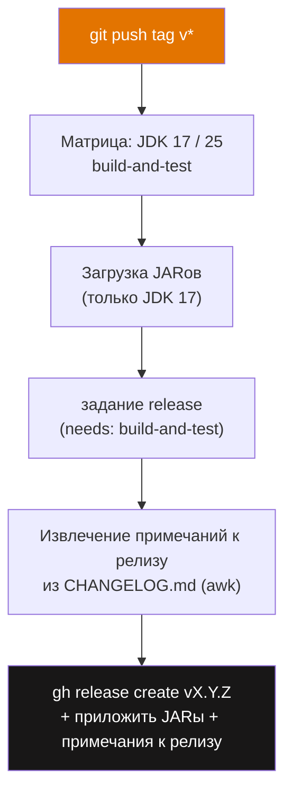
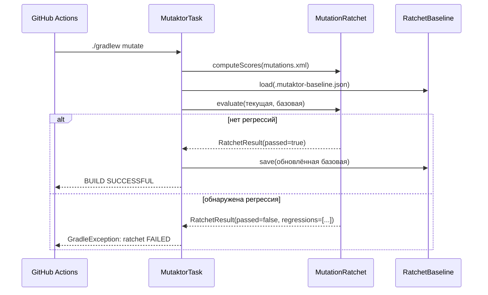

# Интеграция с CI/CD


В этом документе описывается, как Mutaktor сам собирается и выпускается в CI, а также как интегрировать плагин в собственные рабочие процессы GitHub Actions.

---

## Собственные рабочие процессы CI/CD Mutaktor

### Рабочий процесс CI (`.github/workflows/ci.yml`)

Рабочий процесс CI запускается при каждом push в `main` и каждом pull request, нацеленном на `main`. Он проверяет плагин на матрице трёх версий JDK.

```yaml
name: CI

on:
  push:
    branches: [main]
  pull_request:
    branches: [main]

jobs:
  build:
    runs-on: ubuntu-latest
    strategy:
      matrix:
        java: [17, 21, 25]
    steps:
      - uses: actions/checkout@v4

      - name: Set up JDK ${{ matrix.java }}
        uses: actions/setup-java@v4
        with:
          distribution: temurin
          java-version: ${{ matrix.java }}

      - name: Set up Gradle
        uses: gradle/actions/setup-gradle@v4

      - name: Build and test
        run: ./gradlew check --no-daemon --warning-mode=all

      - name: Upload test reports
        if: always()
        uses: actions/upload-artifact@v4
        with:
          name: test-reports-jdk${{ matrix.java }}
          path: "**/build/reports/tests/"
          retention-days: 14
```

| Решение | Обоснование |
|---------|-------------|
| Матрица JDK: 17, 21, 25 | 17 — минимум, 21 — текущий LTS, 25 — максимально протестированный |
| `--no-daemon` | Исключает загрязнение состояния daemon между заданиями матрицы |
| `--warning-mode=all` | Выявляет использование устаревшего API на ранней стадии |
| Отчёты тестов хранятся 14 дней | Позволяет проводить расследование после сбоя без повторного запуска |
| `if: always()` при загрузке | Отчёты загружаются даже при провале тестов |



---

### Рабочий процесс Release (`.github/workflows/release.yml`)

Рабочий процесс release запускается по любому тегу, соответствующему `v*`. Он выполняет сборку и тестирование на JDK 17 и 25, затем публикует GitHub Release со скомпилированными JARами и извлечёнными примечаниями к релизу.

```yaml
name: Release

on:
  push:
    tags:
      - "v*"

jobs:
  build-and-test:
    runs-on: ubuntu-latest
    permissions:
      contents: read
    strategy:
      matrix:
        java: [17, 25]
    steps:
      - uses: actions/checkout@v4
      - uses: actions/setup-java@v4
        with:
          distribution: temurin
          java-version: ${{ matrix.java }}
      - uses: gradle/actions/setup-gradle@v4
      - name: Build and test
        run: |
          VERSION="${GITHUB_REF_NAME#v}"
          ./gradlew check -Pversion="${VERSION}" --no-daemon
      - name: Upload JARs (JDK 17 only)
        if: matrix.java == 17
        uses: actions/upload-artifact@v4
        with:
          name: plugin-jars
          path: |
            mutaktor-gradle-plugin/build/libs/*.jar
            mutaktor-pitest-filter/build/libs/*.jar
            mutaktor-annotations/build/libs/*.jar

  release:
    runs-on: ubuntu-latest
    needs: build-and-test
    permissions:
      contents: write
    steps:
      - uses: actions/checkout@v4
        with:
          fetch-depth: 0
      - uses: actions/download-artifact@v4
        with:
          name: plugin-jars
          path: artifacts/
      - name: Extract release notes
        run: |
          VERSION="${GITHUB_REF_NAME#v}"
          awk -v ver="$VERSION" '
            /^## / { if (found) exit; if ($0 ~ ver) { found=1; next } }
            found { print }
          ' CHANGELOG.md > release-notes.md
      - name: Create GitHub Release
        run: |
          gh release create "$GITHUB_REF_NAME" \
            --title "mutaktor ${GITHUB_REF_NAME}" \
            --notes-file release-notes.md \
            artifacts/**/*.jar
        env:
          GH_TOKEN: ${{ secrets.GITHUB_TOKEN }}
```

| Решение | Обоснование |
|---------|-------------|
| Версия извлекается из тега (`v0.2.0` → `0.2.0`) | Версия в `gradle.properties` должна совпадать с тегом без префикса `v` |
| JARы собираются только из сборки на JDK 17 | Воспроизводимый артефакт; версия JDK не должна влиять на содержимое JAR |
| `fetch-depth: 0` в задании release | Скрипту `awk` нужен полный CHANGELOG для нахождения правильного раздела версии |
| Примечания к релизу извлекаются через `awk` | Полностью автоматизировано — никакого ручного копирования между CHANGELOG и телом релиза |



---

## Использование Mutaktor в собственном CI

### Минимальный пример

Следующий рабочий процесс запускает мутационное тестирование для каждого pull request и загружает HTML-отчёт как артефакт:

```yaml
name: Mutation Testing

on:
  pull_request:
    branches: [main]

jobs:
  mutation:
    runs-on: ubuntu-latest
    steps:
      - uses: actions/checkout@v4

      - uses: actions/setup-java@v4
        with:
          distribution: temurin
          java-version: 21

      - uses: gradle/actions/setup-gradle@v4

      - name: Run mutation tests
        run: ./gradlew mutate --no-daemon

      - name: Upload mutation report
        if: always()
        uses: actions/upload-artifact@v4
        with:
          name: mutation-report
          path: build/reports/mutaktor/
          retention-days: 7
```

### Анализ в рамках git-diff

Для крупных кодовых баз ограничьте мутацию классами, изменёнными в ветке PR:

```yaml
- name: Run mutation tests (changed classes only)
  run: ./gradlew mutate --no-daemon
  env:
    MUTATION_SINCE: origin/main
```

В `build.gradle.kts`:

```kotlin
mutaktor {
    since = providers.environmentVariable("MUTATION_SINCE").orNull
    targetClasses = setOf("com.example.*")
    mutationScoreThreshold = 80
}
```

Подробности о том, как работает свойство `since` и почему требуется `fetch-depth: 0`, см. в [Анализ в рамках git-diff](./04-git-integration.md).

---

## GitHub Checks API

Когда `GITHUB_TOKEN`, `GITHUB_REPOSITORY` и `GITHUB_SHA` все заданы во время выполнения задачи, `GithubChecksReporter` автоматически создаёт Check Run в GitHub со встроенными аннотациями для каждого выжившего мутанта.

### Обязательные разрешения

```yaml
jobs:
  mutation:
    runs-on: ubuntu-latest
    permissions:
      checks: write        # обязательно для создания Check Run
      contents: read
```

### Полный пример с Checks API, SARIF и Quality Gate

```yaml
name: Mutation Testing — Full

on:
  pull_request:
    branches: [main]

jobs:
  mutation:
    runs-on: ubuntu-latest
    permissions:
      checks: write
      contents: read

    steps:
      - uses: actions/checkout@v4
        with:
          fetch-depth: 0    # обязательно для анализа в рамках git-diff

      - uses: actions/setup-java@v4
        with:
          distribution: temurin
          java-version: 21

      - uses: gradle/actions/setup-gradle@v4
        with:
          cache-read-only: ${{ github.ref != 'refs/heads/main' }}

      - name: Run mutation tests
        run: ./gradlew mutate --no-daemon
        env:
          MUTATION_SINCE: origin/main
          GITHUB_TOKEN: ${{ secrets.GITHUB_TOKEN }}
          GITHUB_REPOSITORY: ${{ github.repository }}
          GITHUB_SHA: ${{ github.sha }}

      - name: Upload HTML report
        if: always()
        uses: actions/upload-artifact@v4
        with:
          name: mutation-report
          path: build/reports/mutaktor/
          retention-days: 7

      - name: Upload SARIF to Code Scanning
        if: always()
        uses: github/codeql-action/upload-sarif@v3
        with:
          sarif_file: build/reports/mutaktor/mutations.sarif.json
          category: mutation-testing
```

> **Примечание:** `if: always()` для шагов загрузки гарантирует, что SARIF-файл и HTML-отчёт загружаются даже при провале quality gate или отсутствии мутаций в выводе PIT.

---

## Загрузка SARIF в Code Scanning

Вывод SARIF позволяет выжившим мутантам отображаться как оповещения Code Scanning во вкладке **Security** репозитория. Оповещения сохраняются между прогонами и могут быть отклонены с указанием причины.

```kotlin
// build.gradle.kts — включить генерацию SARIF
mutaktor {
    outputFormats = setOf("HTML", "XML")  // XML обязателен как входные данные для SARIF
    sarifReport = true
}
```

После `./gradlew mutate` SARIF-файл записывается в `build/reports/mutaktor/mutations.sarif.json`. Только **выжившие** мутации появляются как результаты — уничтоженные мутации работают корректно и не требуют внимания разработчика.

```yaml
- name: Upload SARIF to GitHub Code Scanning
  uses: github/codeql-action/upload-sarif@v3
  if: always()
  with:
    sarif_file: build/reports/mutaktor/mutations.sarif.json
    category: mutation-testing
```

---

## Quality Gate в CI

Quality gate применяется внутри `MutaktorTask.exec()` — дополнительный шаг не нужен. Настройте порог в `build.gradle.kts`:

```kotlin
mutaktor {
    mutationScoreThreshold = 80    // сборка завершается с ошибкой, если оценка < 80%
}
```

Задача `mutate` завершится с ненулевым статусом и выведет:

```
Mutaktor: quality gate FAILED — mutation score 72% is below threshold 80%
```

---

## Ratchet в CI

Включите покомпонентный ratchet для предотвращения регрессии оценки между PR:

```kotlin
// build.gradle.kts
mutaktor {
    ratchetEnabled = true
    ratchetBaseline = layout.projectDirectory.file(".mutaktor-baseline.json")
    ratchetAutoUpdate = true
}
```

Зафиксируйте `.mutaktor-baseline.json` в репозитории. На главной ветке ratchet автоматически обновляет базовую оценку при улучшении оценок. На ветках PR регрессия завершает сборку с ошибкой.



---

## Кэширование и инкрементальный анализ

### Build cache Gradle

`MutaktorTask` аннотирован `@CacheableTask`. Build cache Gradle избегает повторного запуска PIT, когда входные данные (исходные файлы, classpath, конфигурация) не изменились с момента последнего прогона.

Совместно используйте build cache между прогонами CI с помощью `gradle/actions/setup-gradle`:

```yaml
- uses: gradle/actions/setup-gradle@v4
  with:
    cache-read-only: ${{ github.ref != 'refs/heads/main' }}
    # Главная ветка: чтение-запись (заполняет кэш)
    # Ветки PR: только чтение (потребляет кэш, исключает загрязнение кэша)
```

### Инкрементальная история PIT

Для инкрементального анализа PIT между отдельными прогонами CI сохраняйте файл `.mutation-history` через кэш Actions:

```kotlin
// build.gradle.kts
mutaktor {
    val historyFile = layout.projectDirectory.file(".mutation-history")
    historyInputLocation = historyFile
    historyOutputLocation = historyFile
}
```

```yaml
- name: Restore mutation history
  uses: actions/cache@v4
  with:
    path: .mutation-history
    key: mutation-history-${{ github.ref_name }}-${{ github.sha }}
    restore-keys: |
      mutation-history-${{ github.ref_name }}-
      mutation-history-main-

- name: Run mutation tests
  run: ./gradlew mutate --no-daemon
  env:
    MUTATION_SINCE: origin/main

- name: Save mutation history
  uses: actions/cache@v4
  with:
    path: .mutation-history
    key: mutation-history-${{ github.ref_name }}-${{ github.sha }}
```

PIT повторно использует результаты из кэшированной истории для мутантов, чей окружающий код не изменился, сокращая время анализа при повторных прогонах.

---

## GraalVM в CI

Если в CI используется GraalVM (например, для нативных сборок Quarkus), и PIT завершается с ошибками classpath `jrt://`, добавьте резолвер toolchain foojay и позвольте Mutaktor автоматически определить правильный JDK:

```kotlin
// settings.gradle.kts
plugins {
    id("org.gradle.toolchains.foojay-resolver-convention") version "0.9.0"
}
```

Или явно настройте `javaLauncher`:

```kotlin
// build.gradle.kts
mutaktor {
    javaLauncher.set(
        javaToolchains.launcherFor {
            languageVersion.set(JavaLanguageVersion.of(21))
            vendor.set(JvmVendorSpec.AZUL)
        }
    )
}
```

В CI убедитесь, что стандартный JDK подготовлен:

```yaml
- uses: actions/setup-java@v4
  with:
    distribution: temurin
    java-version: 21
    # Сборки GraalVM могут также устанавливать: graalvm CE или GraalVM for JDK 21
```

---

## См. также

- [Руководство разработчика](./06-development.md) — Локальная настройка сборки и команды тестирования
- [Руководство по Changelog](./08-changelog.md) — Процесс выпуска: теги и запуск рабочих процессов
- [Отчёты и Quality Gate](./05-reporting.md) — Подробности конвейера постобработки
- [Анализ в рамках git-diff](./04-git-integration.md) — Свойство `since` и шаблоны CI
