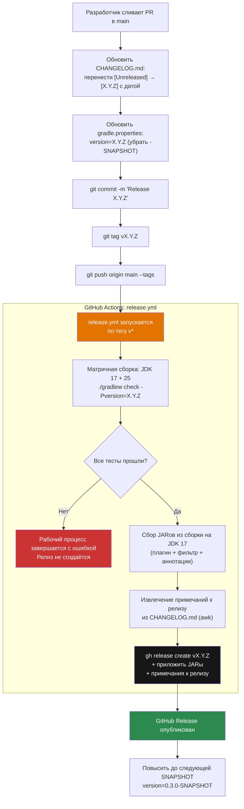

# Руководство по Changelog


В этом документе описывается формат changelog, политика версионирования и автоматизированный процесс выпуска релизов Mutaktor.

---

## Формат

`CHANGELOG.md` Mutaktor следует формату [Keep a Changelog 1.1.0](https://keepachangelog.com/en/1.1.0/).

### Структура

```markdown
# Changelog

All notable changes to this project will be documented in this file.

The format is based on [Keep a Changelog](https://keepachangelog.com/en/1.1.0/),
and this project adheres to [Semantic Versioning](https://semver.org/spec/v2.0.0.html).

## [Unreleased]

### Added
- Новая функция или улучшение

### Changed
- Изменение существующего поведения

### Deprecated
- Функции, которые будут удалены в будущем релизе

### Removed
- Функции, удалённые в этом релизе

### Fixed
- Исправления ошибок

### Security
- Исправления, связанные с безопасностью

## [0.2.0] — 2026-03-21

### Added
- Конвейер постобработки: JSON, SARIF, quality gate, ratchet, GitHub Checks

[Unreleased]: https://github.com/ioplane/mutaktor/compare/v0.2.0...HEAD
[0.2.0]: https://github.com/ioplane/mutaktor/compare/v0.1.0...v0.2.0
```

### Правила использования разделов

| Раздел | Когда использовать |
|--------|-------------------|
| `Added` | Новые функции, новые DSL-свойства, новые форматы отчётов, новые модули |
| `Changed` | Изменения поведения в существующих функциях, изменения значений по умолчанию |
| `Deprecated` | Свойства или задачи, запланированные к удалению в будущей MAJOR-версии |
| `Removed` | Свойства или задачи, ранее отмеченные как deprecated |
| `Fixed` | Исправления ошибок — при наличии ссылайтесь на номер issue |
| `Security` | Любые исправления с последствиями для безопасности (например, защита от XXE, обработка токенов) |

Каждое видимое пользователю изменение требует записи в `CHANGELOG.md`. Внутренний рефакторинг, не влияющий на API плагина или поведение для пользователя, не требует записи.

---

## Политика версионирования

Mutaktor следует [Semantic Versioning 2.0.0](https://semver.org/spec/v2.0.0.html).

### Формат версии

```
MAJOR.MINOR.PATCH[-SNAPSHOT]
```

| Версия | Значение |
|--------|----------|
| `0.1.0-SNAPSHOT` | Сборка для разработки до релиза |
| `0.1.0` | Первый публичный релиз |
| `0.2.0` | Новые обратно-совместимые функции (конвейер постобработки, ratchet, аннотации) |
| `1.0.0` | Стабильный публичный API, первый мажорный релиз |
| `1.1.0` | Добавлено новое DSL-свойство (обратно-совместимо) |
| `2.0.0` | Критическое изменение DSL или API задачи |

### Критические и некритические изменения

| Тип изменения | Повышение версии |
|---------------|-----------------|
| Добавить новое необязательное DSL-свойство с соглашением по умолчанию | MINOR |
| Добавить новую задачу | MINOR |
| Добавить новый модуль (`mutaktor-annotations` и т.д.) | MINOR |
| Удалить или переименовать существующее DSL-свойство | MAJOR |
| Изменить значение по умолчанию существующего свойства | MAJOR (если изменяется поведение) |
| Исправление ошибки без изменения поверхности API | PATCH |
| Новый формат отчёта как opt-in свойство | MINOR |
| Требование более новой минимальной версии Gradle или JDK | MAJOR |

### Политика до 1.0

Пока версия `0.x.y`, публичный API ещё не стабилен. Повышения MINOR-версии (`0.1.0` → `0.2.0`) могут включать критические изменения. DSL стабилизируется в `1.0.0`.

---

## Текущая версия

Версия объявлена в `gradle.properties`:

```properties
version=0.2.0
group=io.github.ioplane.mutaktor
```

Snapshot-сборки не публикуются на Gradle Plugin Portal. Только теговые релизы создают публикуемые артефакты.

---

## Процесс выпуска

### Обзор



### Пошаговые инструкции

#### 1. Подготовить Changelog

Перенесите все записи из `[Unreleased]` в новый датированный раздел версии. Оставьте `[Unreleased]` наверху — всегда пустым после релиза:

```markdown
## [Unreleased]

## [0.2.0] — 2026-03-21

### Added
- Post-processing pipeline: JSON, SARIF, quality gate, ratchet, GitHub Checks wired into `exec()` (Sprint 9)
- `mutationScoreThreshold` property: fail build when mutation score drops below threshold
- `jsonReport` property: first-class DSL control for mutation-testing-elements JSON (default: true)
- `sarifReport` property: first-class DSL control for SARIF 2.1.0 output (default: false)
- Per-package ratchet: `ratchetEnabled`, `ratchetBaseline`, `ratchetAutoUpdate` properties (Sprint 10)
- `mutaktor-annotations` module: `@MutationCritical` and `@SuppressMutations` (Sprint 11)
- GraalVM auto-detection: `GraalVmDetector` switches PIT child JVM to standard HotSpot when building under GraalVM + Quarkus (Sprint 12)
- `javaLauncher` property: Gradle Toolchain API integration for PIT child JVM (Sprint 12)
- Empty `targetClasses` guard: clear error message when no classes are configured (Sprint 9)

[Unreleased]: https://github.com/ioplane/mutaktor/compare/v0.2.0...HEAD
[0.2.0]: https://github.com/ioplane/mutaktor/compare/v0.1.0...v0.2.0
```

#### 2. Повысить версию

```properties
# gradle.properties
version=0.2.0
```

Уберите суффикс `-SNAPSHOT`. Рабочий процесс release удаляет префикс `v` из тега и передаёт версию в Gradle через `-Pversion="${VERSION}"`.

#### 3. Зафиксировать и поставить тег

```bash
git add CHANGELOG.md gradle.properties
git commit -m "Release 0.2.0"
git tag v0.2.0
git push origin main --tags
```

Тег должен точно соответствовать шаблону `v*`. Триггер рабочего процесса:

```yaml
on:
  push:
    tags:
      - "v*"
```

#### 4. Проверить рабочий процесс Release

Перейдите в **Actions → Release** в репозитории GitHub. Рабочий процесс:

1. Запускает `./gradlew check -Pversion="0.2.0"` на JDK 17 и 25
2. Загружает JARы из сборки на JDK 17 как артефакт рабочего процесса
3. Извлекает раздел `[0.2.0]` из `CHANGELOG.md` с помощью скрипта `awk`
4. Создаёт GitHub Release с именем `mutaktor v0.2.0` с прикреплёнными примечаниями и JARами

Если скрипт `awk` не находит соответствующего раздела (например, запись в changelog отсутствует), он откатывается к ссылке на `CHANGELOG.md`.

#### 5. После релиза: восстановить SNAPSHOT

После успешного завершения рабочего процесса release повысьте версию до следующей SNAPSHOT:

```properties
# gradle.properties
version=0.3.0-SNAPSHOT
```

```bash
git add gradle.properties
git commit -m "Begin 0.3.0-SNAPSHOT development"
git push origin main
```

---

## Извлечение примечаний к релизу

Рабочий процесс release автоматически извлекает соответствующий раздел changelog с помощью `awk`:

```bash
VERSION="${GITHUB_REF_NAME#v}"   # удаляет ведущий 'v' из тега

awk -v ver="$VERSION" '
  /^## / { if (found) exit; if ($0 ~ ver) { found=1; next } }
  found { print }
' CHANGELOG.md > release-notes.md
```

Этот скрипт выводит все строки между заголовком `## [X.Y.Z]` и следующим заголовком `## `. Вывод используется дословно как тело GitHub Release.

Для тега `v0.2.0` и changelog вида:

```markdown
## [0.2.0] — 2026-03-21

### Added
- Post-processing pipeline

## [0.1.0] — 2025-12-01
```

Скрипт производит:

```markdown

### Added
- Post-processing pipeline

```

---

## Лучшие практики changelog

### Пишите описания для пользователей

```markdown
# Хорошо — объясняет, что получает пользователь
- Per-package mutation ratchet: `ratchetEnabled = true` prevents score regression on a per-package basis

# Слишком внутреннее — описывает реализацию, а не влияние на пользователя
- Added MutationRatchet.computeScores() using DOM parsing of mutations.xml
```

### Ссылайтесь на номера спринтов или issues

```markdown
### Added
- GraalVM auto-detect: switches PIT child JVM to standard HotSpot when building under GraalVM + Quarkus (Sprint 12)
- `@MutationCritical` annotation: mark classes/methods that require 100% mutation score (#87)
```

### Группируйте связанные записи под правильными разделами

Каждое изменение должно быть помещено под соответствующий заголовок раздела (`Added`, `Changed`, `Fixed` и т.д.) в пределах одного блока версии. Не добавляйте произвольный текст за пределами заголовков разделов.

### Не редактируйте выпущенные разделы

Как только версия помечена тегом и выпущена, её раздел changelog неизменен. Если выпущенная запись содержит ошибку, добавьте запись с исправлением в следующей версии.

---

## Полный набор изменений v0.2.0

| Раздел | Запись |
|--------|--------|
| Added | Post-processing pipeline: JSON + SARIF + quality gate + ratchet + GitHub Checks wired into `exec()` |
| Added | Свойство `mutationScoreThreshold` (0–100): завершать сборку с ошибкой, если оценка мутаций ниже порога |
| Added | Свойство `jsonReport`: первоклассное управление DSL для JSON mutation-testing-elements (по умолчанию: `true`) |
| Added | Свойство `sarifReport`: первоклассное управление DSL для SARIF 2.1.0 (по умолчанию: `false`) |
| Added | Покомпонентный ratchet: свойства `ratchetEnabled`, `ratchetBaseline`, `ratchetAutoUpdate` |
| Added | Модуль `mutaktor-annotations`: исходные аннотации `@MutationCritical` и `@SuppressMutations` |
| Added | `GraalVmDetector`: авто-выбор стандартного JDK при сборке с GraalVM + Quarkus |
| Added | Свойство `javaLauncher`: полная интеграция с Gradle Toolchain API для дочернего JVM PIT |
| Added | Защита от пустого `targetClasses`: `GradleException` с понятным сообщением при отсутствии настроенных классов |
| Added | `util/XmlParser.kt`: общий безопасный разбор XML (защита от XXE во всех конвертерах) |
| Added | `util/JsonBuilder.kt`: общее построение JSON без зависимостей |
| Added | `util/SourcePathResolver.kt`: общее разрешение пути файла → FQN (исправляет хардкод `src/main/java/`) |
| Fixed | Конвертеры отчётов хардкодили `src/main/java/` — теперь используется `SourcePathResolver` со всеми корнями исходников |
| Fixed | `MutationRatchet` считает `TIMED_OUT` и `MEMORY_ERROR` как уничтоженные (не только `KILLED`) |

---

## См. также

- [Интеграция с CI/CD](./07-ci-cd.md) — Детали реализации рабочего процесса release
- `CHANGELOG.md` — Фактический changelog
- `gradle.properties` — Объявление текущей версии
- [Keep a Changelog 1.1.0](https://keepachangelog.com/en/1.1.0/)
- [Semantic Versioning 2.0.0](https://semver.org/spec/v2.0.0.html)
