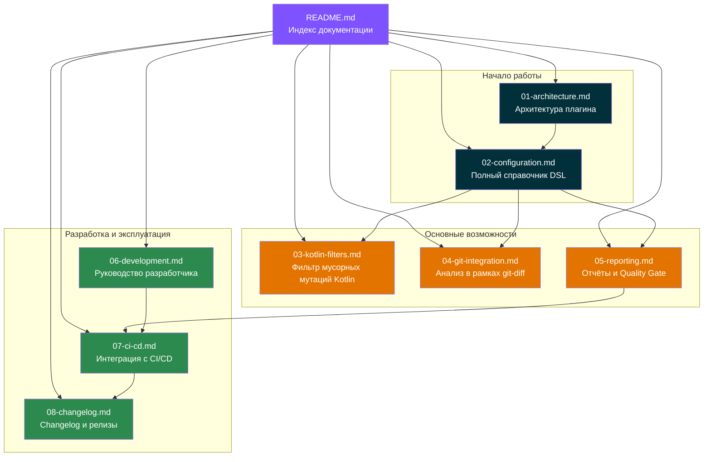
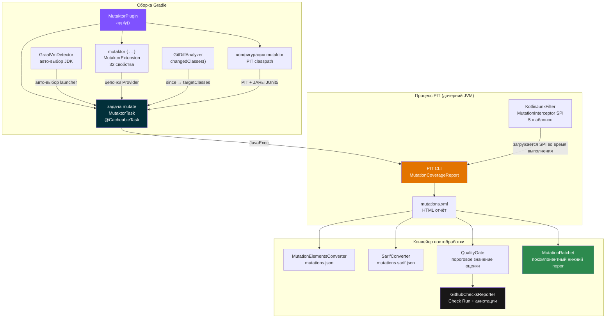

# Документация Mutaktor


> Также доступно на: [English](../en/README.md)

**Mutaktor** — это Kotlin-first плагин для Gradle, предназначенный для мутационного тестирования с помощью [PIT](https://pitest.org/). Он оборачивает проверенный движок мутаций PIT возможностями ограничения области анализа через git, фильтрацией «мусорных» мутаций Kotlin, полностью настроенным конвейером постобработки (JSON, SARIF, quality gate, ratchet, GitHub Checks) и автоопределением GraalVM — без каких-либо внешних зависимостей во время выполнения.

---

## Что такое мутационное тестирование?

Мутационное тестирование проверяет качество набора тестов путём систематического введения небольших изменений — **мутантов** — в исходный код и верификации того, что хотя бы один тест завершается ошибкой для каждого изменения. Мутант, которого ни один тест не обнаружил, называется **выжившим мутантом**: это пробел в покрытии тестами, который не выявляется обычным покрытием по строкам кода.

**Оценка мутаций** — это процент мутантов, которые были уничтожены:

```
оценка мутаций = (уничтоженные мутанты / всего мутантов) × 100
```

---

## Основные возможности v0.2.0

| Возможность | Описание |
|-------------|----------|
| Конвейер постобработки | JSON + SARIF + quality gate + ratchet + GitHub Checks, встроенные в `exec()` |
| `mutationScoreThreshold` | Завершает сборку с ошибкой, если оценка мутаций опускается ниже заданного процента |
| `jsonReport` / `sarifReport` | Первоклассные свойства DSL для включения форматов отчётов |
| Покомпонентный ratchet | `ratchetEnabled`, `ratchetBaseline`, `ratchetAutoUpdate` предотвращают регрессию оценки |
| Аннотация `@MutationCritical` | Помечает код, который должен достичь 100% оценки мутаций |
| Аннотация `@SuppressMutations` | Исключает конкретные методы или классы из анализа |
| Модуль `mutaktor-annotations` | Отдельный JAR с аннотациями без зависимости от Gradle |
| Автоопределение GraalVM | `GraalVmDetector` переключает PIT на стандартный JDK при сборке под GraalVM + Quarkus |
| Свойство `javaLauncher` | Полная интеграция с Gradle Toolchain API для дочернего JVM процесса PIT |
| Защита от пустого `targetClasses` | Завершается с понятным сообщением, если классы не настроены |

---

## Карта документации



---

## Индекс документов

| № | Документ | Аудитория | Описание |
|---|----------|-----------|----------|
| 01 | [Архитектура](01-architecture.md) | Все пользователи | Модули плагина, поток данных, архитектура classpath, жизненный цикл |
| 02 | [Конфигурация](02-configuration.md) | Все пользователи | Полный справочник DSL: все 32 свойства, типы, значения по умолчанию, примеры |
| 03 | [Фильтр мусорных мутаций Kotlin](03-kotlin-filters.md) | Разработчики Kotlin | Как `KotlinJunkFilter` устраняет ложноположительные мутации из байткода, генерируемого компилятором |
| 04 | [Анализ в рамках git-diff](04-git-integration.md) | Пользователи CI/CD | Ограничение мутаций изменёнными классами через `since` и `GitDiffAnalyzer` |
| 05 | [Отчёты и Quality Gate](05-reporting.md) | Пользователи CI/CD | HTML, XML, SARIF, JSON, quality gate, ratchet, GitHub Checks |
| 06 | [Руководство разработчика](06-development.md) | Контрибьюторы | Команды сборки, структура проекта, соглашения, расширение плагина |
| 07 | [Интеграция с CI/CD](07-ci-cd.md) | DevOps / контрибьюторы | Рабочие процессы GitHub Actions CI и release; загрузка SARIF; настройка GitHub Checks |
| 08 | [Руководство по Changelog](08-changelog.md) | Контрибьюторы | Формат Keep a Changelog, политика SemVer, процесс выпуска релизов |

---

## Быстрый старт

### Kotlin DSL

```kotlin
// build.gradle.kts
plugins {
    kotlin("jvm") version "2.3.0"
    id("io.github.dantte-lp.mutaktor") version "0.2.0"
}

mutaktor {
    targetClasses = setOf("com.example.*")
    mutationScoreThreshold = 80          // завершить сборку ниже 80%
    since = "main"                       // мутировать только изменённые классы
    kotlinFilters = true                 // подавить шум компилятора Kotlin
    jsonReport = true                    // JSON mutation-testing-elements
    sarifReport = true                   // SARIF для GitHub Code Scanning
}
```

```bash
./gradlew mutate
```

### Groovy DSL

```groovy
// build.gradle
plugins {
    id 'org.jetbrains.kotlin.jvm' version '2.3.0'
    id 'io.github.dantte-lp.mutaktor' version '0.2.0'
}

mutaktor {
    targetClasses = ['com.example.*'] as Set
    mutationScoreThreshold = 80
    since = 'main'
    kotlinFilters = true
}
```

---

## Быстрые ссылки

### Для пользователей плагина

- **Настроить область мутаций** — [Конфигурация: targetClasses](02-configuration.md#targetclasses)
- **Мутировать только изменённый код** — [Анализ в рамках git-diff](04-git-integration.md)
- **Завершать сборку ниже порога** — [Конфигурация: mutationScoreThreshold](02-configuration.md#mutationscorethreshold)
- **Предотвратить регрессию оценки** — [Отчёты: Ratchet](05-reporting.md#per-package-ratchet)
- **Загрузить SARIF в Code Scanning** — [CI/CD: Загрузка SARIF](07-ci-cd.md#sarif-upload-to-code-scanning)
- **Интеграция с GitHub PR Checks** — [CI/CD: GitHub Checks API](07-ci-cd.md#github-checks-api)
- **Пропустить ошибки classpath GraalVM** — [Конфигурация: javaLauncher](02-configuration.md#javalauncher)
- **Пометить критичный код** — [Конфигурация: Модуль аннотаций](02-configuration.md#annotations-module)

### Для контрибьюторов

- **Настроить локальную разработку** — [Руководство разработчика: Начало работы](06-development.md#getting-started)
- **Запустить тесты** — [Руководство разработчика: Команды сборки](06-development.md#build-commands)
- **Добавить новый шаблон фильтра** — [Руководство разработчика: Добавление новых шаблонов фильтров](06-development.md#adding-new-filter-patterns)
- **Добавить новый формат отчёта** — [Руководство разработчика: Добавление новых форматов отчётов](06-development.md#adding-new-report-formats)
- **Выпустить новую версию** — [Руководство по Changelog: Процесс выпуска](08-changelog.md#release-process)

---

## Обзор архитектуры



---

## Обзор модулей

| Модуль | Plugin ID / Артефакт | Назначение |
|--------|----------------------|------------|
| `mutaktor-gradle-plugin` | `io.github.dantte-lp.mutaktor` | Применяется в проектах-потребителях; регистрирует задачу `mutate` |
| `mutaktor-gradle-plugin` | `io.github.dantte-lp.mutaktor.aggregate` | Применяется к корневому проекту; регистрирует задачу `mutateAggregate` |
| `mutaktor-pitest-filter` | PIT SPI JAR | Загружается PIT во время выполнения; фильтрует мутации, генерируемые компилятором Kotlin |
| `mutaktor-annotations` | `mutaktor-annotations.jar` | Аннотации `@MutationCritical` и `@SuppressMutations` |
| `build-logic` | внутренний | Общий конвенционный плагин для toolchain Kotlin + JVM |

---

## Требования

| Требование | Минимум | Протестировано с |
|------------|---------|-----------------|
| Gradle | 9.0 | 9.4.1 |
| JDK | 17 | 17, 21, 25 (Temurin) |
| Kotlin | 1.8+ | 2.3.0 |
| PIT | 1.19.0 | 1.23.0 |
| pitest-junit5-plugin | 1.1.0 | 1.2.3 |

> **Примечание:** GraalVM поддерживается в качестве JDK для сборки, когда настроен `javaLauncher` или автоматически обнаружен GraalVM + Quarkus. Сам PIT требует стандартного JVM HotSpot для дочернего процесса minion.

---

## Лицензия

Apache License 2.0. См. [LICENSE](../../LICENSE).
