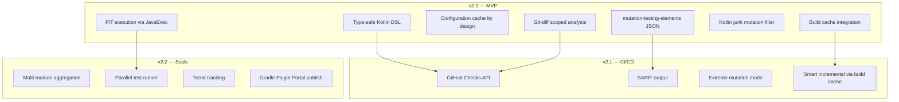

# Mutaktor — Project Plan

> **For agentic workers:** REQUIRED: Use superpowers:subagent-driven-development or superpowers:executing-plans.

**Goal:** Build a Kotlin-first Gradle plugin for PIT mutation testing with git-aware analysis, Kotlin junk filtering, standardized reporting, and CI/CD integration.

**Plugin ID:** `io.github.dantte-lp.mutaktor`
**Group:** `io.github.dantte-lp.mutaktor`
**License:** Apache 2.0
**Tech Stack:** Kotlin 2.3, Gradle 9.4.1, JDK 25, PIT 1.23.0, JUnit 5 + Kotest

---

## Feature Map



## Architecture

```
mutaktor/
├── mutaktor-gradle-plugin/           # Gradle plugin module
│   └── src/main/kotlin/
│       └── io/github/dantte_lp/mutaktor/
│           ├── MutaktorPlugin.kt             # Plugin entry point
│           ├── MutaktorExtension.kt          # Type-safe DSL extension
│           ├── MutaktorTask.kt               # Main task (abstract, JavaExec)
│           ├── MutaktorAggregateTask.kt      # Multi-module report task
│           ├── git/
│           │   └── GitDiffAnalyzer.kt        # git diff → targetClasses
│           ├── report/
│           │   ├── MutationElementsConverter.kt  # PIT XML → mutation-testing-elements JSON
│           │   ├── SarifConverter.kt             # PIT XML → SARIF
│           │   └── GithubChecksReporter.kt       # GitHub Checks API
│           └── filter/
│               └── KotlinJunkFilterConfig.kt     # Configure Kotlin-specific PIT filters
├── mutaktor-pitest-filter/           # PIT plugin JAR (loaded by PIT runtime)
│   └── src/main/kotlin/
│       └── io/github/dantte_lp/mutaktor/pitest/
│           ├── KotlinCoroutineFilter.kt      # Filter coroutine state machine junk
│           ├── KotlinSealedWhenFilter.kt     # Filter sealed/when hashcode junk
│           ├── KotlinInlineFunctionFilter.kt # Filter inlined function duplicates
│           └── KotlinDataClassFilter.kt      # Filter data class boilerplate
├── build-logic/                      # Convention plugins (shared build config)
│   └── src/main/kotlin/
│       ├── kotlin-conventions.gradle.kts
│       └── publish-conventions.gradle.kts
├── docs/                             # gobfd-format documentation
│   ├── en/
│   └── ru/
├── deployment/
│   └── containerfiles/
│       └── Containerfile.dev
├── scripts/
│   └── quality.sh
├── .github/workflows/
│   ├── ci.yml
│   └── release.yml
├── gradle.properties                 # version=2.0.0
├── settings.gradle.kts
├── CHANGELOG.md
├── CLAUDE.md
├── README.md
└── LICENSE
```

## Sprint Plan

### Sprint 1: Project Scaffold (Week 1)
**Goal:** Empty project compiles, tests run, CI green.

| # | Task | Files | Exit criteria |
|---|------|-------|---------------|
| 1.1 | Init Gradle project with settings.gradle.kts, gradle.properties | `settings.gradle.kts`, `gradle.properties`, `gradle/libs.versions.toml` | `./gradlew build` passes |
| 1.2 | Create build-logic with convention plugins | `build-logic/` | Kotlin compilation, JUnit 5 runs |
| 1.3 | Create mutaktor-gradle-plugin module (empty) | `mutaktor-gradle-plugin/build.gradle.kts` | Module compiles |
| 1.4 | Create mutaktor-pitest-filter module (empty) | `mutaktor-pitest-filter/build.gradle.kts` | Module compiles |
| 1.5 | Containerfile.dev (from gradle-pitest-plugin) | `deployment/containerfiles/Containerfile.dev` | Container builds |
| 1.6 | GitHub Actions CI workflow | `.github/workflows/ci.yml` | CI green on push |
| 1.7 | README.md, LICENSE, CLAUDE.md, .editorconfig | Root files | Repo looks complete |

### Sprint 2: Plugin Core — DSL + PIT Execution (Week 2-3)
**Goal:** `./gradlew mutate` runs PIT and produces HTML report.

| # | Task | Files | Exit criteria |
|---|------|-------|---------------|
| 2.1 | `MutaktorPlugin.kt` — registers extension + task | Plugin entry point | Plugin applies to test project |
| 2.2 | `MutaktorExtension.kt` — type-safe DSL with Property API | Extension with 20+ properties | DSL compiles in Kotlin/Groovy test project |
| 2.3 | `MutaktorTask.kt` — abstract JavaExec, runs PIT CLI | Task with @Input/@Output annotations | PIT executes, HTML report generated |
| 2.4 | PIT dependency management — auto-resolve pitest + junit5-plugin | Configuration wiring | PIT JARs on classpath |
| 2.5 | Configuration cache compatibility | Serialization tests | `--configuration-cache` passes |
| 2.6 | Build cache support | @CacheableTask, proper annotations | Cache hit on re-run |
| 2.7 | Functional tests with Gradle TestKit | Test suite | 10+ funcTests green |
| 2.8 | Unit tests for extension defaults, arg building | Test suite | 20+ unit tests green |

### Sprint 3: Kotlin Junk Filter (Week 4)
**Goal:** PIT plugin filters Kotlin compiler artifacts from mutations.

| # | Task | Files | Exit criteria |
|---|------|-------|---------------|
| 3.1 | `KotlinCoroutineFilter.kt` — filter suspend state machine mutations | PIT filter SPI | Coroutine junk eliminated in test project |
| 3.2 | `KotlinSealedWhenFilter.kt` — filter when/hashcode bytecode | PIT filter SPI | Sealed class junk eliminated |
| 3.3 | `KotlinInlineFunctionFilter.kt` — deduplicate inlined copies | PIT filter SPI | Inline function junk eliminated |
| 3.4 | `KotlinDataClassFilter.kt` — filter copy/equals/hashCode/toString | PIT filter SPI | Data class junk eliminated |
| 3.5 | Auto-load filter JAR — plugin adds mutaktor-pitest-filter to PIT classpath | Plugin wiring | Filters active by default |
| 3.6 | Integration tests with Kotlin test projects | funcTest | 5+ Kotlin-specific tests green |

### Sprint 4: Git-Diff Analysis (Week 5)
**Goal:** `./gradlew mutate --since=main` mutates only changed code.

| # | Task | Files | Exit criteria |
|---|------|-------|---------------|
| 4.1 | `GitDiffAnalyzer.kt` — parse `git diff --name-only` | Git integration | Returns changed .kt/.java files |
| 4.2 | Map changed files → targetClasses | Class name resolution | Correct package.Class mapping |
| 4.3 | DSL: `mutaktor { since.set("main") }` | Extension property | Property wired to git analysis |
| 4.4 | CLI option: `--mutaktor-since=main` via @Option | Task option | Works from command line |
| 4.5 | Integration test: create branch, change file, verify scoped | funcTest | Only changed class mutated |

### Sprint 5: Reporting (Week 6)
**Goal:** mutation-testing-elements JSON + SARIF output.

| # | Task | Files | Exit criteria |
|---|------|-------|---------------|
| 5.1 | `MutationElementsConverter.kt` — PIT XML → mutation-testing-elements JSON | Report converter | Valid JSON per schema |
| 5.2 | `SarifConverter.kt` — PIT XML → SARIF 2.1.0 | Report converter | Valid SARIF per schema |
| 5.3 | DSL: `mutaktor { reports { json.set(true); sarif.set(true) } }` | Extension nested block | Reports generated alongside HTML |
| 5.4 | Schema validation tests | Unit tests | JSON validates against mutation-testing-elements schema |

### Sprint 6: CI/CD Integration (Week 7)
**Goal:** GitHub Checks API with inline PR comments.

| # | Task | Files | Exit criteria |
|---|------|-------|---------------|
| 6.1 | `GithubChecksReporter.kt` — create Check Run with annotations | GitHub API client | Annotations visible on PR |
| 6.2 | DSL: `mutaktor { github { token.set(env("GITHUB_TOKEN")) } }` | Extension | Configurable |
| 6.3 | GitHub Actions workflow example | docs + example | Working PR comment example |
| 6.4 | Quality gate: fail if mutation score < threshold on changed code | Task failure | Build fails below threshold |

### Sprint 7: Extreme Mutation + Incremental (Week 8)
**Goal:** Method-body removal mode + smart incremental.

| # | Task | Files | Exit criteria |
|---|------|-------|---------------|
| 7.1 | Extreme mutation mode — remove method bodies | PIT mutator config | Method removal mutations work |
| 7.2 | DSL: `mutaktor { extreme.set(true) }` | Extension | Configurable |
| 7.3 | Smart incremental via Gradle build cache | Build service | Cache hit when source unchanged |
| 7.4 | Performance benchmark vs gradle-pitest-plugin | Benchmark test | Measured comparison |

### Sprint 8: Multi-Module + Polish (Week 9-10)
**Goal:** Aggregation, docs, Plugin Portal readiness.

| # | Task | Files | Exit criteria |
|---|------|-------|---------------|
| 8.1 | `MutaktorAggregateTask.kt` — multi-module reports | Aggregate task | Combined HTML report |
| 8.2 | Variant-aware configurations (producer/consumer) | Plugin wiring | Cross-project resolution |
| 8.3 | Documentation (gobfd format, en + ru) | docs/ | 7+ documents |
| 8.4 | Release workflow with artifacts | .github/workflows/release.yml | JAR + sources + javadoc |
| 8.5 | Gradle Plugin Portal publication | publish-conventions | `./gradlew publishPlugins` works |
| 8.6 | README with badges, examples, mermaid | README.md | Complete |

---

## Quality Gates (per sprint)

| Gate | Requirement |
|------|-------------|
| Unit tests | 80%+ line coverage (JaCoCo) |
| Functional tests | All Gradle TestKit tests pass |
| Linting | ktlint clean |
| API validation | Binary compatibility check (Kotlin ABI) |
| Configuration cache | `--configuration-cache` on all funcTests |
| Deprecation warnings | 0 on `--warning-mode=all` |
| CI | GitHub Actions green |

## Milestones

| Milestone | Version | Date target | Deliverable |
|-----------|---------|-------------|-------------|
| **MVP** | v0.1.0 | Sprint 2 complete | Plugin runs PIT, type-safe DSL, config cache |
| **Kotlin-aware** | v0.2.0 | Sprint 3 complete | Kotlin junk filter |
| **Git-aware** | v0.3.0 | Sprint 4 complete | Git-diff scoped analysis |
| **Reports** | v0.4.0 | Sprint 5 complete | mutation-testing-elements JSON + SARIF |
| **CI-ready** | v0.5.0 | Sprint 6 complete | GitHub Checks, quality gates |
| **Advanced** | v0.6.0 | Sprint 7 complete | Extreme mutation, smart incremental |
| **1.0 GA** | v1.0.0 | Sprint 8 complete | Multi-module, Plugin Portal, stable API |

## Risk Register

| Risk | Impact | Mitigation |
|------|--------|------------|
| PIT MutationFilter SPI changes | HIGH | Pin PIT version, test against 1.22+1.23 |
| Kotlin compiler bytecode patterns change | MEDIUM | Filter tests per Kotlin version, CI matrix |
| Configuration cache serialization edge cases | MEDIUM | Extensive funcTests with `--configuration-cache` |
| Gradle Plugin Portal review delay | LOW | GitHub Releases as primary until approved |
| Git-diff analysis edge cases (renames, moves) | LOW | `git diff --diff-filter=ACMR` + `--follow` |
