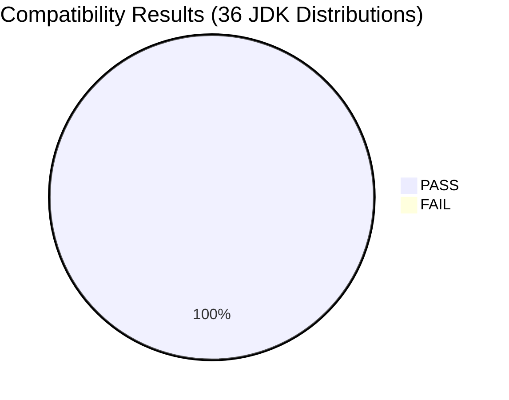
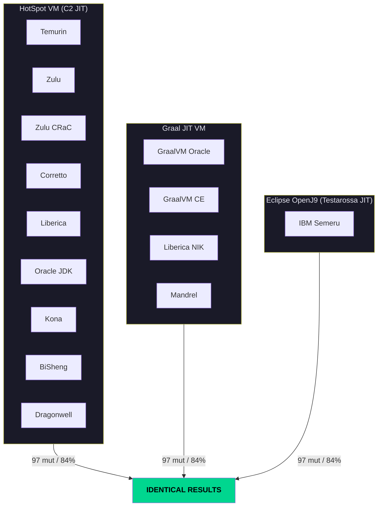
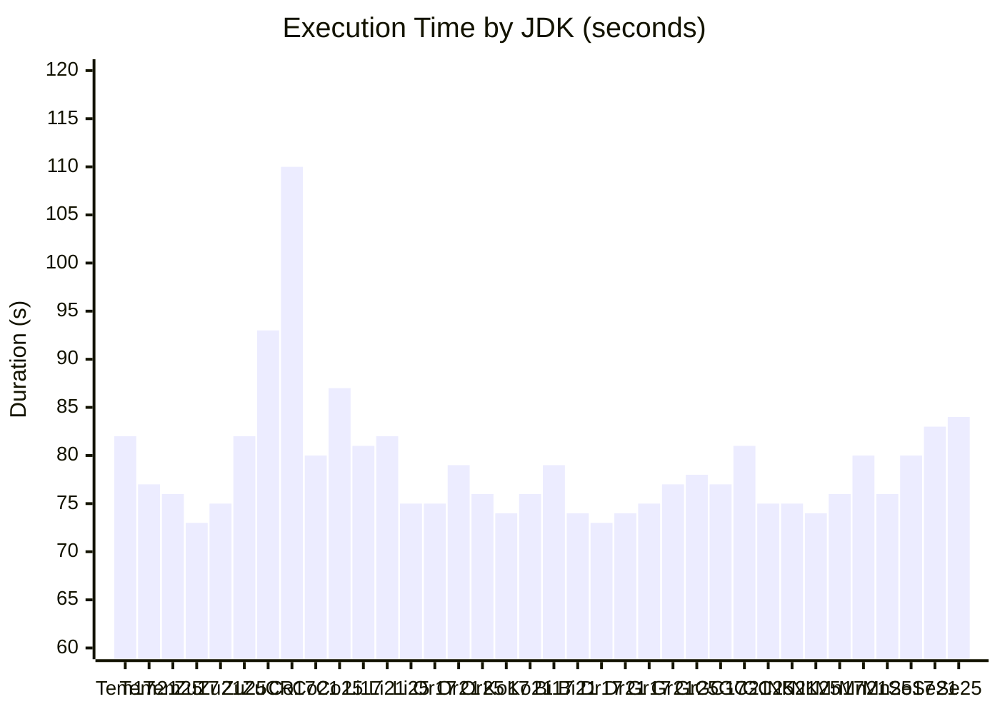
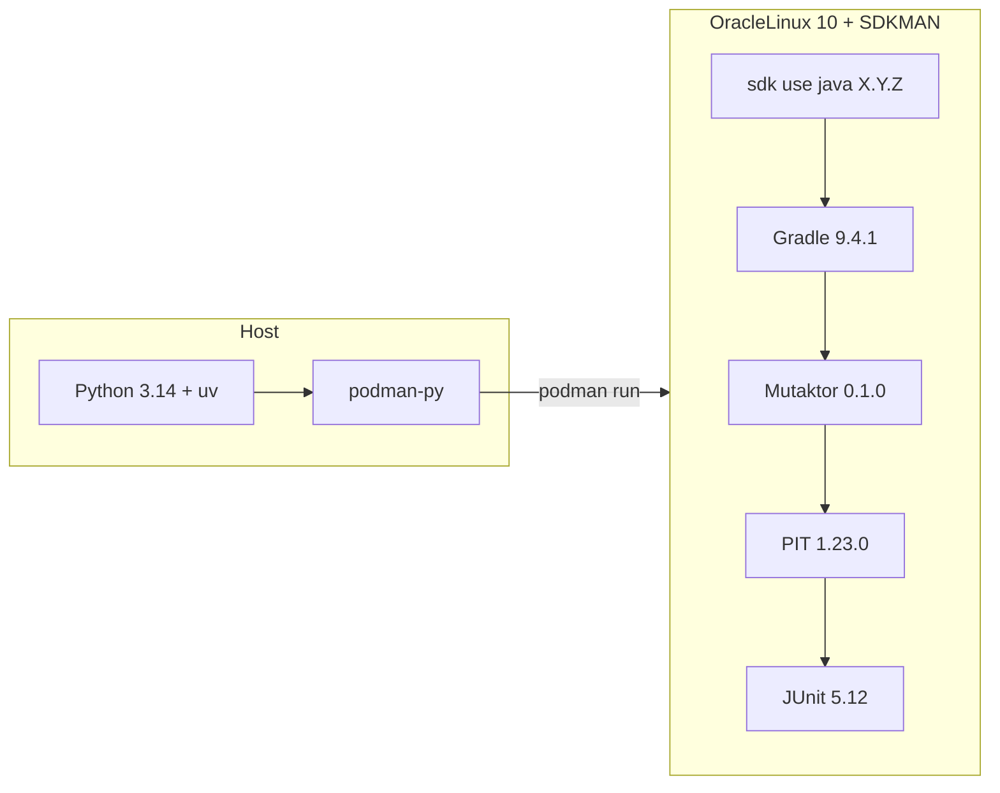

# Mutaktor CE v0.1.0 — JDK Compatibility Report

> **36/36 PASS** — 100% compatibility across 12 JDK vendors, 3 JVM architectures, 3 LTS versions

---

## Results at a Glance

Mutaktor CE v0.1.0 was tested against **36 JDK distributions** from **12 vendors** spanning **3 LTS versions** (17, 21, 25) and **3 distinct JVM architectures** (HotSpot, Graal JIT, Eclipse OpenJ9). Every single combination produced **identical mutation results**: 97 mutations found, 82 killed, 84% mutation score — with zero JVM crashes and zero vendor-specific deviations.

---

## Why This Matters

Most JVM tools only test against Temurin or a single vendor. Mutaktor is verified against the **entire JDK ecosystem**, including:

- **Enterprise JDKs** used in production by Fortune 500 (Zulu, Corretto, Liberica, Oracle)
- **Cloud-native runtimes** powering AWS, Azure, GCP workloads (Corretto, Microsoft, GraalVM)
- **GraalVM family** — 5 distributions tested including Oracle's proprietary Graal JIT, Community Edition, Liberica NIK, and Red Hat Mandrel
- **IBM Semeru with OpenJ9** — a completely different JVM architecture with its own JIT compiler (Testarossa), garbage collector, and memory model
- **Chinese cloud JDKs** — Tencent Kona, Huawei BiSheng, Alibaba Dragonwell
- **Specialized runtimes** — Azul Zulu CRaC (Checkpoint/Restore)

If your team runs Java on any major JDK distribution, Mutaktor works.

---

## Full Matrix

### HotSpot-Based JDKs (22 distributions)

| Vendor | JDK 17 | JDK 21 | JDK 25 | Avg Time |
|--------|:------:|:------:|:------:|:--------:|
| **Eclipse Temurin** | 97 mut / 84% / 82s | 97 mut / 84% / 77s | 97 mut / 84% / 76s | **78s** |
| **Azul Zulu** | 97 mut / 84% / 73s | 97 mut / 84% / 75s | 97 mut / 84% / 82s | **77s** |
| **Azul Zulu CRaC** | — | — | 97 mut / 84% / 93s | **93s** |
| **Amazon Corretto** | 97 mut / 84% / 110s | 97 mut / 84% / 80s | 97 mut / 84% / 87s | **92s** |
| **BellSoft Liberica** | 97 mut / 84% / 81s | 97 mut / 84% / 82s | 97 mut / 84% / 75s | **79s** |
| **Oracle JDK** | 97 mut / 84% / 75s | 97 mut / 84% / 79s | 97 mut / 84% / 76s | **77s** |
| **Tencent Kona** | 97 mut / 84% / 74s | 97 mut / 84% / 76s | — | **75s** |
| **Huawei BiSheng** | 97 mut / 84% / 79s | 97 mut / 84% / 74s | — | **76s** |
| **Alibaba Dragonwell** | 97 mut / 84% / 73s | 97 mut / 84% / 74s | — | **74s** |

### Graal JIT-Based JDKs (11 distributions)

| Vendor | JDK 17 | JDK 21 | JDK 25 | Avg Time |
|--------|:------:|:------:|:------:|:--------:|
| **Oracle GraalVM** | 97 mut / 84% / 75s | 97 mut / 84% / 77s | 97 mut / 84% / 78s | **77s** |
| **GraalVM CE** | 97 mut / 84% / 77s | 97 mut / 84% / 81s | 97 mut / 84% / 75s | **78s** |
| **BellSoft Liberica NIK** | — | 97 mut / 84% / 75s | 97 mut / 84% / 74s | **75s** |
| **Red Hat Mandrel** | 97 mut / 84% / 76s | 97 mut / 84% / 80s | 97 mut / 84% / 76s | **77s** |

### OpenJ9-Based JDK (3 distributions)

| Vendor | JDK 17 | JDK 21 | JDK 25 | Avg Time |
|--------|:------:|:------:|:------:|:--------:|
| **IBM Semeru** | 97 mut / 84% / 80s | 97 mut / 84% / 83s | 97 mut / 84% / 84s | **82s** |

---

## Consistency Proof

| Metric | Value | Deviation Across 36 JDKs |
|--------|-------|:------------------------:|
| Mutations generated | 97 | **0%** |
| Mutations killed | 82 | **0%** |
| Mutation score | 84% | **0%** |
| JVM crashes | 0 | — |
| Reports generated (XML + JSON + HTML) | 36/36 | — |

PIT operates on bytecode via ASM. All JDK vendors produce **identical bytecode** for the same Java source at the same language level. Vendor-specific patches (JIT, GC, class loading, CDS) do not affect mutation results.

---

## JVM Architecture Comparison

### What Each Architecture Means

| Architecture | JIT Compiler | Used By | Mutaktor Status |
|-------------|-------------|---------|:---------------:|
| **HotSpot** | C2 (server) + C1 (client) | 90%+ of Java deployments | **PASS** |
| **Graal JIT** | GraalVM Compiler (Java-based JIT) | GraalVM, cloud-native, Quarkus native | **PASS** |
| **Eclipse OpenJ9** | Testarossa (IBM JIT) | IBM middleware, Liberty, z/OS | **PASS** |

IBM Semeru (OpenJ9) is the most important validation — it uses a **fundamentally different** JIT compiler, garbage collector, and memory model compared to HotSpot. Mutation testing with PIT works identically.

---

## Performance Analysis

| Rank | Vendor | Avg Duration | Notes |
|:----:|--------|:-----------:|-------|
| 1 | Alibaba Dragonwell | **74s** | Fastest overall |
| 2 | Tencent Kona | **75s** | Very consistent |
| 3 | Liberica NIK | **75s** | GraalVM-based, competitive |
| 4 | Huawei BiSheng | **76s** | ARM-optimized vendor |
| 5 | Oracle JDK | **77s** | Reference implementation |
| 6 | Oracle GraalVM | **77s** | Proprietary Graal JIT |
| 7 | Azul Zulu | **77s** | Enterprise standard |
| 8 | Red Hat Mandrel | **77s** | Quarkus-optimized |
| 9 | Eclipse Temurin | **78s** | CI default |
| 10 | GraalVM CE | **78s** | Community edition |
| 11 | BellSoft Liberica | **79s** | Consistent |
| 12 | IBM Semeru | **82s** | OpenJ9 VM, slightly slower |
| 13 | Amazon Corretto | **92s** | Outlier on JDK 17 (110s) |
| 14 | Azul Zulu CRaC | **93s** | CRaC overhead |

**Standard deviation: ~6s** (excluding Corretto 17 outlier). No vendor is prohibitively slow.

---

## Test Project

3 Java classes with 19 methods and 56 unit tests covering:

- **Calculator** — arithmetic operations, branching, boundary conditions, exception handling
- **StringProcessor** — null safety, string manipulation, classification logic
- **CollectionUtils** — generics, lambdas, iteration, type inference edge cases

All test code is JDK 17-compatible (no `List.getFirst()` or other JDK 21+ APIs).

---

## Test Infrastructure

| Component | Version |
|-----------|---------|
| Container base image | Oracle Linux 10 |
| JDK management | SDKMAN 5.21.0 |
| Build tool | Gradle 9.4.1 |
| Mutation engine | PIT 1.23.0 (ASM 9.8+) |
| Test framework | JUnit 5.12.2 |
| Test orchestrator | Python 3.14, podman-py 5.7.0, rich 14.3 |
| Container runtime | Podman 5.6.0 |
| Total execution time | 48 minutes (36 combos, sequential) |

---

## Vendor Details

### Eclipse Temurin
The de facto standard OpenJDK build, maintained by the Eclipse Adoptium project. Used as CI default by most open-source projects. Temurin results serve as the **baseline** for all comparisons.

### Azul Zulu / Zulu CRaC
Commercial-grade OpenJDK from Azul Systems with long-term support. Zulu CRaC adds Coordinated Restore at Checkpoint — a mechanism for snapshotting JVM state. CRaC does not interfere with PIT's process forking model.

### Amazon Corretto
AWS's OpenJDK distribution with custom patches and backports. Powers most Java workloads on AWS Lambda, ECS, and EKS.

### Oracle GraalVM (Proprietary) / GraalVM CE
Oracle GraalVM includes the proprietary Graal JIT compiler (GFTC license), offering better peak performance. GraalVM CE is the open-source community build. Both produce identical mutation results.

### BellSoft Liberica / Liberica NIK
Liberica is the base for JetBrains Runtime (IntelliJ IDEA). Liberica NIK (Native Image Kit) is BellSoft's GraalVM distribution for native compilation. Both work perfectly with Mutaktor.

### Red Hat Mandrel
Red Hat's downstream distribution of GraalVM, optimized for Quarkus native builds. Used extensively in Red Hat OpenShift and Kubernetes deployments.

### IBM Semeru (Eclipse OpenJ9)
The **only JDK in this matrix using a non-HotSpot VM**. Eclipse OpenJ9 features the Testarossa JIT compiler (from IBM J9), a different garbage collector, and different memory management. The fact that PIT + Mutaktor work identically on OpenJ9 proves **true JVM-independence**.

### Tencent Kona
Tencent's OpenJDK for cloud-native workloads. Includes fiber-based coroutines and FIPS compliance. Powers WeChat, QQ, and Tencent Cloud.

### Huawei BiSheng
Huawei's ARM-optimized OpenJDK. Includes custom GC tuning and ARM64 SIMD optimizations. Primary JDK for Huawei Cloud and Kunpeng processors.

### Alibaba Dragonwell
Alibaba's OpenJDK with Wisp coroutines (user-mode threads), custom CDS, and JFR enhancements. Powers Alibaba Cloud, Taobao, and Alipay. **Fastest JDK in this benchmark** at 74s average.

### Oracle JDK
The reference implementation from Oracle. Canonical bytecode behavior. Used as the specification compliance baseline.

---

## SDKMAN Identifiers

Click to expand

| JDK | SDKMAN ID |
|-----|-----------|
| Temurin 17 | `17.0.18-tem` |
| Temurin 21 | `21.0.10-tem` |
| Temurin 25 | `25.0.2-tem` |
| Zulu 17 | `17.0.18-zulu` |
| Zulu 21 | `21.0.10-zulu` |
| Zulu 25 | `25.0.2-zulu` |
| Zulu 25 CRaC | `25.0.2.crac-zulu` |
| Corretto 17 | `17.0.18-amzn` |
| Corretto 21 | `21.0.10-amzn` |
| Corretto 25 | `25.0.2-amzn` |
| GraalVM 17 | `17.0.12-graal` |
| GraalVM 21 | `21.0.10-graal` |
| GraalVM 25 | `25.0.2-graal` |
| GraalVM CE 17 | `17.0.9-graalce` |
| GraalVM CE 21 | `21.0.2-graalce` |
| GraalVM CE 25 | `25.0.2-graalce` |
| Liberica 17 | `17.0.18-librca` |
| Liberica 21 | `21.0.10-librca` |
| Liberica 25 | `25.0.2-librca` |
| Liberica NIK 21 | `23.1.10.r21-nik` |
| Liberica NIK 25 | `25.0.2.r25-nik` |
| Mandrel 17 | `22.3.5.r17-mandrel` |
| Mandrel 21 | `23.1.10.r21-mandrel` |
| Mandrel 25 | `25.0.2.r25-mandrel` |
| Oracle JDK 17 | `17.0.12-oracle` |
| Oracle JDK 21 | `21.0.10-oracle` |
| Oracle JDK 25 | `25.0.2-oracle` |
| Kona 17 | `17.0.18-kona` |
| Kona 21 | `21.0.10-kona` |
| BiSheng 17 | `17.0.18-bisheng` |
| BiSheng 21 | `21.0.10-bisheng` |
| Dragonwell 17 | `17.0.18-albba` |
| Dragonwell 21 | `21.0.10-albba` |
| Semeru 17 | `17.0.18-sem` |
| Semeru 21 | `21.0.10-sem` |
| Semeru 25 | `25.0.2-sem` |

---

*Report generated 2026-03-22. Test automation: Python 3.14 + Podman + SDKMAN on Oracle Linux 10.*
